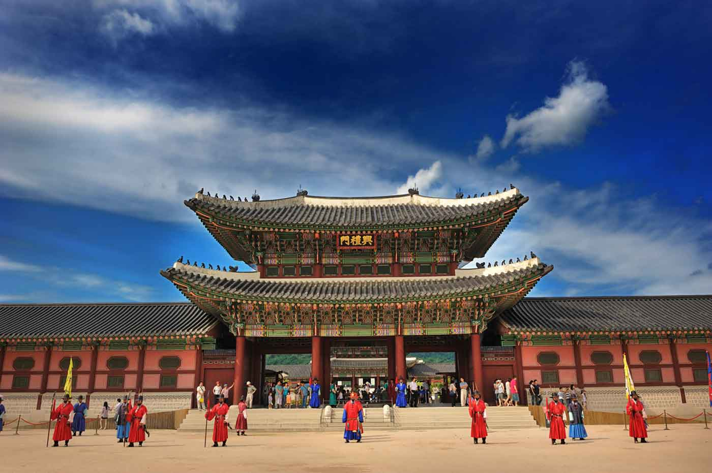
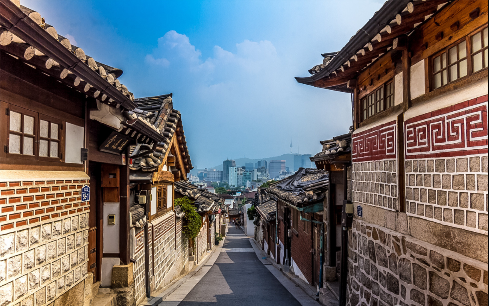
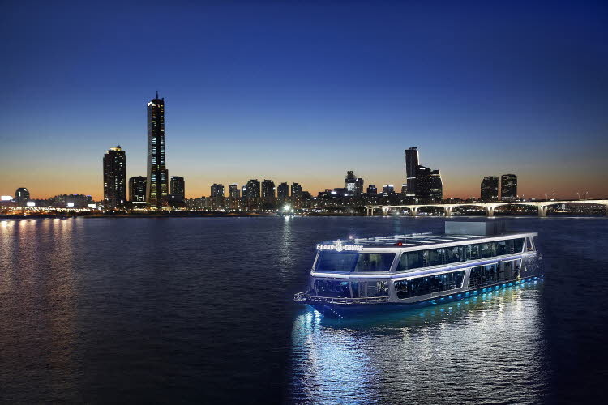

Chuseok is almost upon us, and with it comes a nice and relaxing, week-long holiday. Chuseok itself falls on October 4th, but because it coincides with National Foundation Day (October 3rd) and Hangul Day (October 9th), the government has decided to also make October 2nd a national holiday. Thus, this year’s “Chuseok” holiday will last from September 30th until October 9th.

Chuseok, also known as Korean Thanksgiving Day, is one of the most important holidays in Korea. Families gather together in their hometowns to make special food and give thanks to their ancestors. Due to Korea’s past as an agrarian society, people traditionally celebrated Chuseok during a full harvest moon, to give thanks to their ancestors for a bountiful harvest. These days, families still honor their ancestors by holding memorial services on Chuseok morning, but the customs of Chuseok have shifted over time to visiting hometowns, vacationing, and spending quality time with relatives.

Since international students don’t have hometowns to visit or relatives to spend quality time within Korea, Chuseok can be quite a bore, especially with most of the restaurants, cafes, and “hang-out” spots closed for the holiday. Don’t put your week-long break to waste just by sitting at home and watching Netflix all day. Since most Koreans travel out of Seoul during Chuseok, it is actually the perfect time to go and explore the city’s usually crowded hotspots.

PC: Seoulistic

Historic sites such as palaces and Hanok villages are one of the best places to visit during Chuseok. Not only are they still open during Chuseok day itself, but the cultural performances and activities in these places fully operate during Chuseok as well. The most popular palace is Gyeongbok Palace, which was the main royal palace of the Joseon dynasty. With its grand structures and a beautiful pavilion, Gyeongbok Palace is easily one of the most attractive historic locations in Seoul. If you have already visited Gyeongbok Palace, you should also check out the other two palaces nearby- Changdeok Palace and Changgyeong Palace. Changdeok Palace is known for its beautiful gardens and green, open spaces, while Changgyeong Palace is home to Korea’s first ever western-style greenhouse and botanical garden.

PC: thisgirlabroad

Surrounded by Gyeongbok Palace and Changdeok Palace lies Bukchon Hanok Village, another place you can explore. Bukchon Hanok Village is home to hundreds of hanoks, which are traditional Korean houses that date back to the Joseon Dynasty. Most of the hanoks’ interior in this village have been remodeled; they now serve as modern-day houses, cultural centers, guesthouses, restaurants, and cafes. If you’d like to see a more traditional hanok village, you should visit Namsangol Hanok Village. The hanok houses in this village have traditionally furnished interiors to show guests a more authentic glimpse of the past.

If visiting palaces and traditional villages are too slow-paced for your taste, then visiting an amusement park might be a better alternative for you. During Chuseok, amusement parks give plenty of discounts, especially for foreigners. And since this year’s Chuseok coincides with Halloween season, amusement parks will have special themed rides and events. Everland, Korea’s largest amusement park, is located on the outskirts of Seoul, in Yongin, Gyeonggi-do. Here you can find the world’s fourth steepest wooden roller coaster, T-Express, and even a zoo. If the two-hour subway commute is too long for you, then maybe you’d opt for a closer amusement park instead- Lotte World. Lotte World consists of both an indoor and outdoor amusement park. In addition to the numerous rides, here you can also find an indoor ice skating rink.

PC: trazy

If you enjoy the outdoors but are not up for hiking, then the Han River is the place to be. The parks along the Han River, especially Yeouido Park, is always teeming with people. Since the park is a popular family destination, you wouldn’t usually be able to escape the shrieks of children, no matter how early or how late you come. But during Chuseok, you can enjoy a much quieter Han River and spend a thoroughly relaxing day at the parks. There are smooth biking trails along the river, and you can rent a bike for only 3,000 won. The breezy weather is also perfect for a picnic with your friends. Get fried chicken delivered straight to your mat and crack open a cold can of beer and watch Seoul’s skyline light up as the sun sets over the river.

Even if you don’t have a hometown to travel to, or family to spend quality time with here in Korea, there are still lots of things to do and places to visit during Chuseok. Take the opportunity of a deserted Seoul to go out and explore as many of its popular hotspots as possible. May this year’s Chuseok be a fun and meaningful one for you. Happy Chuseok!
