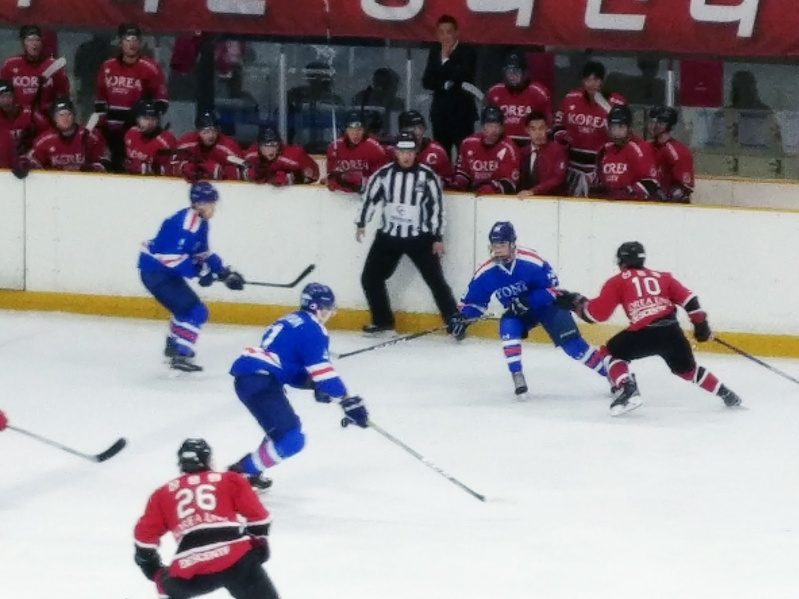
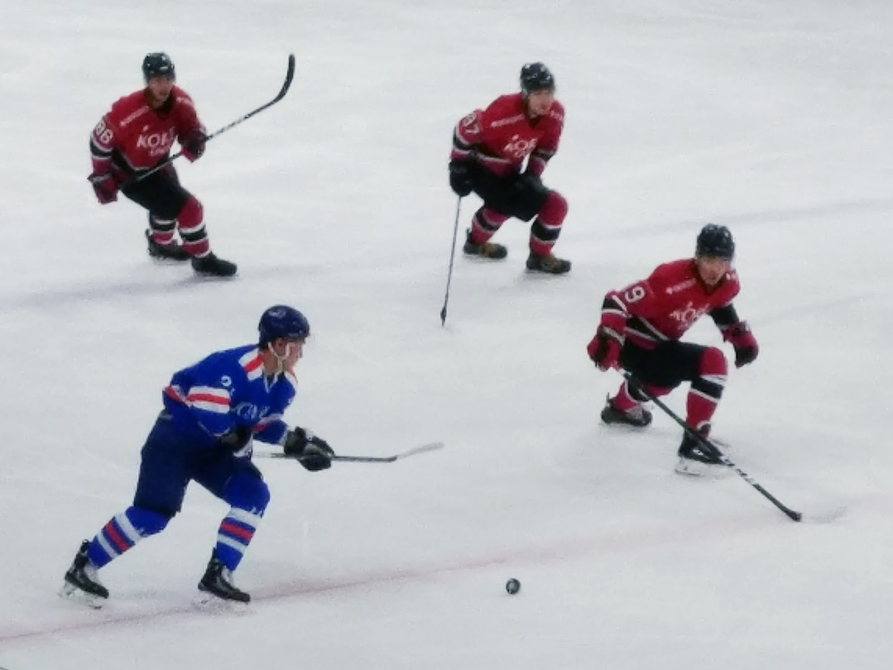

**The decisive game ended with a 5-1 win over Korea University, marking Yonsei University’s first Yonko Games victory in seven years.**

The first period started off with a powerful shot from Yonsei by Sang-Won Kim at about 00:20 but was deflected by Korea's goaltender Yeon-Seung Lee.

Yonsei was on the power play when Korea’s Young-Jun Seo was off the ice for the delayed penalty at 16:45 and the first period ended without any goal from both sides.

Yonsei grabbed a 1-0 lead in the second period when Byung-Gun Kim received the puck from Hyung-Chul Song with an assist from Ji-Hyun Cho at 27:43, silencing the Korea University’s cheering crowds.

But soon, Yonsei was on a penalty kill as Wun-Jae Choi was sent to the penalty box for minor penalties.

The second period ended with 2-0 with Ji-Hyun Cho stuffing a puck with help from Hyung-Cul Song and Hee-Du Nam at 39:49, just 11 seconds before the end of the second period.

Yonsei and Korean started the last period with fierce tension.

A sequence of shootings continued until Ju-Hyung Lee scored at 42:16. He shot a puck that came from Jong-Min Lee.

Yonsei's Ju-Hyung Lee got his stick on a puck, which Jong-Min Lee shot but was then deflected off the goalpost, leading Yonsei to the fourth goal of the game at 42:16.

Tensions continued but without progress for a while as Yonsei was on a penalty kill for the minor penalty of Hee-Du Nam.

The game was suspended when Korea’s Seok-Jin Lee was injured.

Yonsei's Jong-Min Lee scored his swift second goal of the game at 49:49 by stuffing home a Chong-Hyun Lee's feed.

When Chong-Hyun Lee made it 5-0 at 55:32 by wristing home his first goal of the game with help from Woon-Jae Choi and Ye-Jun Kim, the victory of Yonsei became certain as it was heading toward the end of the game with 4:28 left.

With 1:51 left, face-off took place in Yonsei side and Jae-Hee Lee from Korea University shot a puck that went into the goal at 58:11.

The decisive game ended with a 5-1 win over the Korea University, marking the Yonsei University’s first Yonko Games victory in seven years.

A promising season undoubtedly awaits Yonsei ice hockey team with talented players from various ages and backgrounds.

Winner of the first goal, Byung-Gun Kim is a sophomore who has successfully maintained his amazing performance from last season.

Ji-Hyun Cho, a junior who scored the second goal, showed noteworthy work as the center, stably leading the team.

Ju-Hyung Lee and Jong-Min Lee, albeit relatively young as freshmen, respectively scored the third and the fourth goal, not to mention showing an energetic play throughout the game.

The last goal came from Chong-Hyun Lee, a junior who also runs for the national team. It is yet decided whether Chong-Hyun Lee will be running as Yonsei player for the next season or be training as the national team player.

In the end, it was the teamwork. Players were fully immersed in the game when on the ice and the four lines were timely substituted, which eventually brought out the best potential of the players.
