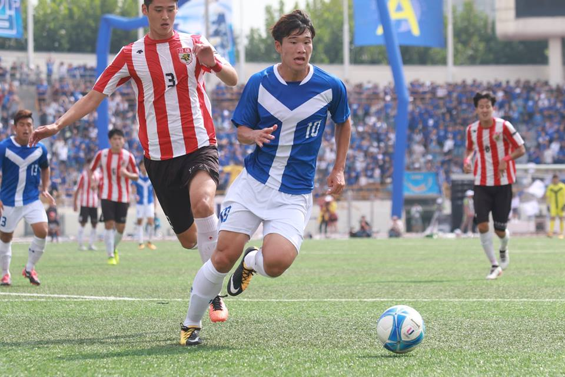

Soccer was the last game that left a final mark on a new history of Yonsei University. The score was 1 to 1 when the clock was indicating 90th minute with the ball still in the play. As every second ticked, everyone was anxiously gazing at the ball, wondering when it would hit the net. Suddenly, Yonsei’s Ha Seung Un (#11) drove the ball into the net right before the game came to an end. The long-awaited triumph was there within a second. It was truly the fruit of hard work that could not, and should not, be taken for granted.

**Korea University’s Initiative**

Korea University (Korea) brought a formation of 3-5-2 while Yonsei University (Yonsei) brought 4-3-3. During the first half, Korea tried to take the initiative by pressuring Yonsei midfielders past the half-line. With a very fast paced passing, Korea midfielders shook Yonsei’s organization. Korea wingers could then exploit the gap between Yonsei center backs and wing backs. Then, Korea would penetrate the flanks and cross the ball to the center which resulted in a perilous situation for Yonsei. With a similar pattern, Korea continued to overwhelm Yonsei defenses by penetrating to the flanks with great passes and physiques.

To continue the initiative, Korea pushed its entire formation past the half-line even further to place more constraints on Yonsei players. Yonsei tried to launch a fast counter attack but Korea’s continuous pressure forced mistakes on Yonsei players that caused turnovers. Korea midfielders capitalized on those mistakes and practiced the same offensive pattern of penetrating the flanks. Korea managed to maintain the coherent formation that enabled each player to assist one another. For the first 25 minutes, it seemed as if Korea was on the verge of scoring.

But the first half eventually ended with no goals. It was a loss for Korea while a gain for Yonsei. Korea could not capitalize on their early lead by failing to score a goal. And due to such incessant pressure and aggressive plays, Korea players consumed more stamina compared to Yonsei players who tended to stay more defensive. Yonsei had an opportunity to seize the initiative.

**Yonsei University’s Counter Attack**

During the second half of the game, Yonsei managed to recover and reorganize their formations through aggressive passes and plays that created cracks between Korea formation. At 51st minute, Yonsei’s Lee Jung Mun (#6) connected Doo Hyun Suck’s (#13, Captain) corner kick with a header that drove the ball into the net. Yonsei finally grabbed a 1-0 lead, resulting in further initiatives. Yonsei’s Yu Jung Wan (#19) acted as a playmaker who promptly carried the ball past the half-line; he then gave accurate passes to center and flanks that granted Yonsei forwards the opportunities to take shots on goal.

Desperate to equalize, Korea launched fast counter attacks whenever they won the possession. At 82nd minute, Korea’s Sin Jae Won crossed the ball from the left flank to the center and Jo Young Wook finished it with a header (1-1).

That was when both teams reached the heights of their ambition. Yonsei strived to bring this game to a successful conclusion to write a new history for their school while Korea tried to redeem themselves from their previous four losses. But the crack showed on Korea’s defense. At 92nd minute, Yonsei’s Ha Seung Un (#11) dribbled between Korea defenders and his medium-range shot drove the ball into the near post. All that took were few seconds to mark the triumphant end to this game.

**Final Remarks**

With the goals led by Ha Seung Un and Lee Jung Mun, Yonsei finalized its complete victory over Korea with 5-0. As this is an unprecedented victory over Korea University, Yonsei players must celebrate their hard-won victory to the fullest extent. Yet, needless to say, they must not forget how to apply their lessons from such successful outcomes to the games that are to come.

Many may question the significance of this game. It may even appear as merely one aspect of the inter-university sports. But what we have to realize is that such games provide us with lessons that are as valuable as, if not more than, in-class learning. Valiant efforts by the players to win without knowing the results motivated us to cheer for them likewise. Ha Seung Un’s last minute goal showed us to push ourselves even harder in the last minute no matter how uncertain the future may seem. Their efforts that we, as the spectators, have eye-witnessed truly exemplified the spirit of persistence. The wins are precious. But what matters more is their active endeavor after victory and true demonstration of sportsmanship.

**\*PC: Yonsei Chunchu**
