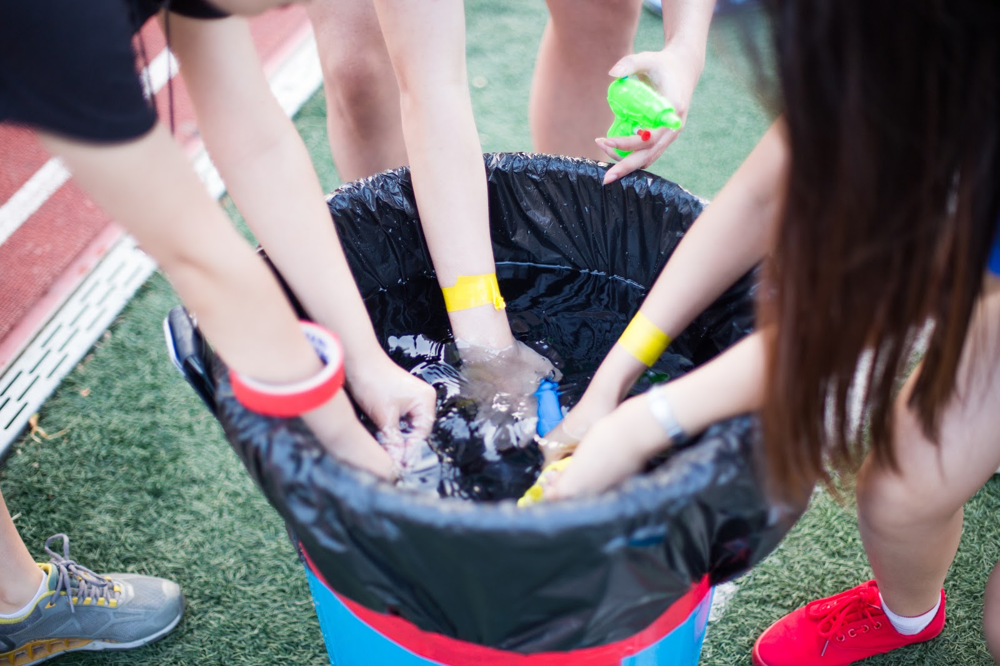
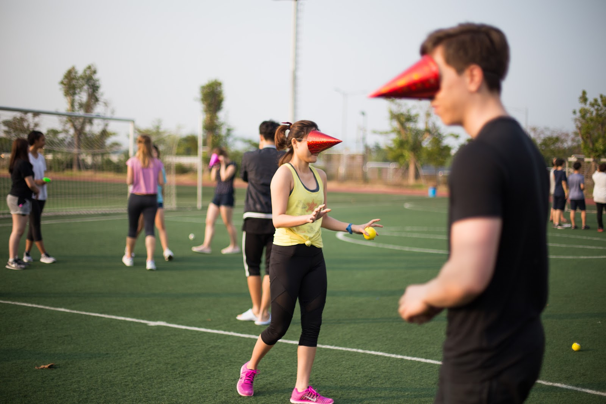
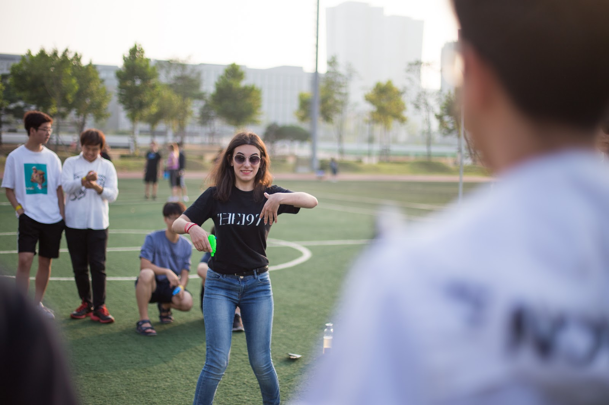
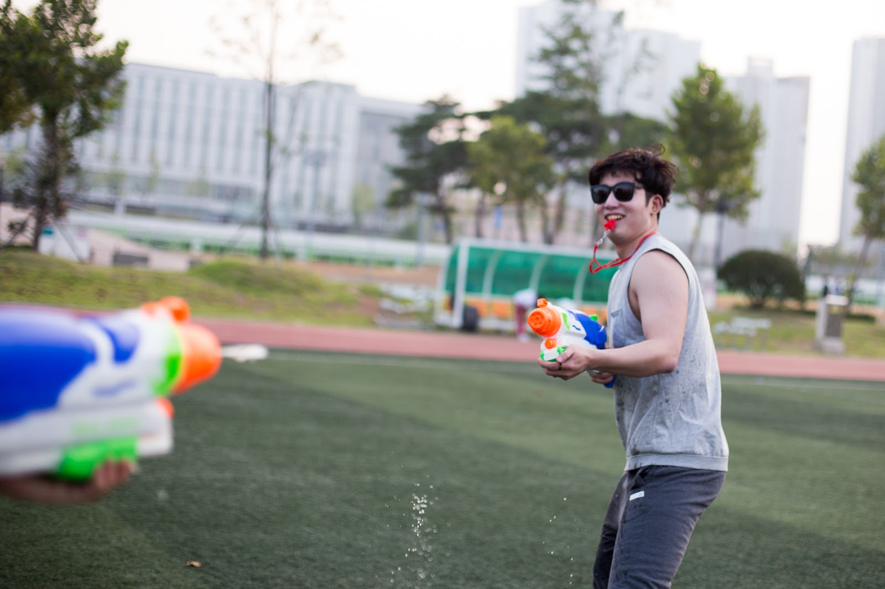

Aristotle House is the international house at the Songdo international campus. The value of our house follows the philosopher, Aristotle. Aristotle is a philosopher who promoted the “good life”, the golden medium. Aristotle explains in his Nicomachean Ethics, that humans must live a life of virtue and be educated to pursue that virtue. Virtue can be found right in the middle of deficiency and excess and thus, the good life for Aristotle is a balanced life. This balanced life for us in Aristotle house is managing to find the time to have fun.

As the hot summer weather waned, we decided to create a memorable event for the Aristotle house freshmen. The event was called ‘Crazy Arcade’ because it comprised of minigames, dodgeball and the main event called “shoot the queen”.

We tried to manage the games so that everyone could be part of the fun. Aristotle house started off with the cone hat game, a game of finding balls of different colors and sizes with the cone hats not on their heads but on their faces which made it extremely hard for us to see clearly. Many of us were not able to find the balls with the cones on and wandered off the grounds finding ourselves heading outside the campus grounds.

It did not get any easier in the next mini game which was the ‘charades’ where one of us would gesture for the other team members who had to try and figure out what the gesture meant. To make things a bit more physical, we played the hula hoop game where team members had to hold each other’s hands in a line and try and get all of their bodies get through the hoop without losing each other’s grasp. We all became a team when we struggled together to get through the tiny hoops.

The mini games strengthened our team work and when the two games ended, we were set and ready to be truly physical.

The game became truly physical when the Aristotelians began playing dodgeball, but with a special twist which is that there were not two opposite teams, but there were four teams playing against each other and with two balls instead of one. Everyone was so serious in keeping their teammates alive and were cheering for the ones remaining alive. All of us were sweating and feeling the last bit of summer heat that we had left.

But what is a summer without a good old water gun fight?  Aristotelians were truly savoring the good life when our sweat from dodgeball was rewarded with cool sprays of water. Our four teams had our own territories which were safety zones for “queens”, the leader of the group who had to try and avoid getting wet. The other teammates were protecting and covering for their queens but at the same time had to try to get out from their safety zone to get hold of the super guns which had a much longer range. The teams were assessed with the wetness of the queens’ t-shirts in the end by squeezing the dripping shirts into a small cup. The four cups of suspiciously opaque liquids were produced and measured. The winning team was rewarded with a chance to get fried chicken all together. Thanks to this event, we could mingle among themselves and get to know each other better. The Aristotle house is planning out future events and will present us, events that will let everyone get together once again to create our “good lives”.
