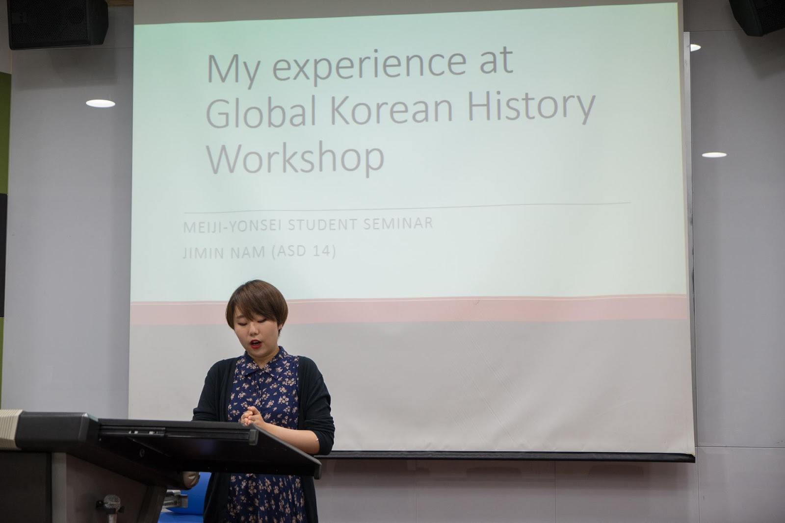
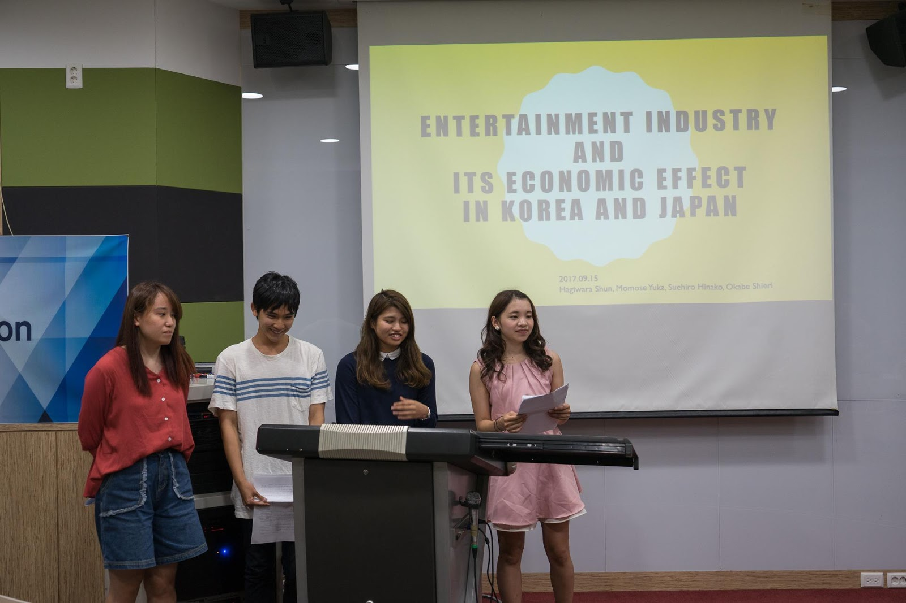

On Sep. 15, 2017, the annual Meiji Yonsei Student Seminar was held in New Millennium Hall, Sinchon campus. With the participation of ten students from Meiji University and around twenty from the UIC Asian Studies department, the seminar was a cooperative success between the schools and of the friendship between Japan and Korea.

Meiji University is a prestigious private university located in Tokyo, Japan. Yonsei University has various exchange relationships with Japanese universities such as Keio and Waseda University. Starting from 2013, each year, a group of Meiji University students travels to Korea for academic exchange with Yonsei University. First, they spend two weeks at Wonju campus attending lectures, exchanging thoughts and making presentations. Then, they come to Seoul to do sightseeing and attend this annual seminar.

This year, the Meiji students were welcomed with the Asian Studies Student Council Representative Sang Jun Lee’s heart-warming opening statement. Then, student Kyuwan Kim, class of ‘16, gave a thorough presentation about Yonsei University and student life in Korea. From our hectic midterm exam period to the much awaited YonKo games, the Japanese students’ curious eyes were drawn to Kim’s words.

The final student presenter from UIC, student Jimin Nam, class of ‘15, gave a presentation on her summer workshop on Ahn Junggeun, a rather controversial figure. As the person who shot and killed prince Hito Hirobumi, Ahn is regarded as a hero in Korea and a terrorist in Japan. Opinion varies, but Nam’s point was that we as academics of today should not be looking at history as right or wrong, but should examine how a historical event happened and its impact on the flow of time.

\[Above: Jimin Nam on her experience at Global Korean History workshop\]

Nam’s delicate topic opened up room for discussion that drove the seminar to focus on Japanese colonization and memory politics. The Japanese students shared that they  learned little about Japanese colonization in school but agreed that what the Japanese imperial government did at the time was wrong. As a result of exchanging stories and opinions,  students of both sides gained a better understanding of each other and developed friendships beyond the classroom.

The last half of the seminar was dedicated to comparative presentations from the Meiji students on contemporary issues in the two  countries.The first group offered a presentation on job hunting, an ever-concerning topic for college students. The second group’s presentation was about the pension system. Last year, Statistics Korea predicted that starting from 2018, Korea will become an aged society; pensions are expected to  become one of the most important topics of debate. The last group gave a presentation about entertainment, which mainly compared famous Japanese animations and Korea’s Hallyu wave.

\[Above: A group of Meiji student on the entertainment industry\]

In conclusion, the seminar’s atmosphere was very cozy. In a time when the Japan-Korea relationship has its ups and downs, its academic relationships, as shown by this seminar, are as close as ever. Professor Yumi Horikane from Meiji University gave the closing remark of the seminar. On behalf of Meiji University, she relayed  that they were most honored to be welcomed to Korea each year and hoped that there would be exchange from Yonsei in the near future. Giving her sincere thoughts on colonial memory, Professor Horikane believed that we should learn from the past and aim for cooperation and friendship in the future.
