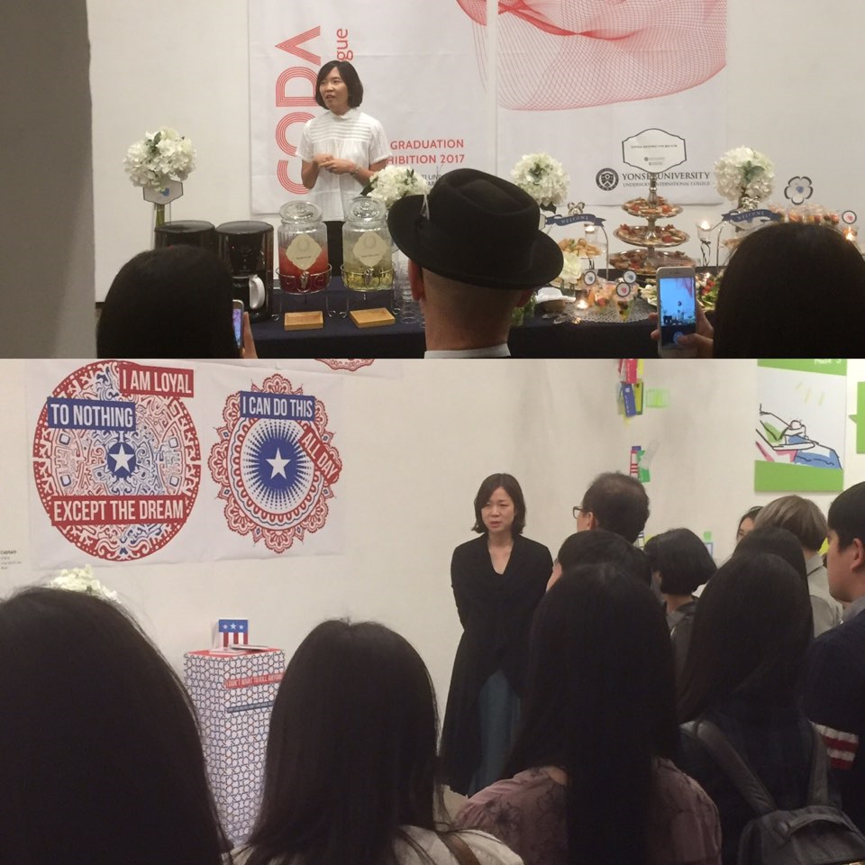
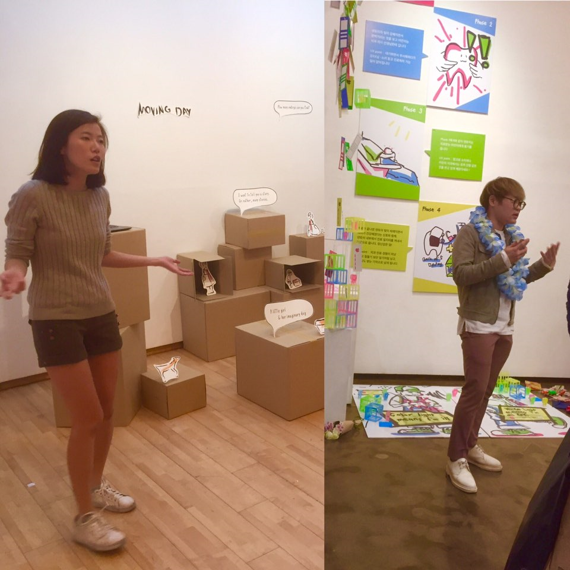
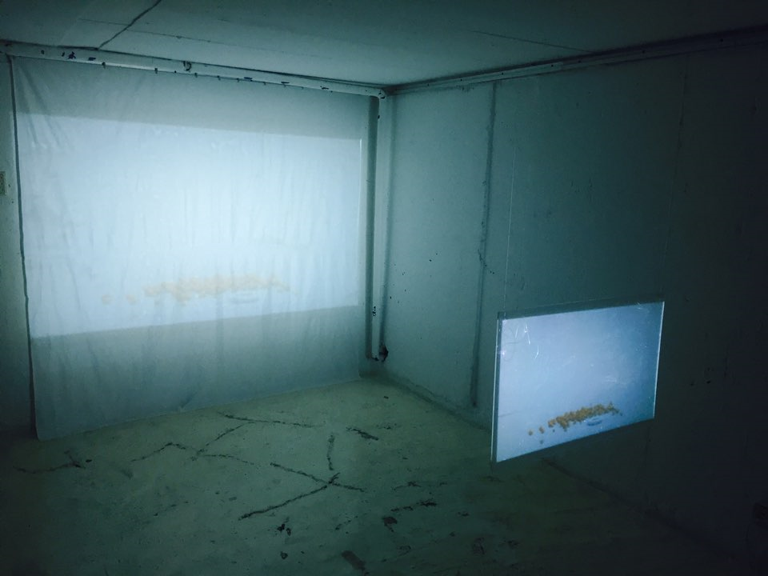
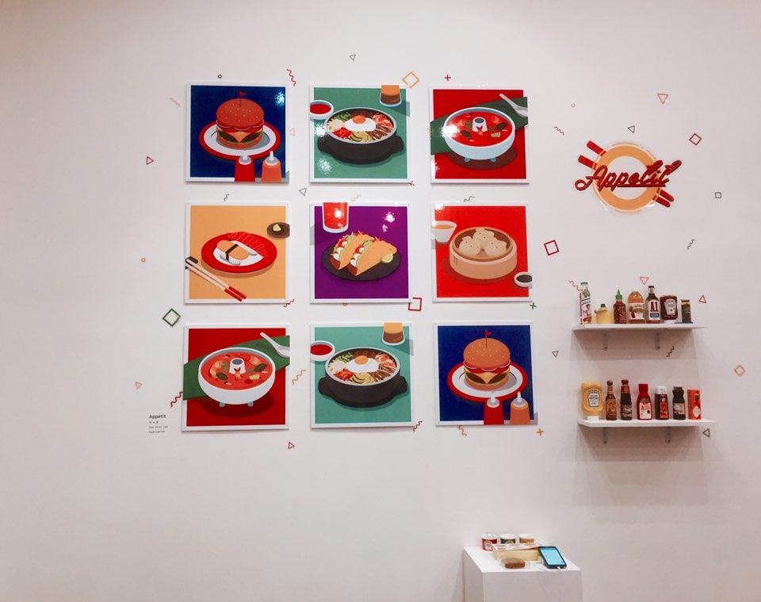
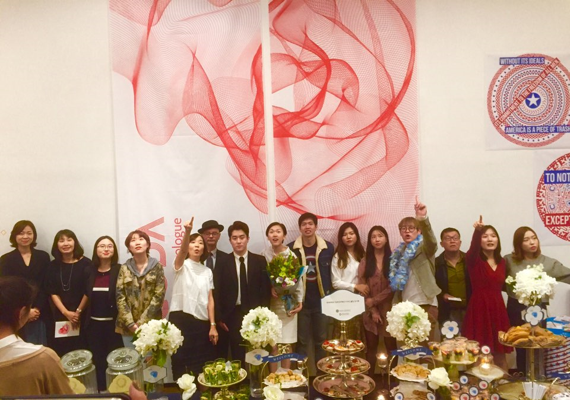

In the afternoon of October 14th, artists and their friends and family were gathered at Cheongdam-dong’s Gallery ‘Won’ for the 2017 IID Graduation Exhibition titled “CODA The New Prologue”. Here, the graduating class of the IID (Information & Interactive Design) major showcased their works which were the culmination of all the skills that they have cultivated in their university careers. As expected of an IID event, all the guests were well dressed for the occasion and many even prepared flowers for the young artists who seemed anxious and eager to share their works.

The opening ceremony began at 4pm at which professors of the IID major spoke a few words commemorating the hard work that the graduating class of the IID major put into the exhibition. They also spoke some words of encouragement towards the students’ careers post-graduation. After the opening speeches, the guests were taken on a tour of the exhibition during which the young artists introduced and explained their pieces. There was a wide variety of pieces displayed at the exhibition such as photo collages, phone applications, metal chains, video presentations, and even a video game.

After the tour, a few members of the graduating class were asked to share a few comments on the exhibition and the IID major overall.

The respondents were first asked what their impression of the major was before entering it. Hyejin Kim (IID Class of 2014) replied that she thought it was simply an art related major. Another student, Hedgie Choi (IID Class of 2013), replied that the major appeared to be about digital art which was “the intersection between software engineering and fine arts”. A third student, Yeji Park (IID Class of 12), replied that she thought that IID was “a very interesting major where \[she\] could learn the cutting-edge skills that will practically contribute to designing a better world.”

When asked how their impressions of the IID major changed now that they are seniors, Hyejin Kim responded that the “meaning of ‘design’ expands…We \[also\] study how/ why people use such services (app, space, object, etc.) and the experience\[s\] while using them.” Hedgie Choi replied that the major seems to be orientated towards UX design (also known as design research) while Yeiji Park answered that the major seems to focus on teaching students how to design easier and more interesting ways to deliver information or services to users.

The three graduating students were then asked to give tips for their underclassmen. To begin with, Hyejin Kim reassured the freshmen that design courses are not intimidating and can broaden their points of view as designers/inventors. Interestingly enough, Hedgie Choi and Yeji Park both stated that, due to the very diverse nature of the major, one should choose a certain field or set of skills to focus on. This point was evident by the diverse range of pieces shown in the exhibition and the depth of skill portrayed in every single piece despite them all being completely unique and unrelated to another.

The students were also asked what have they learned upon completing their senior projects for the exhibition. Hyejin Kim spoke of how she came to the realization that IID helps one see ordinary objects and experiences in novel perspectives and this aided her in coming up with the idea of her senior project.

As for Yeji Park, she expressed joy at the fact that she was able to not only apply the skills she learned in her classes, but also have more confidence in her self-taught skills which she utilized for the final project. Hedgie Choi simply answered that she realized her passion for programming.

Lastly, the senior students were encouraged to share any comments that they wished to. Hyejin Kim gave encouraging remarks stating that “the learning \[in the IID major\] will come together and make you more professional. Knowing one thing very well is not enough. You have to understand the related area in order to be good at your interested field. IID is where this can happen.” Yeji Park wished to express thanks and cheers to her fellow IID major students who “went through this intense, but fruitful journey together.” And Hegie Choi bluntly remarked that she was simply pleased to be graduating.

_For more information on the CODA The New Prologue exhibition, please visit the offic__i__al website at_ _[http://iid2017.yonsei.ac.kr/](http://iid2017.yonsei.ac.kr/)_
