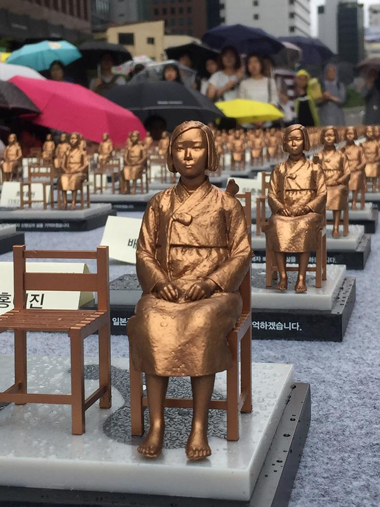

From mid-August to the end of September this year, travelers who rode the five buses of Dong A bus company got some new companions: Comfort women’s statues. The image of young Korean girls wearing simple black and white traditional Hanbok not only raises contrast with today’s modern fashion but also symbolizes the Korean women who were forced to provide sexual service to Japanese soldiers during World War II. These statues belong to the project titled "Dream Lost by Girls," to memorize the sexual slavery victims during the fifth anniversary of World Comfort Women’s Day: August 14. The statues were also brought to the Japanese embassy, Suwon, Daejeon and Jeonju before they arrived at a permanent monument at the end of September.

Although the statues are part of Dong A bus company owner Rim Jinwook’s personal campaign, it received positive support from the government. Nonetheless, the project also triggered fierce criticism from Japan. In response to the circulation of these statues on the streets of Seoul, Chief Cabinet Secretary Suga Yoshihide, regarded as the Japanese government's spokesperson, said at a press briefing that "We are concerned this move could put a damper on efforts between Korea and Japan to develop a future-oriented relationship," (Kyodo News Agency). Later in a talk with Japanese Prime Minister Shinzo Abe, President Moon Jae-in remarked that "The reality is the majority of our people cannot emotionally accept the comfort women agreement.”

President Moon’s statement is part of his effort to regain justice for the victims. In 2015, The South Korean government led by the impeached President Park Geun Hye signed a landmark deal to "finally and irreversibly" resolve the comfort women issue, with Japan agreeing to give 1 billion yen ($9.1 million) in compensation to provide support to former comfort women and their families. However, this deal was rigorously protested by the people since Japan refused to issue an official apology to the victims. Currently, the Moon administration is looking into nullifying it.

As most surviving victims are getting old and passing away, it is essential to fight for an official apology from Japan before no victims are left. The establishment of World Comfort Women day and projects like “Dream Lost by Girls” is showing the revitalization  of campaigns for comfort women’s justice. In the same spirit, an exhibition of 500 hundred comfort women statues was held at Cheonggye Stream Square in central Seoul during World Comfort Women Day.

\[Credits: Shim Hyun-chul\]
