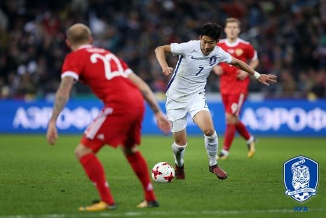
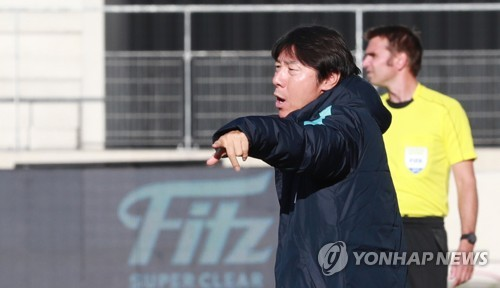

On October 7, 2017, Korea lost against Russia (2:4). On October 10th, Korea lost against Morocco (1:3). Both games ended in depressing defeats that elicited much disappointments from Korean fans. But what is more disheartening with such results was not the loss itself but the fact that  the Korean national team was unable to put up a good fight. On the one hand, the defense ended up giving too much space to the opponents along with the conceding of goals. On the other hand, the offense did not manage to create enough pass plays that could penetrate the opposing team’s defense..

But why was this happening? The Korean national team has highly skilled players who play competently in European league teams. Son Heung-Min (Tottenham Hotspur) is the Asian super star who scored 21 goals last season in the English Premier League, replacing Cha Bum-Kun’s record of 19 goals in a season. Ki Sung-Yueng (Swansea City), Kwon Chang-Hoon (Dijon FC), and Koo Ja-Cheol (FC Augsburg) are all esteemed players who established themselves as essential players in their European teams. It is safe to conclude that the Korean national team does have players adroit enough to form a competent team. In fact, many Korean football analysts believe that the problem lies not necessarily in the players, but in the Korean Football Association’s management.

\[Son Heung Min dribbling between Russian defenders; Credits: Korean Football Associations\]

To elaborate, a lack of long-term plan, or a roadmap, seems to be what the Korean national team lacks. It is undoubtedly responsibility of the Korean Football Association to come up with a practical strategy that can maximize the team’s strength and hire a competent general manager who can implement it. A football columnist Seo Hyung-Wook suggests that the controversy regarding hiring Gus Hiddink as general manager or keeping Shin Tae-Yong, the inability to find a formation that can maximize national team’s strengths, and the failure to recruit K-League players for international matches all indicate the absence of long term strategy, not to mention administration problems.

\[Shin Tae Yong giving instructions; Credits: Yonhap News\]

2018 FIFA World Cup that will be hosted by Russia is less than eight months away. But if the association fails to provide a specific tactical long-term plan, it will massively hinder the Korean national team from demonstrating its full potentials. What worries the fans is not necessarily the scores. It is the possibility that the association may fail to sufficiently support the team and the players.

Fans of the Korean national team are not necessarily demanding that the team create another World Cup miracle of advancing to the semi-final like what happened in 2002. What we want to see from the players and the associations, however, are some of the practical solutions that can prepare and match Korea to stand against the World Cup giants--be it Germany, France, or Brazil. And we believe that the Korean national team can and will find a way to resolve current crisis through, and only through, valiant efforts to take appropriate measures within the realm of management.
