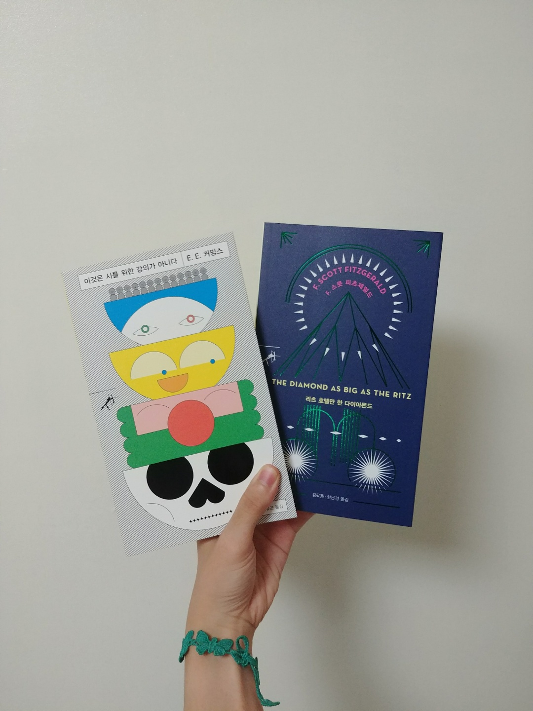

I would define the ‘classical’ as something that I return to after a long wandering. My example of ‘classical’ things would be the film ‘Wall-E,’ which is what I watch after going to the movies a couple of times per month to watch a series of brand new box-office films. Another ‘classical’ thing is the 1980s Korean rock music that I listen to after listening to trendy popular songs with similar melodies for a while.

The story goes back to my freshman year when I first used a smartphone. My commuting time took more than an hour. All the way from my home to school, I endured the tiring process by using a smartphone. I even missed a stop that I should get off because I was watching a video or playing a mobile game. But all of a sudden, fidgeting with smartphone became a mundane thing. Mobile contents were fun, but I became tired of them because of their shallow and flashy characteristics.

These days, I ride the subway with a book on my hand. Pocket-sized books are especially great commuting companions as they are small and light. Even when I go standing all the way, reading is not that difficult with pocketbooks. Unlike smartphones, it neither hurts my wrist nor dries my eyes. Some book publishers paid particular attention to this new trend--books coming back to the attention of subway commuters--and presented new pocketbook series.

Sson-Sal Moon-Go, published by Min-Um Sa, is one of the most successful Korean pocketbook series so far whereby Min-Um Sa is one of the major Korean publishers. Sson-Sal Moon-Go, which means swift arrow book series, was named after the publisher’s symbol. A man is aiming an arrow at the symbol. Min-Um Sa explains that they named the series as a swift arrow because this series is going to introduce books that are light like an arrow but hit the reader's mind as if an arrow hits the bull’s eye.

The books in the series are not long nor expensive. They are about 150 to 200 pages long and the price starts from 5800 KRW. In the series are Hermann Hesse’s “Peter Camenzind,” Edgar Allan Poe’s “The Black Cat,” Kim Seung Ok’s “A Cup of Tea,” Andre Gide’s “L’lmmoraliste,” Franz Kafka’s “Before the Law,” and more.

Among these 29 Sson-Sal books, I bought E.E. Cummings’ “I: Six Nonlectures” and Scott Fitzgerald’s “The Diamond as Big as the Rits.” These two books carry the Sson-Sal characteristics. “I: Six Nonlectures,” which is a book that contains six lectures at Harvard University, was published in Korean for the first time. Cummings shares his stance on the role of art in these six unconventional lectures. “The Diamond as Big as the Rits” is made of five short stories that illustrate the ups and downs of the writer’s life and the turbulent 1920s Jazz Age.

Sson-Sal Moon-Go aims to capture the minds of its readers with books that resonate with a message. In particular, a ‘new’ classical book series, including books from Japan and Nigeria, has always made me ponder for a while as I was walking or on the train. One is Hirokazu Koreeda’s “After the Storm,” which depicts the life of a family after going through painful moments: death and divorce. The other is Chimamanda Ngozi Adichie’s “Feminist Manifesto in Fifteen Suggestions.” In Korean version, the title is “Feminist Mother: Fifteen Ways To Raise A Child To Be A Feminist,” a title that clearly delivers the writer’s intention. I would say these two new books, which I’m planning to read, have not only solidified the Sson-Sal brand but also widened the boundary of the series.
