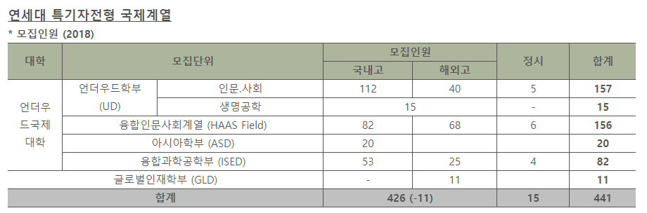

The cold winter brisk of November signals the nearing end of the year. It also marks the beginning of university admissions. As it does annually, the season of university admissions has returned at Yonsei University, with a slight change in its college admissions policy for the Underwood International College. The 2018 UIC admissions policy is now admitting 15 UIC applicants through a newly created admissions system with qualification standards for Suneung (CSAT).

Initially, all UIC applications had a _susi_ admission system, in which no Suneung (CSAT) requirements were needed for applications. Students go through two rounds of examinations. Students are required to submit certain documents for the first round, which are then evaluated and given a score. The necessary documents include the applicants’ permanent high school records, which display their grades, rankings, and in-school activities, and a cover letter, which consists of a 600-word essay in English. The selected students from the first round then go through a second round, in which the aggregate scores of document evaluation and student interviews are measured. 70% of the total score accounts for scores marked from the first round, whereas the remaining 30% reflects students’ performance during interviews.

All high school graduates, regardless of their year or place of graduation are eligible to apply, given that they meet the qualification standards for the Suneung. Applicants should take no less than six Sunneung subjects, which include Korean Language, Mathematics, English, two subjects from Social Studies or Sciences, and Korean History. In order to apply, students taking Mathematics A (designed for the Natural sciences track) must attain a total of Grade 8 or less. Students taking Mathematics B (designed for Liberal Arts students) must receive an added total of Grade 7 or less in four subjects of their choosing. Further requirements include a Grade 3 or less in Korean history and a Grade 2 or less in English.

As a side-note for those who aren’t familiar with the Suneung system, the Suneung currently divides students into nine grades according to their test scores, Grade 1 being the top grade. Since Suneung is based on a relative grading system on a fixed scale, it is not always the case that students scoring 90~100 will receive the Grade 1. Instead, national percentile ranks are taken into consideration and accumulation rates are utilized to divide grades. Scores that receive a Grade 1 nationally rank top 1~4%. Scores receiving a Grade 2 will range until 11%, and those receiving a Grade 3 will range until 23% and so on down the list.

This new UIC admissions policy states that applicants will undergo a similar process of evaluation as do the UIC _susi_ applicants, by going through two rounds of document evaluation and interviews. The evaluation methods are also consistent. Suneung scores will only be utilized for setting standard qualifications and when selecting between students of equal scores. In order words, the Suneung minimal standards will be later applied once the scores from the students’ documents evaluations and interviews are added up.

UIC admissions for aspiring applicants who wish to take the Suneung and become UIC students must have their CSAT scores ready. The admission period lasts four days from December 30th to January 2nd, and interviews will be held on January 13th, 2018. The 15 accepted students will be announced on January 26th of next year.

\[Source: Hana Language Institute\]
