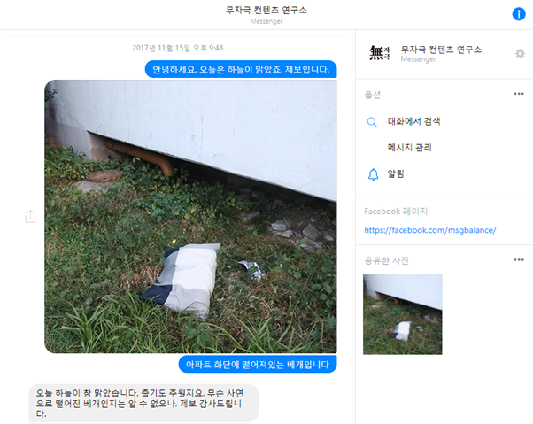

“This is a circular lamp.”

“These are a newly painted arrow and line.”

“These are a sky blue dry rag and a blue tray.”

These are some of the latest postings from the Facebook page ‘Bland Contents Lab(무자극 컨텐츠 연구소)‘. Being one of the fastest growing pages in Facebook Korea, Bland Contents Lab uploaded their first post on June 23rd, 2017. It said, “This is the early evening sky of Jeju.” This was the beginning of a phenomenal Facebook page that now almost fifty thousand people follow. In fact, this bland hype gathered more than five thousand followers in the first week and among these followers, 86 percent were reported to be between 18 and 24 years old. And the source of this statistics? Bland Contents Lab themselves. Occasionally on weekends, they upload the report of their posts. They explore the characteristics of the followers and why some of their posts were not so bland. One of the subjects that they have not yet invested in depth is why people like their page. So this article will look through the possible reasons for the emergence of bland hype.

Many Korean Facebook users have been undoubtedly tired of typical Facebook contents that would attract attention with flashy photos and videos. The Facebook feed of most users is flooding with posts introducing delicious restaurants and must-go places with heavily adjusted photos and speedy video clips. Most of these posts somewhat pressure Facebook users that they should do something to be trendy. Meanwhile, some pages post too many posts per day that the feed ends up being covered with their posts. In fact, Facebook even introduced a policy that if a page uploads more than five posts per day, only five of their posts will randomly appear to respective page followers.

But once you follow Bland Contents Lab, you are freed from all these. Bland Contents Lab shares photos of everyday life, rather mundane scenes. The objects on their photos are quite unconventional in the SNS world. Just like ambient music, photos from Bland Contents Lab are like ambient photos. Photos of wet blocks on the sidewalk, new shower curtains, rainy window, and a doorstopper are one of their most liked feeds. All of their photos seem to be taken by a smart phone. Their unedited photos may therefore seem unprofessional. They might be cropped, but at least no Photoshop liquification and no multi layered filters.

If you are enchanted by this MSG-Free Facebook page, you can write comments about what you felt when looking at these photos. Then, the page will reply. Bland Contents Lab replies all the comments it receives. When someone tags their friend, the Lab replies “Thank you for the recommendation.” On comments that point out why the particular photo was not so bland, the Lab sympathizes with the reason and comments that they will try to better post bland photos. If you wish to share the bland and ambient scene right in front of you, take a photo and send it to the Lab via Facebook Message. They will reply to you and simply say “Thank you for the photo.” On a weekly basis, they upload the selected collection of photos that their followers have sent with apologies to photos that are not chosen. When you interact with the Lab, you will soon be attracted to their comfortingly gentle, yet humorous manner.

Last Wednesday, I sent a photo to Bland Contents Lab. I didn’t realize that I had paid close attention to ordinary scenes of my daily routine until I took this photo. It was a photo of a pillow fallen on a flowerbed of an apartment that I passed by every single day. Thanks to Bland Contents Lab, I felt more attached to such seemingly insignificant objects.

With all these thoughts in my mind, I sent a Facebook message to them. I wrote “Hello, today’s sky was very clear. I have a photo to report. This is a pillow fallen on a flowerbed of an apartment.” And they replied “The sky was very clear today. And cold. I cannot know why the pillow has fallen, but thank you for the photo. Have a good evening.” What a bland, yet warm conversation it was.

\*Bland Contents Lab: https://www.facebook.com/msgbalance/
