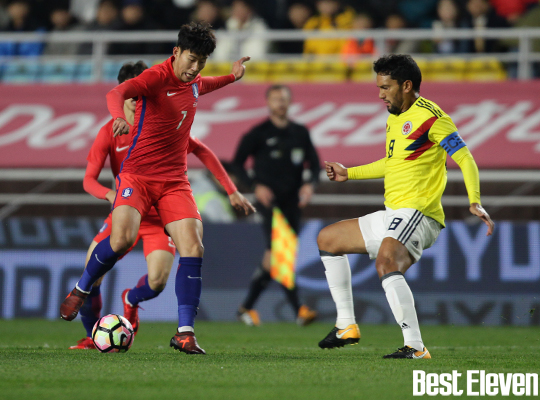
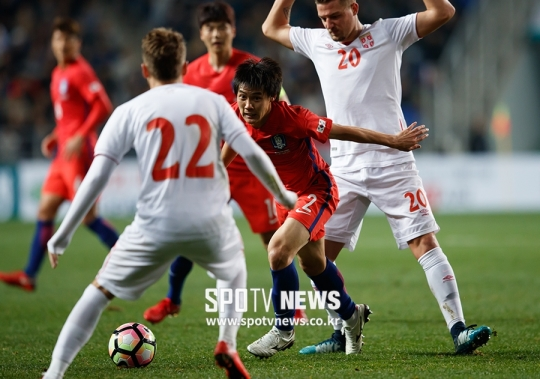

South Korea achieved a resounding victory against Colombia with Son Heung-Min’s multi-goal (2:1). Against Serbia, we could  put up a good fight to bring the game to a tie (1:1). It is surprising how much our national team has changed after experiencing humiliating defeats during the international matches in October. What caused our team to improve so substantially? What could have potentially changed the attitudes of our players?

One of the contributing factors that has improved the performance of the South Korean national team seems to have lied in a change in its strategy and formations. In October, Shin Tae-Yong stubbornly used 3-4-3 formation and emphasized on keeping the possession. The result was a lack of creativity on offense and stretched defense that gave too much space to opponents. Against Colombia and Serbia, however, Shin Tae-Yong abandoned his original formation completely and used 4-4-2 formation. Such formation revived South Korea’s unique style of football play, not to mention fast counter-attacks. Furthermore, by placing Son Heung-Min as astriker instead of a winger, he managed to get behind the defenders with his fast speed and scored with his accurate strikes.

Of course, Son Heung-Min is not the only player who deserves credit for the triumph. Ki Sung-Yeung was one of the star players who took command of the mid-field. With his great footwork and accurate passes, he could escape the pressure in the mid-field and precisely pass the ball to forwards and wingers. He was the essential central mid-fielder who would initiate the attack from the half-line. Kwon Chang-Hoon and Lee Jae-Sung were also among the star players who adroitly intercepted the passes and effectively exploited the flanks as winger forwards. Overall, each player performed his expected role in the match, which led to a highly coherent and powerful offensive plays.

\[Son Heung-Min dribbling against Colombian defender, Credits: Best Eleven\]

Perhaps, one of the most important changes was their attitude. Ever since their poor records against Russia and Morocco in October, players, blatantly put, had nothing to lose. Their fighting spirits were revived, determined to pour out all of their efforts. Consequently, all the players persistently pressured their opponents and won possessions after possessions. Every player seems to have given 110% of their efforts while staying thoroughly active throughout the game.

South Korean national team delivered what fans had exactly wanted to see. Fast and quick offensive plays and coherent passes were what they needed to bring the games to a great and meaningful conclusion. But what really won the hearts of the fans were the team’s valiant efforts. Despite the fact that Colombia and Serbia were much more competent counterparts, our players did not back down and instead put up a great fight. They exemplified the beauty of sports and the pinnacle of sportsmanship where an underdog could still win.

\[Choi Chul Soon dribble between Serbian players, Credits: SpoTV News\]

The team’s results are commendable. But we should not be solely satisfied with them. World Cup involves many other teams with seasoned players and strategies. We must therefore find various other strategies that can maximize our strengths and overcome some of the preexisting limitations. 2018 Russian FIFA World Cup is not far away. Nevertheless, so long as we stay humble with our victories, we will further redeem ourselves and bring even more fruitful results from the World Cup.
