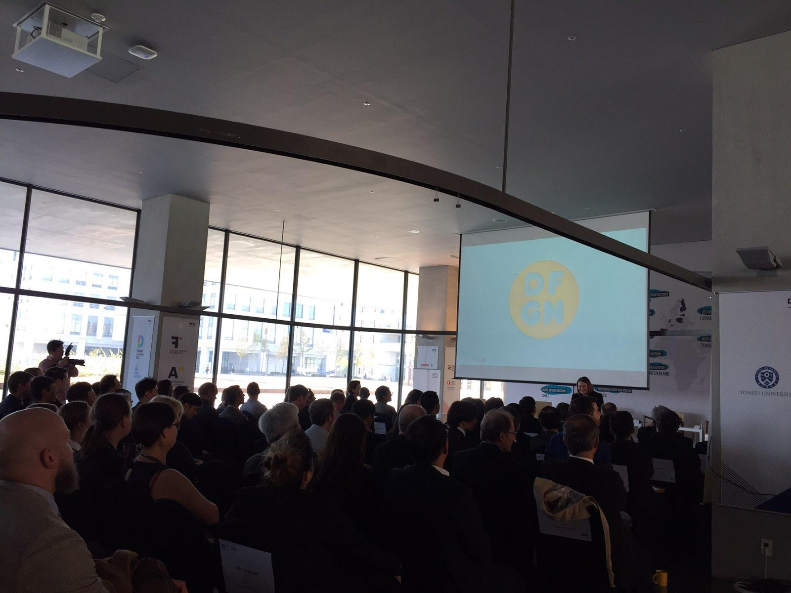
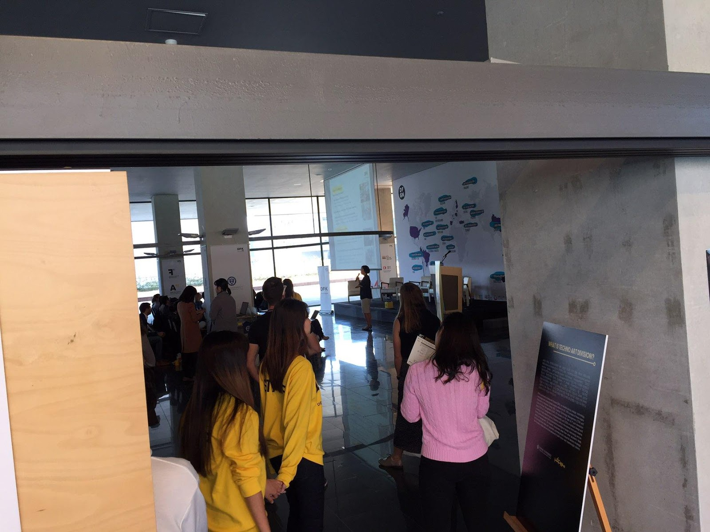
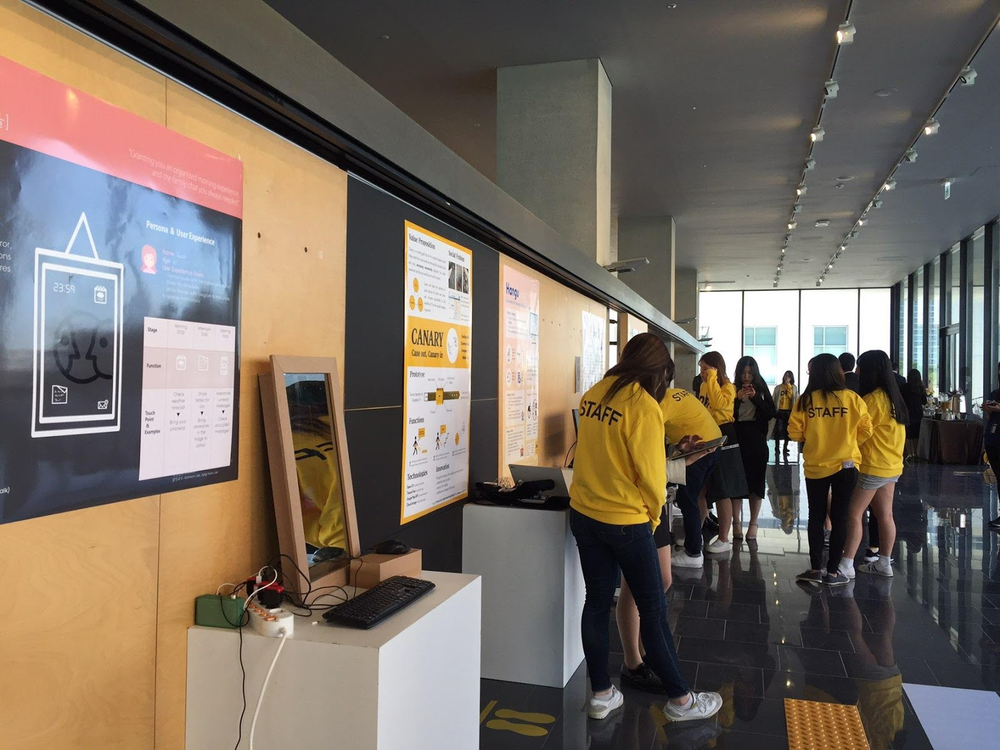

International Design Factory Week 2017 was held in Veritas Hall B and welcoming many UIC students and professors and representatives from Design Factories all over the world. October 30th was the opening ceremony of the IDFK and at 2 o’clock, Professor Jin-bae Chung, the dean of UIC, opened the ceremony with his welcoming remarks.

DFK is anchored by the Techno-Art Division (TAD), an interdisciplinary design, technology, and management program offered at Yonsei University Underwood International College. Through collaboration with the Design Factory Global Network, DFK extends the local projects globally by involving students with various cultural backgrounds and expertise in their field.

In Design Factory Korea more than two hundred fifty students are participating in a number of different projects. Seventeen projects have been initiated and some of the students have been recognized by multinational corporations in Korea like LG. This kind of interdisciplinary education in DFK holds new challenges and brings new education platforms, creativity, and innovation.

Professor Kyung Tae Lee, the vice president of Yonsei University International Campus, explained that creativity and social innovation are key concepts of Yonsei University’s vision and added that “Now, Ban-ki Moon, former UN secretary general, is at Yonsei to initiate his social engagement activities at Yonsei. As part of this initiative, I hope that the IDFW acts as a chance to introduce how Yonsei University is engaging with social innovation activities throughout the campus.” He anticipated the next five days to be a chance to expand relations with other new members of the Design Factory global network to enrich educational institutions for students and create new opportunities for business in academic societies around the world. He thanked everyone for coming and also thanked all twenty-one representatives of Design Factories around the world. Special thanks were given to Professor Jin-bae Jung for hosting this event. He also expressed gratitude towards colleagues from industrial sectors and the government for the dedication that made this event possible.

A congratulatory message was delivered by Hannu Seristo, the vice president of Aalto University. He explained that the Design Factory is not simply a model of modern higher education but is a kind of education that is interdisciplinary, very international and closely linked to reality.  “Design Factories are very relevant to innovative actions and they tend to attract very talented, particularly active and outgoing people like university students who are able to come up with innovative solutions for the whole society, including not only corporations or companies but also the public sectors as well”. Hannu was impressed at how social innovation was very visible in the projects and how the Design Factory itself is a fantastic example of social innovation in the sense that “it is truly global and people get together from all around the world, this time in South Korea”. He expressed his affection towards traveling in South Korea and visiting Yonsei University and said, “I am happy to be with the faculty from the Technology and Art Design Division. I thank Yonsei University and the partners who helped arrange this event including the companies and public sectors”. He wished all participants of the week to have a very rewarding and good week and congratulated everyone on the work they have come up with so far.

The Opening Ceremony of 2017 IDFW was a great opportunity for both the students and Yonsei University. It was motivational for students because they could see their fellow students actualizing their plans in order to make social change. It was also a great chance for Yonsei University to stress the educational importance of social innovation.
