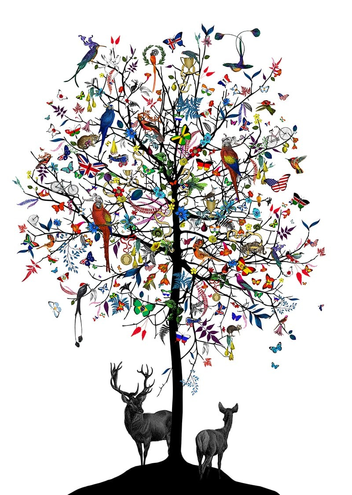

After living in England, the USA and many other places, I have realized how I don’t fit into any of them. Growing up in countries I never really could consider my home made my constant departures an amusing cycle. I would gloriously wave goodbye, a moment I have always been waiting for, and leave another borrowed home behind, and as I arrive yet in another place, a similar situation repeats.

What is my main language? And then what is my accent? It’s not British, it definitely is not Czech and yet it is not really American as I always thought. I guess this confusion contributed to the reasons why people label me “the different one”,  but I would be lying if I said that I don’t like the way no one really seems to know how to describe it. However, many times, it is a painful reminder of the fact that I am isolated from belonging to a certain culture - from having a home. Once again, I am a foreigner. And each time I return back to where I used to live, I have to cope with the pressure of fitting in what I _should_ consider my home country.

The Czech Republic is beautiful. It has many unique treasures, from the country itself to the people who live there. I have learned to appreciate its individual beauty much more whilst living abroad. I often surprised myself as I passionately described a whole variety of things native to the place I lived in - the beautiful Prague and everything you can get there. What surprised me even more, was how defensive I got when I heard some negative comment about Czech or during a silly comparative discussion regarding different countries. And yet I cannot consider Czech my home.

I can’t really recall at what point in life I became aware of the isolation I feel from the culture I was born in and when I started to try and identify myself with multiple different languages and cultures - how I lost connection with my mother language and began to crave all that was not native to the Czech Republic. I know it used to be annoying and upsetting to many, but I decided to embrace the idea that “we can’t decide where we come from, but we can decide where we go from there.”

It's not all about the language; it is the whole package of you that gets judged, your appearance, your behavior, and even your table manners can make you stand out, exclude you from the place you are at or on the other hand, make you feel like you belong there. I have never looked very Czech. Or more specifically, I have never looked as, according to Czech people, how I am supposed to look. “Too white”, “too skinny”, I could go on listing the common remarks I hear forever. The same went on in the US and I heard it all over again in the UK. In England, my eating habits were like any others. In Czech, I was being questioned and observed with exceptional curiosity. Coming to Korea, I both stand out and fit in once again. I am unapologetically white, which makes people form immediate assumptions about me. Because assumptions about me, since your appearance and the language you speak, are supposed to create the image in the head of the one observing you. They can, based on the country or the whole region you look like you come from, recall all the stereotypical knowledge about that one particular area and apply it all to you. But what happens if there is not one single place to allocate you to? I am literally a product of multiple countries, multiple cultures - all blended together into a unique mess.

Nowadays, I see so many people like me around. And our international college for sure has a concentration of students who do not belong to one or even two distinct cultures.People would ask, “Are you from this country?” and people would respond, “No, not really,but I was born there.” Statements like “I am half this, half that” are the most common responses others would give you. However, the issue of stereotyping and labeling prevails. We unfairly get assigned qualities and opportunities based on what our passport says as if it was not enough discrimination for us to enter through different tracks. Are we not truly global?

This issue might be even more important than we can imagine. I bet many students applying for UIC would have never pictured just how powerful the effect of what country is written in their passports is. Officially, students can enter through three different tracks, International students, Overseas Korean and Korean. But what are the distinctive characteristics that sort out students into one group or another? The administration treats you pretty straightforwardly - whatever is on your passport, that is your home country and it either makes you Korean or not. Yet, when you are classified as an “overseas Korean”, what does it mean?

In theory,  it is explained as someone having lived in a country other than Korea his or her whole life, often being born there as well. The student’s parents may have Korean citizenship, but since the whole family have lived abroad for so long, he or she share fewer habits with Koreans than others might assume. The student might not really speak the language. He or she might not feel comfortable within the culture you he or she is in now. No one can erase - not that anyone would necessarily want to - their heritage but people learn quickly to adapt to their new surroundings and easily forget what was before, no matter how proud "before" makes you. But, when someone who lived his or her entire life abroad  decides to apply to his or her dream college, the student is thrown together with all the Korean students and is inevitably held to the same standards. Who cares if he or she does not consider him or herself Korean? He or she still has it written in one of the passports.

Entering college based on the country you have in that little book is indeed many times unfair. Sometimes you are even required to be "foreign" to apply for a certain courses, but then - because of what your passport says- you have to conduct everything in the language you don't even know well. Entering as an international student, I have experienced my dose of discriminatory labeling and stereotypical assumptions, that I can’t speak Korean, I am rude,.. Revealing to people my home country even increases the assumptions and then I have to prove everyone wrong once again. However, I have realized that all three groups - International, overseas Koreans and Koreans - struggle together. We, as international students, get labeled "woegug" to further show the professor how different we are, but who distinguishes the rest? Being a foreign "Korean" makes you appear like you have to know it all; because you visually (and based on your documents) fit in. It is generally assumed you can speak Korean fluently and you know all about the country, its history and the people. No matter where you say you are from, it is weird if you are not conscious of it.

Can we stop for a moment and think about how twisted this all is? Why do we feel the need to hold someone up to certain standards based on where his or her passport was issued? And what does international mean? Even now, in the age when nothing seems impossible, in an age where we even recognize the third gender, we still cannot be truly international. And I really want to be. I want to be the citizen of the world - not bounded by one country's borders anymore.

 

