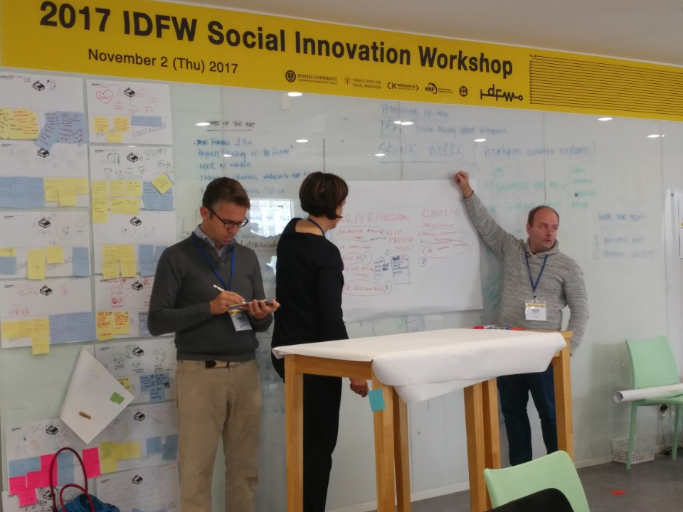

During the 2017 International Design Factory Week (IDFW) at Yonsei University’s Songdo campus, the Design Factory Global Network (DFGN) held one of its sessions on November 2nd. Anita Kocsis, one of the Design Factory directors representing Melbourne, Australia, said that the goal of Design Factory, which consists of students, faculty, and industry partners who share a passion for creative learning and efficient problem-solving, was to “come together all ways, to re-energize, share practices, and together decide what’s next.” During an hour session from 11:30 to 12:30, the directors worked on a creative exercise to discuss what the DFGN would look like in the distant future.

Out of eight tables, each table had a different scenario. Four to five members assigned to a table discussed and initially made notes of the topics. Then, the directors rotated from table to table, contributing new ideas to each different setting. The topics were fun and creative: What if Design Factory was a university; what if you were learning for 55 years? What if 90% of all education was digital—supported by AI? What would DFGN’s network look like then? If life-long learning is a norm, what would education look like? The directors were told to not feel limited by present conditions. The objective of this exercise? To have fun, gather as many ideas as possible (with a little future forecasting), and produce a fruitful workshop.

With three other directors, I sat down at the table discussing the topic “life-long learning is a norm.” Some ideas that popped up were that education needs to be democratic to all, and available from cradle to the grave. Non-competitive, cooperative learning should take more form. Shorter “in-between” programs, including intensive seminars lasting a few weeks, should be made for students willing to break free from their average four to six consecutive years of college, to develop or learn other skills.

Ten minutes later, we moved to the next table to discuss measures to extend DFGN’s influence. Ideas of producing a DF broadcasting channel, making a new home in Africa, and further establishing operational branches were brought up. Some tables presented the “crazy” idea of establishing a DFGN university, which would accept both conventional students and life-long learners. The university would have no holidays and a very flexible system. The directors imagined a future where a 20-year-old and a 60-year-old would together work on projects in a creative space. Another table, understanding the technological push, discussed ideas to harness technology to DFGN’s advantage—the future could be that Design Factory is installed in our smartphones! Programs using augmented reality (AR) could become a reality and directors contributed ideas to develop digital DFGN programs, by producing online courses (like MOOC).

Other tables thought of new professions that would accompany the futuristic activities. Mindful of the dystopian view that our knowledge could well be injected into robots, leading to a decrease in the number of available jobs, directors discussed the need for more world peace activists and more animal kingdom coordinators, well-being analysts to keep us on the right track on creating a better world. Virtual world tour guides, were also a potential profession, for DFGN to work on virtual “hugging points.” (Hugging points, representing the culture and values of DFGN, are specific locations where people can engage in cooperation and conversion.)

At the end of the interesting workshop, I interviewed Anita to gain a director’s perspective on the conference. Her responses reflected the passionate spirit and positive energy of the workshop. When asked which activities from today she would like to run in the next few years, she responded: “Anything that empowers \[students\] to become the change-makers, because they are the drivers of their own education.” She would also like to put the academics to work better. She was especially interested integrating education with mobile technology to make education more accessible. I then asked her whether she sees the “crazy” ideas from the conference coming to life in the foreseeable future. “We were crazy when we said we would have 50 design factories a few years ago, and now we have 20. So we’re almost there. Out of crazy ideas, if you have a passion for it, \[you\] just do it.”
