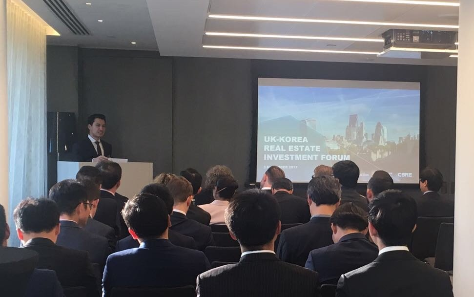

1\. Please introduce yourself (student year, major, the location of your current work, etc.)

My name is Daniel Woehler. I graduated from UIC in 2012 (class of 8.5) with a major in Economics and a minor in Business. Straight after graduating I started my career at CBRE in London, and have been there ever since. CBRE is the world’s largest real estate consulting, investment and development company. I am an Associate Director within the Investment Properties team, advising institutions such as pension funds, insurance companies and investment banks on investing in commercial real estate. I do that for London, the UK, and continental Europe.

If you’re interested to learn more about CBRE have a look at the 2013 Global Career Tour, which visited my offices in London: [https://uic.yonsei.ac.kr/main/academic.asp?mid=m03\_05\_03](https://uic.yonsei.ac.kr/main/academic.asp?mid=m03_05_03)

2\. What projects or tasks are performed in a typical week of your job?

There are few typical weeks, but generally I look after a number of international clients, among others, various from Korea. Because of the time difference, I spend my mornings on client calls, catching up on current projects or bringing new opportunities to them. The afternoon is spent mostly on client meetings or inspections, preparing financial and other strategic analyses, presentations and reports, and liaising with other advisors including legal, tax and technical. Travelling fortunately is limited to a few trips to Asia and continental Europe every couple of months.

3\. Why did you choose the career that you are currently in?

I always had a passion for real estate and when I was younger wanted to become an architect. However, I also liked business, economics, and finance; hence majoring in these subjects. Real estate is where I could combine those interests. After interesting internships in architecture, accounting and consulting, I started looking up the largest real estate companies. I had a few options, but decided to work 3 months with CBRE in Germany in the PPP (public private partnerships) team, which was a great first experience and led to two more internships with CBRE in Paris (Debt and Structured Finance) and London (Investment Properties), followed by an attractive job offer.

4\. If you had to choose one essential skill that is critical in order to succeed in the workplace, what would it be?

I’m not sure if there is one skill that is so much more essential, rather it is a combination of skills that are important. If I had to bring it down to one though, I would probably say that you need to be forward thinking and proactive. Everyone can work hard and efficiency comes with practice, communication and presentation skills as well, but if you are not thinking ahead and anticipating the needs of clients, colleagues, your boss or business, then you are likely to stay where you are.

5\. How did your UIC experience prepare you for your career (previous internships/ school clubs at college/ study abroad programs, etc.)?

I was in the student council, UGC (Underwood Global Community), UVE (Underwood Vision Ensemble, VOIS (Visionaries of International Studies), MADE (Major Assets and Development of Equity), and the UIC Student Ambassadors. I think I joined pretty much all the English-speaking clubs that one could join at the time. I don’t think it necessarily matters which club you join though, but what you do within those clubs. It’s great being a member, contributing and participating, but if you have an opportunity to take on additional responsibility, initiate and lead a project, or manage the activities and members of an organisation, I think that’s what prepares you the most for your career. At work you’ll be given and you have to look for responsibilities from day one. If you got experience taking responsibility and creating excellent outcomes then that’s the best preparation for a successful career.

I also went on exchange to Paris for a year, at a school called ESCE. In retrospect, it doesn’t really matter which country and which university you go to, but you really need the foreign experience. I think the three-campus exchange is a unique opportunity to experience other Asian countries, especially if you intend on working in EMEA or the Americas, but Yonsei has great exchange partners everywhere. I chose Paris, because I knew I wanted to work in Europe and was always fascinated by the city. It also helped me getting another internship there. If you want to work in a particular place or just want to know another culture / city / country, then I highly recommend an exchange. It’s not an opportunity that comes around very often.

6\. As one of our alumni, please give us some of your advice and/or recommendations regarding UIC student life.

If you are an international student that doesn’t speak Korean, make sure you learn Korean and become fluent at it. You never know when you might need it in your career. It will also make your stay in Korea and at UIC more exciting and enjoyable.

Secondly, do go on exchange if what I said earlier appealed to you. It’s highly unlikely that you’re going to get the chance to take out a year of your life again after you start work. If you do go on exchange, make as many new friends as possible from all parts of this world. You will learn a great deal about other cultures and their best practices which you can apply wherever you’re going. Moreover it’s nice to have friends and a home everywhere in this world.

In terms of clubs, I personally think it doesn’t matter which club you join as long as you take an active role.

As for classes and professors, I think they’re all good and I would rate them on par with some of the best lectures I have attended while on exchange or during my Masters.

I am obviously biased towards Economics as a major, but it’s certainly a more widely known and demanded subject in Europe than e.g. International Studies. ☺

Please do not hesitate to reach out to me anytime if you have any further questions. My email address is daniel.woehler@outlook.com.
