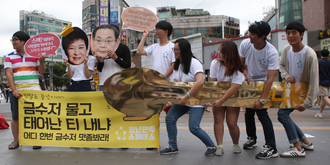

**What is Cryptocurrency?**

A cryptocurrency is a medium of exchange that uses cryptography for security. The revolutionary block-chain technology that serves as its backbone  enables information to exists as a shared — and continually reconciled — database.  Despite its transparency and incorruptibility potential, being decentralized from central banks and government manipulation makes the cryptocurrency market fertile ground for money laundering and tax evasion.

The cryptocurrency craze came to South Korea in mid-2017. Tempted by quick hot money, various South Koreans took advantage of a largely unregulated South Korean market to invest heavily on cryptocurrency. Even though the technology behind cryptocurrency is fairly new and complicated, one does not know how cryptocurrency works except for the law of demand and supply to make money from it. Between late 2017 to early 2018, increase in demand pushed the value of cryptocurrency in South Korea to 30-40% higher than global average. Promptly, South Korea became the third largest cryptocurrency market in the world.

Despite limited fund, young people, especially college students, account for a large majority of cryptocurrency investors. When the cryptocurrency market plummeted due to South Korean government’s announcement of a plan to regulate this market in January 2018, it was young people who invested their life-savings into altcoin that suffered the most. Just  one month after the announcement, students’ suicide news flood the Internet.

The older South Korean generation may criticize young people investing their entire saving into cryptocurrency as lazy and foolish. To a traditional mind, the only way to be successful is through hard work, which renders investing in altcoins just “lazy-clicking”. While it is true that investing in altcoins is a risky business, this desperate action speaks volumes for young people’s dream of changing their lives in an almost “unchangeable” society.  

**Lottery out of Hell Joseon**

Young and educated South Koreans understand the risk of the cryptocurrency market and are perhaps not “out of their minds”. During the “Miracle of the Han River”, the older generation believed that hard work will eventually lead to success. However, the level of inequality in a developed South Korea rose so rapidly that it became extremely difficult to change one’s “spoon class” in a lifetime. The atmosphere of growing up in “Hell Joseon”, an expression that refers to the high youth unemployment, economic inequality, excessive working time in South Korea, suffocates the South Korean youth with the inability to escape from poverty no matter how hard one works.

According to OECD, the youth unemployment rate of South Korea has been rising steadily since 2001 to a record of 10.68% as 2016 statistic suggests. According to an article in the _Korean Herald_, lawmaker Chung Se-kyun from the New Politics Alliance for Democracy claims that “the number of young Koreans aged 15-29 who are out of work would reach 1.16 million, if the statistics include those who ‘gave up’ work, and those who are not actively seeking employment at all.” Adding more to the gloomy picture, it would take somewhere from 20 to 30 years for a fresh graduate of average salary to save enough money to buy an apartment in Seoul. However, success from cryptocurrency investment can solve all of a young person’s problems, turning them from a “dirt spoon” to a “gold spoon” in one night. Therefore, the promise of quick, big profit from cryptocurrency may be the only chance for young people to gamble their way out of “Hell Joseon.”

“Young Koreans in Seoul protest against the government’s labor policies for the nation’s youth population, using a large, gold-colored spoon to criticize politicians and businessmen with prosperous backgrounds and therefore ‘never experienced the difficulties faced by young job seekers today.” (_The Korean Herald_)

The cryptocurrency craze in South Korea reveals the embedded problem of inequality and youth desperation in the country’s society. While the altcoin fever slowly cools down, another fever will arise in near future if the government does not take immediate actions to improve youth employment rate and fix the unequal structure of the Korean society.
