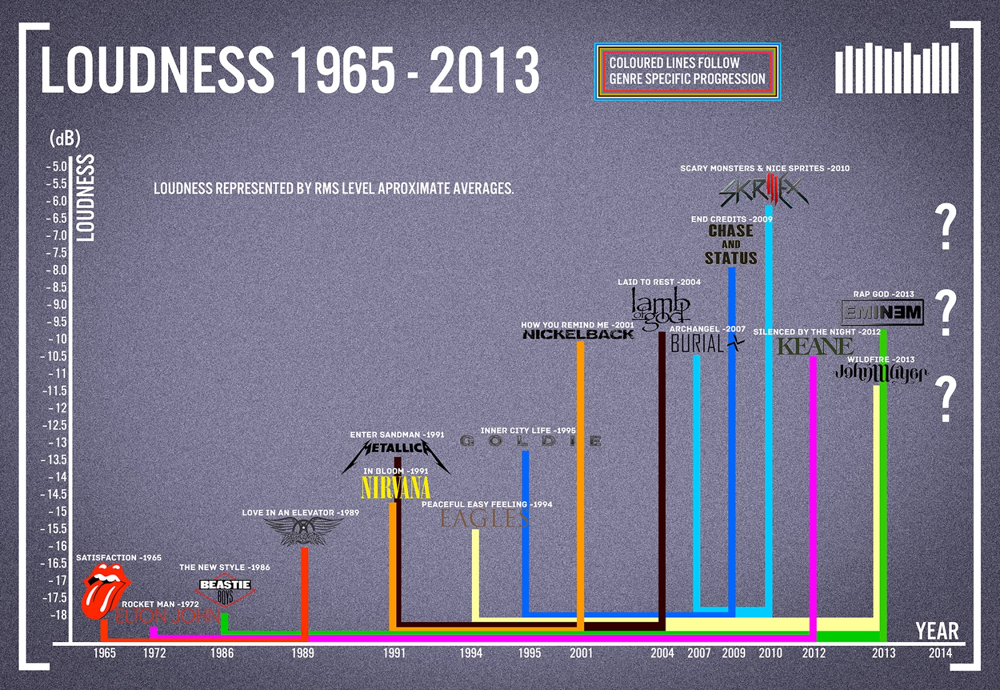
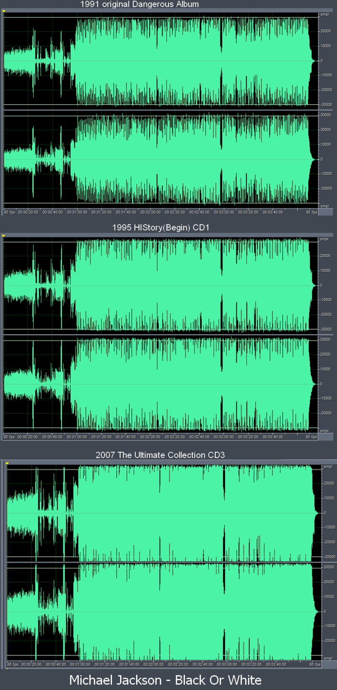

Think of your favorite song, any genre. Chances are that the word “loud” or references to volume are included in the lyrics. Popular musicians have long asked listeners in their songs to “turn the music up” or rejoice in the loudness. Surprisingly, it appears that music producers have been doing just that; the music we listen to has actually been steadily increasing in volume throughout the years.

Even before the advent of smart phones, the sight of people plugged into the world of music was ubiquitous. From the old school days of tuning onto radio stations,  carrying around CD players and MP3 devices, to the now commonplace use of online streaming services or video hosting applications, technology has made music readily accessible given that you have a pair of ears. Yet, just as there are a wide range of genres and artists out there, opinions on what constitutes as good music is very diverse and subjective. Yet one apparent trait of perceived “good” music has been how loud it sounds. This concept has fueled what has now been coined the ‘loudness war.’

\[caption id="attachment\_1160" align="aligncenter" width="1600"\] This graph made by music site Sample Magic shows the volume index measured in decibels  
between 1965 and 2013.\[/caption\]

The ‘loudness war’ stems all the way back to when vinyl discs were played in jukeboxes. Songs that were louder caught listeners’ attention and thereby became more popular, prompting many artists to try to master their records with more intense volume. By the 1950s, producers were altering their songs to jump out among others in hopes of attracting airtime by radio stations. This alteration process involved entailed the ‘sacrifice of dynamics’, a piece of musical jargon referring to variations in loudness. Quiet parts were made more discernible, while loud parts were brought up to maximum levels. The ‘sacrifice of dynamics’ process yielded a difference in demands and sales which could not be ignored. This spurred many artists in the 60s and 70s to insist that their most popular songs be remastered to be louder and catchier. Unfortunately, vinyl discs (the popular medium for music at the time) limited the extent to which the music could be tweaked.

In the 1980s, the world of music saw the advent of something which would revolutionize the ‘loudness war’: CDs. Previously limited by primitive technology, modern digital processing methods allowed musicians greater amount of control over the loudness of their songs. Sound engineers began to use “dynamic range compression” to make the overall song at constant loud volumes. To understand this effect, imagine zooming into a photo of an object against a background. The object becomes larger, more intense, but the object’s contours or contrast against the backdrop are lost. Similarly, songs began to show unpleasant side effects: as more compression is added to a song, the sounds become distorted with buzzing sounds or unnatural noises. Nevertheless, demands for loud music was high and the war waged on. Studies have shown that hit records have been consistently increasing in loudness from the late 80s to the beginning of the 21st century. Furthermore, the popularity of louder music can be observed from every re-release of Michael Jackson’s 1982 hit single _Thriller_ being audibly louder than the previous version. Ian Shepherd, a long-time mastering engineer in the industry, described the phenomena as “a sonic arms race” in which there is constant competition to be the loudest.

\[caption id="attachment\_1161" align="aligncenter" width="800"\] Michael Jackson’s single Black or White, another victim of the Loudness War, displaying  
more compressed waveforms per every re-release.\[/caption\]

This trend has not gone unnoticed by music lovers and have been the cause of growing concern. Some music lovers have complained that listeners are deprived of the artist’s original intentions in creating certain sounds such as contrasting between the soft and forte. The popular heavy metal band, Metallica, had its 2008 release of its _Death Magnetic_ album spark a protest among more than 10,000 fans who petitioned to have the album re-mastered. The album had a second, less compressed version available online, and many had preferred the alternative to the heavily compressed, louder original.

In recent times, the ‘loudness war’ seems to be waning. Streaming services like Spotify or Melon, typically adjust all tracks to be equally loud, giving no particular song an edge in its attractiveness based on volume. With worldwide users of such services expected to reach more than 200 million by 2019, the emphasis may shift from loudness of music to the attitudes of listeners.

Dr. Dre, hip-hop artist and founder of the Beats Electronics brand of headsets, famously cited his motivation for the brand to be that “people aren’t hearing all the music.” He may have been referring to the sound quality of our electronic devices, but indeed, many forego the dynamics and subtleties that give music its complex characteristics. While the backdrop of the commotion in the metro or bustling of the streets may tempt preference for louder music, dynamic range is an aspect that can open up your ears to new delights in music.

The same applies for many other aspects of our lives. Often, ‘loud’ issues or public opinions divert our attention away from the less noisy, but crucial voices of society. We tend to put all our focus in roaring matters and forget the minute details in life that are truly meaningful. There is a great variance in tackling our problems and going about our lives, but stubbornly focusing on the ‘loud’ may result in solutions akin to one-hit wonders.
