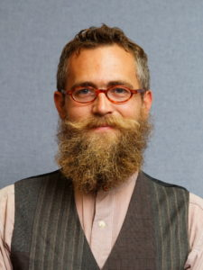

**Could you briefly introduce yourself?**

My name is Bennett Holman, and I’m an assistant professor of the History of Philosophy and Science. I was born in Detroit, Michigan. First started studying psychology and then somewhere along the way I got really interested in more foundational questions about how we know what we know and it turns out that's not a question you can ask in psychology but it's a deeper question about what philosophers call epistemology, which is really just a fancy word for the Study of knowledge. So, I actually spent a couple years bouncing around traveling and just reading a lot and trying to figure out what I wanted to do with my life and eventually I found philosophy and it has brought me here.

**Are there any interesting facts about your name? Because Professor Ratnapalan shared the meaning of his name and that was interesting. Do you have something like that?**

I don't know that my name has any particular meaning. I do know that it's not a common one. It's more common for a last name, Bennett. And it was a compromise between my mom and my dad. My mom wanted something that was more common name and then my dad wanted a weird name and so they compromised on Bennett because it could be shortened to Ben. That's why I grew up my parents called me Ben until I was fourteen or fifteen and then I decided I really liked Bennett as a name. And so now my whole family still calls me Ben but they're the only ones.

**What were you like as a university student?**

Well the first two years I was in university, I was at community college because I did not do very well in high school. In fact, I left high school early. And so, I spent the first two years working full time to support myself in going to college. So, I was tired as a university student. Then, my last two years, I transferred to the University of Michigan. And I don't know, I would say I was kind of nerdy. (Laughs) I hung around with a lot of people who were very into the thing that they were studying and our idea of a fun night was like sitting around and playing board games. But I mean just a really interesting group of eight people that I lived with in college. And I think three of us are professors now and the other people are doing a bunch of interesting things. One woman found an educational company. Another guy's like the president of like a soap company, an industrial soap company. Matt, my best friend is an environmental Engineer. Just really interesting people that were passionate about what they're doing. If you find people that are passionate about what they're doing, they make good friends.

**Your friends’ careers are diverse. Were they from the same major?**

No, I think everyone was from different majors. So, my roommate Matt was a physics major and I was studying bio psychology. I think Victor was a biochemist. We had a philosopher. It wasn't new though. And someone was studying library science and studying biblical studies. So, were all sort of all over the map on what we studied. The reason we met was actually because we all hung out at the same café.

**How did you gain enthusiasm towards Philosophy?**

As I said, I was I was doing a PhD in psychology at the time. And I knew that psychologists valued quantitative research that used statistics over qualitative research. And I didn't really understand why and it seemed to mean that there were a lot of sociological reasons. That had nothing to do with whether or not qualitative research methods were reliable. And so, I wanted to investigate the sort of the foundations of the research methods that my discipline used. And generally speaking you can't do that in the discipline you're in. Like when you're in an academic discipline, the discipline has the tools that it has and you learn what those tools are. But you don't really spend a lot of time thinking about “why these tools and not some other set of tools?” Furthermore, asking why these tools and not some other tools is typically not a research topic within that discipline. It certainly wasn't in psychology and so I just I was dissatisfied with the way that psychology did research and so I wanted to take a step back and think about why we use the research methods that we use. So, I stepped out of my PhD Program and took a master's degree. And then just kind of like traveled around and read a bunch. So, I'd work short term jobs for a couple weeks, save up some money, and then quit and read a bunch. So, I was reading a bunch of different disciplines trying to find something that was interesting and that I was passionate about and trying to figure out sort of how to answer this kind of question and it led me to reading philosophy, philosophy of science. And when I found that as a topic. It  just really resonated with me just. I don't know, it just fit. And I remember the first book that I read that really grabbed me was Kuhn’s Structure of Scientific Revolutions. These are like all the kinds of questions that I was thinking about in an unstructured unfocused way and all the sudden there was like someone else that was thinking about the same kind of topics of what is the larger structure of science and how does it work and then I read Karl Popper and then some of the other famous philosophers of science in the twentieth Century. I was just hooked like this is the stuff that is the most interesting to me and the stuff that I want to work on. And so, I got here.

**How did you discover Korea and UIC? What made you decide to work here?**

The nature of the academic job market is such that you don't really get to plan a lot about where you're going to live. An average graduate student will apply from anywhere from twenty to a hundred jobs and a lot of time you’re just hoping to get something. And you know I was really just really hoping to get something and I wasn't sure that I was going to have a job, that I was going to be able to do philosophy professionally. And the thing that I feared would be that I would end up in a small college in a small town with students that didn't really care about school and learning. And in a job that required so much teaching that I didn't have time to do research which is another thing that is really a passion. And so, when I got the job offer from Yonsei it was the opposite of everything. Because of Young's his commitment to students, they allow us to have lots of time for research but then also I teach two classes a semester and my classes are kept at twenty five students which means that I get to spend a lot of time on every student and interacting with students and have small group discussion rather than just have a lecture class with four hundred people and I never get to meet my students. So just for example, the papers I'm grading right now for my science and society class. I'm spending somewhere between forty minutes and an hour and a half on every paper. Going through reading it, thinking about what the student is saying, giving them feedback about how to improve their paper. And if I had a hundred students I I wouldn't be able to do anything like that. But because of the kind of environment that Yonsei creates, it allows me to really engage with my students and that's wonderful. And then on top of that the students themselves are smart and hardworking and excited about classes so it just makes for a wonderful teaching environment and then finally rather than being stuck in some small little city in the middle of nowhere I mean one of the world class cities in the world I get to travel to places I’ve never been to and experience a culture that I'm still learning about so it’s an incredibly exciting and wonderful job.

**What is your typical day like in Korea?**

On my typical day, I wouldn’t be teaching. I wake up early in the morning.. It’s not going to be a very exciting day. (laughs) I wake up in the morning and I make coffee. That's first thing. I do academic work for a couple hours and this might be reading or it might be working on a paper that I'm writing or grading. Then, I have breakfast. And then I go back to work. And then I have lunch and then go back to work and then I have dinner and I go back to work. So, especially right now in my career, two things are going on. One thing is that I'm really passionate about what I do. And it's important to me and it fills me with the sense of meaning. So, It's the thing that I want to do whenever I can do it. And I'm working on a bunch of projects that I think are really exciting right now. And so It's hard to put that down. Now this being said, I'm still trying to find work-life balance and I don't have that right now. It is just work. I try to take time off when I can. But a lot of times I just work.

**So, what do you do in your free time?**

I really like backpacking, hiking, being out in nature. For example, for a honeymoon my wife and I hiked three hundred miles of the Appalachian Trail. And just being out in nature and just sort of letting all of the craziness and hectic mess of the world just sort of fade away. When you’re backpacking, life becomes so simple. You wake up in the morning, you make breakfast, you take your tent down and all you have to do for the rest of the day is walk and eat and put your tent back up. (laughs) I can be very strenuous and stressful and a lot of a lot of ways but on the other hand you kind of have a single thing that you need to focus on and you don't have to juggle a bunch of things all simultaneously. And that's just refreshing to be out in nature.

**Have you visited any hiking spots in Korea?**

We have been hiking around in the mountains behind Yonsei international campus and Seoul campus. And then we've done some hiking at some of the national parks around here but I don't remember what their names were.

**I was told that your wife is also a professor. Is that true?**

She has taught here. She's not currently a professor but she's been an instructor for some of the courses here, RDQM and also a course on Food System.

**I believe that your most recent research interest is ‘Scientific Evidence and Industry Funding on Medical Research’. Have you always had an interest in this field and could you share how you were inspired to pursue the research?**

I certainly haven't always had an interest in the topic. I became interested in it because I was looking at the case of antidepressants and depression. And I wanted to know why people were more likely to be prescribed antidepressants versus sent to like talk therapy. And this was a case where I thought, going into it, what I thought the answer would be something like in the in America you have a third party payer system where an insurance company will reimburse you for its health services that you use. And since they're paying for things, they want you to do stuff and they want you to take a cure that works right. They don't want to pay for something that doesn't work because that would be a waste of their money. And so what I thought you would find was that with drugs you could do randomized controlled trials and we think that's like our best form of evidence. But you can't do double blind randomized controlled trials for talk therapy because you can't have the therapists not know if they're giving therapy. And so what I thought would be the case with was that you have a situation where you can only get the best kind of evidence for a certain type of therapy. And so that would explain that. I thought that the two forms of therapy would be roughly equal but because of this sort of social structure you would end up with people more likely to take drugs than talk with therapists. So I was looking into that and started looking into the research on antidepressants and.. (laughs) It was like someone pulled the curtain back all of the ways in which industry manipulate scientific research. And when I started looking into that, I was just blown away and I found the topic incredibly fascinating and I’m still working on it today.

**Do you speak Korean?**

Not very well. I speak restaurant Korean. I think I can get by ordering food. But I haven't spent enough time learning the language.

**What about other languages?**

So I do speak Spanish. Passively Well. I can get by and have a polite conversation, I can ask question. But  I could not do philosophy in Spanish. (laughs) Actually that's one of the things that I'm so impressed by my students here. Philosophy is hard enough in your native language. So the fact that I have students who are engaging in philosophical discourse at the level that they're doing in a language that isn’t their native language blows me away every time. I have a hard-enough time doing it in my own language, so the fact that students are doing it in the second language or a third language is very impressive.

**What are your UIC students like? What do you expect from them?**

I'm still learning the sort of cultural norms regarding it's formality for example. So for example I has a T.A. who found it so weird to speak with me in English because if she were speaking to me in Korean, she would be using a different set of words because of my relative position.  And she found it weird to use the same sort of words talking to me with which she would use talking to a friend of hers. That doesn't make any sense to me. (laughs) I understand what she's saying and I can kind of imagine something like that. But I don't feel that way. What I suppose is that there is a certain level of formality and deference that is expected in Korean culture. That is foreign to me sort of by definition. (laughs) And so it's certainly not something I expect. It's something that I try to respect and understand how that affects my relationship with my students. But that's an expectation my students bring to the table rather than something that. So, for example when I taught in the States, I would go by my first name. I let my students call me Bennett. I tried that once here and it just did not work. So, okay, fine. But it just speaks to a different kind of expectation for relationships. I really enjoy getting to know my students, I love when they come into office hours and they talk to me about things that they're interested. My favorite part of teaching my history of science and technology course is the papers that students write because I meet with every student at least once and many students multiple times to talk about their project, to talk about what they're interested in and why they're interested in it. I get to know my students a little bit personally. And I really love that. So, what I would say is that I don't expect any sort of level of formality and it doesn't offend me if students adopt an impersonal demeanor with me. On the other hand, I do understand or try to understand that other students have expectations of a certain level of formality between students and professors and I try to take that into account in my interactions because I want to understand where my students are coming from and to interact with them in a way that makes them feel comfortable.

**Could you recommend some of your works to the UIC students?**

Sure, well I have an article coming up, which is almost set to come out, called The Promise and Perils of Industry Funded Science.  It's a really good introduction and summary to industry funded science. So that would be something that students could read if they're interested in industry funded science. Second paper, which is a working paper but available on my academia at EDU site, is a paper called The Post Truth and The Rediscovery of Bullshit. And bullshit is a technical term in philosophy. Its vulgarity is intended. It’s a paper that tries to understand the sort of post truth politics that have arisen in the past couple years. You know in the United States, in Europe, especially in the United States but also you know in Europe and some parts of Asia, and for students that are interested in trying to understand what post truth politics is all about, that might be something that would interest them. It’s on my site at academia on EDU and the previous one that I’ve mentioned is not publicly available yet but will be available on the same website, before this interview will be published.
