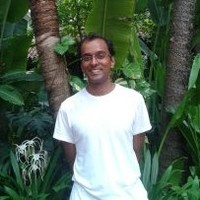

**In regards to your previous interview with the UIC Scribe (which can be found in the Spring of 2012 publication), you shared your plans to learn Korean more systematically. Has there been significant progress in your Korean language proficiency, and could you share advices for the foreign students studying Korean in UIC?**

Good question. It depends on who you ask. If you ask my wife, probably she would say no. (laughs) But she's the one who helped me a lot. Maybe of what I can say to use this question is to talk a bit about why I found it helpful to learn Korean. In that year, 2012, after my first semester, that spring semester, I did a kind of the intense summer classes at the Yonsei Korean Language Institute. So I did the summer school. That’s like four hours a day, five days a week. So I used to commute to the college and then had those classes. And they were painful. (laughs) Because I just taught my first semester in a new country and I just wanted a break and it was my first summer in Korea. And it was really hot since I’m from London where sun never shines. So, everything was kind of ‘jung-shin-i-eop-seo’. But it was really helpful because it really, although I'm not trying to advertise here, I don’t think that anyone at Yonsei needs an advertisement for Yonsei’s own class, but it really gave me a basic grounding in grammar and vocabulary. I wouldn’t say that I have fluent Korean or anything now but after that, for several subsequent semesters, I took evening classes which are a little bit milder with fewer hours. But I had to do them coming home from class in Songdo. So, I had to go back to Sinchon and take the classes for three nights a week. But they kind of added to what I knew and helped me to go on. So those helped me a lot as did and after a while it was just too much, so the evening classes go up to level eight and I did up to level six. I finished level six not because just couldn't make the time really to be quite frank with you, but those really helped me a lot and I recommend them to certainly any faculty member. Especially ones who has come into Korea because it's quite difficult to make time after you've established yourself here and you feel that you've got enough Korean to get by. Well, I first did it, it was hard but it was worthwhile. Since then, I kept up Korea not very well. I tried to pick up vocabulary as I go along. I watch  some Korean dramas. Most recently, I watched Misty. Before that, well you wouldn’t watch the dramas that I watch because I watch ‘a-ju-ssi’ and ‘a-jum-ma’ dramas. (laughs) Oh, do you know that Ko So-young drama? ‘Wan-byuk-han-ah-nae’. That was well made. I watch them with my wife and she'd explain with vocabularies that are difficult.

**Do you have any advice for the foreign students in UIC for learning Korean?**

I'm probably not the best person to ask the question to be quite frank with you because my experiences are so different from theirs. What helped me was probably what they already know, which is just try to immerse yourself in Korean life as much as possible which means as far as possible nothing special but everyday life. For example, I'm Catholic so I go to Mass. So, I go to Korean mass during the weekdays.  On Sundays go to hear the sermon ‘gang-yeon’, an English language mass. On the weekdays, when I can, I go with my wife to Korean mass in ‘Yeon-hee’ parish or one of the other parishes nearby. I obviously go as a Catholic to witness my faith, but also I’m just around that to be Korean environment, a Korean speaking environment. I don't understand everything. I'd be lying if I say that I understand every word. But it helps me and I get to meet people and they get to see me and I get interact with them. And I get to say few words. The ‘hal-meo-nie’s in the weekday masses would be like ‘ye-peo’ (while patting professor’s head) and I ask my wife “does it mean that I’m good looking?” and she says “no, it means your habit is good”. So, you learn little things. (laughs) So, I would say to students as well to go to mass if you can. (laughs) But, in terms of learning the language, just try to be regularly around Korean environment rather than feel the need to do any special things. If there's ways for you to do things in Korean rather than English, try to do it in Korean. For example, I suppose I could have striven to just go to English language services, but because I went to Korean language services, it got me involved in a world that would not have been comfortable.

**You have shared that you have been raised in London as a refugee from Jaffna, Sri Lanka, and currently, you are living in Korea. What is it like to move around to such different settings?**

When I arrived in Korea and for the first period, one of the things that struck me was how culturally homogenous it is here compared to London. So when I went back to Heathrow Airport in London the first time I was back in London a year later I looked around the airport and the first thing I thought was “wow, there are people of different colors and sizes and shapes here”, so it was very unusual. But then after I spent some more years in Korea and especially living in Sinchon, I realized that actually by Korean standards it's extremely and extraordinarily diverse. So, I’d be going around like “wae-gook-in-man-ah-yo-jeum” or something like that. So, you become more attuned. You realize that these things must be relative. So, for Korean people, it must also be quite a drastic change to in the last say ten to twenty years. A lot of people from outside of Korea coming and living. So, of course naturally, I think about things like that and I think about the direction of Korean society. But I also think that my experience as a refugee in Britain, probably my comparison with that here is probably not fair in a number of levels. I've come here for economic reasons I suppose to work here, but being a professor at Yonsei is not the same as being a young refugee going from Sri Lanka to London. (laughs) Better comparison might be those low economic refugees who are working in Korea in factories on the suburbs of Seoul, in An-san or Gyung-gee-do. Also, as you see in Korean television, women from the Philippines and Singapore who married Korean men who got enough money to support them in that very difficult life in rural Korea. Maybe that is, I suspect, the more majority experience of foreigners in Korea because more and more of those kind of workers and those kinds of people live in Korea. That must be a really different life.

**What were you like as a university student?**

I was very shy to be quite frank with you. The system in Britain mainly was that you had lecture style classes which are often large lectures but you also had many more seminars out of classes which was composed of a maximum of something between fifteen and twenty five if I remember rightly. And for most of my university time, except when I became a graduate student and I gained a bit more confidence, I was very shy, hardly ever spoke, and it took me a long time within a class session to get the courage to speak even though I may have things to say. And one thing I can say about that is that it helped me to sympathize a bit with students in my classes now. So I was trying to make a point to students who feel shy to speak after class or I make all these other occasions. I am aware that students who are quiet are not because they don't have anything to say. They often have a lot to say but they can’t say it, and of course added to that is the difficulty in speaking English or things like that. So, I was shy. That would be my main experience as a university student. I had a small group of friends, but didn't say much in class.

**What is your typical day like in Korea?**

It depends on the day whether I'm teaching or not. If I’m teaching, it means that I commute to Songdo. So, I’m up a little bit earlier because of the shuttle bus coming in here. And then after classes I spend some more time here. I come earlier than when I have to teach and I leave later in the day as well to make sure to meet students and if there's other things going on here. In terms of professionally, most of my other time, and this is the same for my colleagues I'm sure, is research which involves reading and writing papers, revising papers, meeting people to talk about our research, giving papers at conferences. Because that's the normal life. It's not special for me and it's not special for Korean academia. It’s probably for all academia all over the world, and it’s getting more intense. You might have heard the expression ‘publish or perish’. That's what it is. You to keep publishing and keep thinking about publishing. So that's something that people maybe outside of academia or outside of the research don’t see. They think college professor just teach class, but in a most of our time is actually, I can tell you from my experience and other people's, thinking about the next paper or the next book or article. But in Korea aside from that I go to Mass in the mornings or try to go somewhere local. And then aside from work, in the evenings, I like to just chat with my wife. We watch the news, we complain about whatever is going on in the world. (laughs) And then sometimes we like to go out and walk around the local area. We don't really go very far. A typical day would be like going to Sinchon and have a coffee. You might see us in the McDonald’s. (laughs). Or sometimes if we feel ambitious, we go to Hongdae. There’s a little café there that we like. We don't tend to go to places that you might associate with ‘wae-gook-inn’, not for any particular reason. It’s just that we’re lazy. (laughs) I don't think I've been to ‘i-tae-won’ for more than a year now. We just don't go to those places. So daily life is kind of very boring and very domestic. (laughs)

**Could you tell us about your most recent research interest (The circulation of Western ideas about science in the late nineteenth century Pacific)? Furthermore, did you always have an interest in this field?**

Probably not just about science but also politics and culture in the pacific.

One of the things I have in common with all my research here is I'm kind of interested very broadly in the humanities. I was trained in history most of my academic career but particularly in what they call cultural history which is a kind of a discipline that brings in what people have learnt in other subjects like anthropology, sociology, social sciences, and so on. And also my doctoral research had a lot of literature although it was a history PhD. I was looking at a literary figure and his ideas about culture. So yes you can say that on one level yeah it does come out in that interest in the human sciences generally. I'm interested particularly in ideas in anthropology. How to define culture, what makes human beings unique and different, and also what are the differences between different human societies. So, I’m very curious about the change in Korean society and British society. Like that, people in the nineteenth century especially westerners who went to the Pacific for the first time in the eighteenth or nineteenth century as they start to study the people there and they had all kinds of theories about what made them different what made them similar. And I’m interested to learn more about that. So, the current work I'm doing is really looking at particularly missionaries who went to the Pacific both Protestant and Catholic, to be focusing at the moment on the Protestant missionary who went to Hawaii. This particular paper that I’m looking at and how his ideas about gained from his religious and educational background informed the way he understood Hawaiian society and culture. That’s kind of my focus at the moment.  My interest in history in general kind of arose as I was a student. When I went into university, I was most interested in English literature to be honest but I did a history degree. But I really was interested in literature and history, and so I ended up doing PhD that was kind of a mixture of both. But I grew more and more interested in the past and I think the main reason really has to be teachers. I had particular teachers at different stages of my academic life. When I was a high school student, I had a very good and very interesting teacher who was very clear in his explanations and I remember taking courses about twentieth century history which I still remember him teaching us about American history and German history so he really imprinted. And then similarly when I was doing what they call A levels in Britain which is kind of a between high school and a university. And among my good teachers there was a very good teacher who taught us the English Civil War. Which has always stuck with me even though I don't look at that period in my own work. I have always retained an affection for that period because of the way he taught it and it made me genuinely curious about the Wars of Religion that happened at the time. And then similarly at university I had a lot of good teachers in different aspects in different subjects that I had took. So as I took those classes I developed an interest in different eras of history and made me more curious.

**What are your UIC students like, and what do you expect from them?**

That's a two way question because students also I can ask what they expect from me, and over the years I've come to see that more and more as a two way question. It is a kind of balance. In every semester, you see that there's a new cohort of students coming and they're different each time. What are they looking for? You're aware that you're growing older and older as they are at the same age of course as they come in at a same age but society is changing. (laughs) But I've managed to understand a few things through my experience about what I want to try to get across to students at least in this present period in their lives. I think with Korean students particularly I want to give them confidence in themselves. I want to help them to be creative. And that could be creative in academic way. Have the confidence to be creative in the different fields that they will obviously go into because this is a liberal arts college and they're doing many different majors or plans of different programs and so on. So I don't I don't envisage most of them will become historians. So, being confident and creative is how I would like to have them leave at least my class. To feel that they've gained some confidence and a sense of possibility in whatever they go into and also I think I'd like them to be positive about the challenges that at least and so to give them some sense of a challenge in my class to give them some sense of intellectual challenge at least which I can give them in some of the works I can provide and to the problems that I can pose. So I want them to experience those challenges because I think it's good for learning and hopefully there will enjoy as well because people like to be challenged. And they'll take away that experience of their own mental models or ideas that have been challenged. I hope they take away a positive experience of that so that they can then confront any other challenges to their way of thinking or doing things in the future confidently.

**Do you have aspirations beyond UIC?**

I suppose there are two ways to interpret the question. One way is to think about do I have any plans to work elsewhere beyond U.I.C. and the other way to think about is what are my goals outside kind of the academic life and scholarship and professional life and teaching of UIC. The first answer honestly is who knows. I'm very happy with the job I have. Especially as I've done interviews for some of my colleagues coming to UIC, I've interviewed them. I've been involved in it. And so I've seen hundreds of applicants for jobs around the world including top colleges everyone dreams of attending. It's really hard to get a job this good. Around the world, it's really hard, so I'm really happy that I'm here. I'm really happy that I have a job and that it's this job. So, beyond that I really don't have any thoughts beyond UIC in that sense. Life in Korea, living beyond UIC, I just would like to continue to be better at speaking the language and integrating myself in Korean society. I think it's a good aim for all my colleagues if it's possible. I know it's harder for some and there’ll be different complications of people learning but I think it's a good aim for all of us to try to integrate ourselves and to try to get a little bit more engaged with Korean society. As you know if you give a little bit you get that a bit as well, and I think the more we can kind of try to be more involved in what's going on here and I don't just mean in the college but also in the wider society. For example, we're quite interested in in the environment here. I think a lot of things can be done to try to improve the way people look after the environment in Korea. I think the steps are being taken but for example recently you may have heard about the problem of plastic bags being used. I think in the news it turns out there's an issue of our number of plastic bags that are accumulated. We really like to raise awareness that plastic bags create a lot of environmental degradation. They go into the soil, they damage the soil, we all are eating bits of plastic now apparently because of this, animals get caught in them and they die. So I think that we can improve awareness of reusing plastic bags or using biodegradable bags or trying to trying to use cloth bags when we go shopping and things like that. So I mean these are just ways in which we can try to be more involved in Korean life in a practical way. If I talk about aspirations beyond UIC, I would like to be more engaged in that way.

**What motivates you as a scholar?**

It’s such a good question. As I've become older as a scholar, as I gain experiences as a scholar as a somebody who does research and things like that. I’m motivated by lots of different things. For example  I am motivated by the experience of teaching more and more. Besides teaching yourselves and university students, I also with my wife for example teach very young children in a catechism class in the church class. Nine year olds from eight to ten on Sunday mornings in the English language parish we go to. So there will be Korean children who speak English or foreign children like Nigerian children, Italian children, and all kinds of children who go that parish. So that is hard. That's really hard to get their attention for one hour a week is hard work. (laughs) And so I learn from experiences like that about how to refine the way I think about my own work and how to express it better. I've become more interested in how to deliver the work that I've done in a way that's easier for people to understand including not just written work but spoken presentations, lectures, and things like that. So I'm motivated really by a lot of things going around me to be honest. I could say that I’m motivated by also higher aspirations and stuff like that, but day-to-day life motivates me as much as anything like. And besides that I want to be, I'm sure I'm the same as all my other colleagues, be committed to progress of truth in my particular line of work, to try to be committed to that, I suppose, to the truth. We fail but we try.

**Could you tell us more about your teachings in the Parish?**

In the catechism class, so they’ve had their first communion. Specifically a number of weeks we teach them the ten commandments and then after that and we're in the middle of doing it now the Beatitudes So those are what we're actually teaching. That's the actual core counting for our class.
