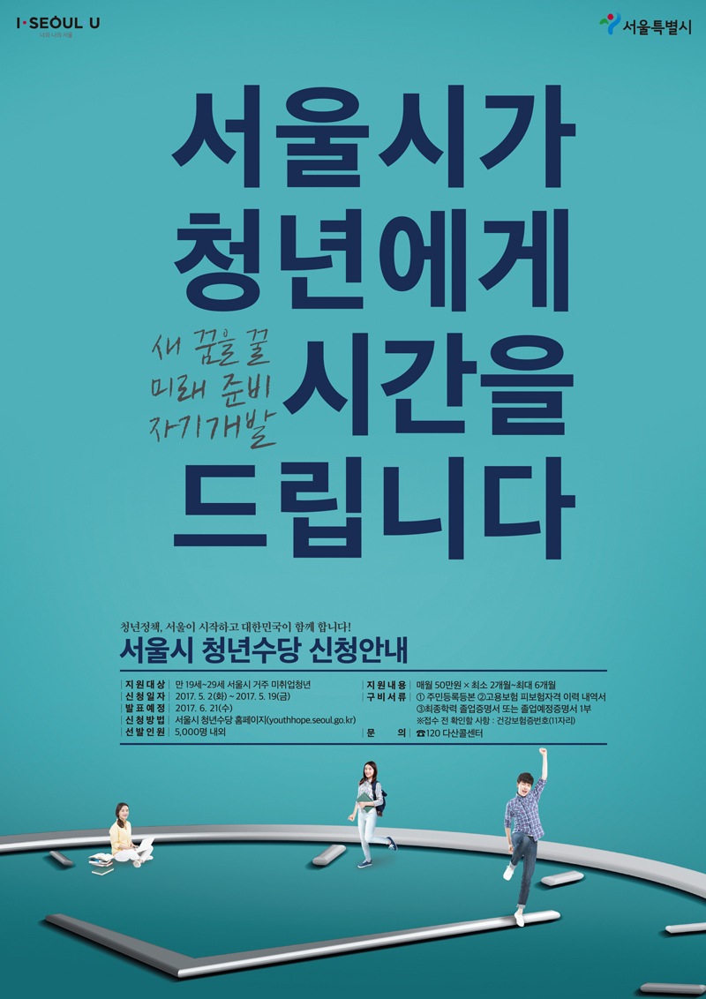

Compared to the past, the Korean government has been paying more and more attention to the welfare of the youth. As a result, two main policies have been implemented - Youth Allowance and Youth Dividend. There is a need to know more about these two policies, since they may be the first step towards true welfare for the youth.

Youth Dividend is a cash program that was enacted in Seoul in 2015. It basically gives unemployed people in their 20s monthly subsidies, with the goal of providing them financial assistance as well as encouragement to overcome their hard situations. The financial assistance given is approximately 500,000 won each month, for a total of six months. However, not all people in their 20s can be a recipient of this program. One has to fulfill four conditions. He or she has to be between the age of 19 to 29, unemployed or without income, or with income under 150% of the median, and has to have lived in Korea for over a year. Among the people who satisfy all these conditions, a portion of them are selected according to their social and economic environment as well as their strong will, which candidates display through the application. If their living environment is poor and their will is strong, they have a higher possibility of being selected.

Youth Allowance seems like an ideal policy. Advocates say that youth allowance teaches teenagers and adults about finances, responsibilities, and consequences that come with money. Also, since it lessens financial burdens, it allows teenagers to go to school rather than get jobs to make ends meet before graduating high school. As a result, it leads to higher rates of students attending school. In 2006, high school completion rates were 59% for students from low-income families compared to 78% for higher-income students. This shows that providing financial assistance for students from low-income families may allow them to attend school and provide them with more opportunities. Furthermore, a majority of students claim that the policy brings about huge positive effects. According to the 2017 participant analysis study of Seoul’s Dividend system, those who responded that the allowances helped them extremely jumped from 18.9% in 2016 to 68.7% in 2017. However, opponents claim that Youth allowance is a waste of tax. It is unclear how money will be used by the recipients, and there is possibility that the extra sum may be used for unnecessary or illegal activities. Moreover, the youth could become too dependent on the government.

Meanwhile, Youth Dividend is a policy providing a set amount of money to the residents of Seongnam of a certain age every quarter. It was first proposed in September 2015 in Seongnam, Gyeonggi-do. In order to be a recipient of Youth Dividend, one has to be a 24-year-old who has lived in Seongnam for at least three years. At the moment, only 24-year-olds are eligible, but it is said that the city’s government will gradually expand the age range and make it from 19 to 24. The policy’s objective is to enhance the quality of youth’s lives and encourage job seeking activities which then will contribute to the local economy. One of the main programs is 성남사랑상품권(Seongnam Love Gift-card), which is giving the youth a gift-card which is worth 250,000 Korean won, once. The local aid is distributed to help traditional markets and small businesses, and can be used in over 7000 stores and services in Seongnam city.

Youth Dividend also faces controversy. The advocates say that it represents a ‘pre-investment’ in young people who will continue to work hard in the future. It also stimulates the local economy by utilizing money that can only be used within the city. However, opponents say that it does not have much of an influence in young people’s lives since the amount of money is not enough to support their everyday lives.
