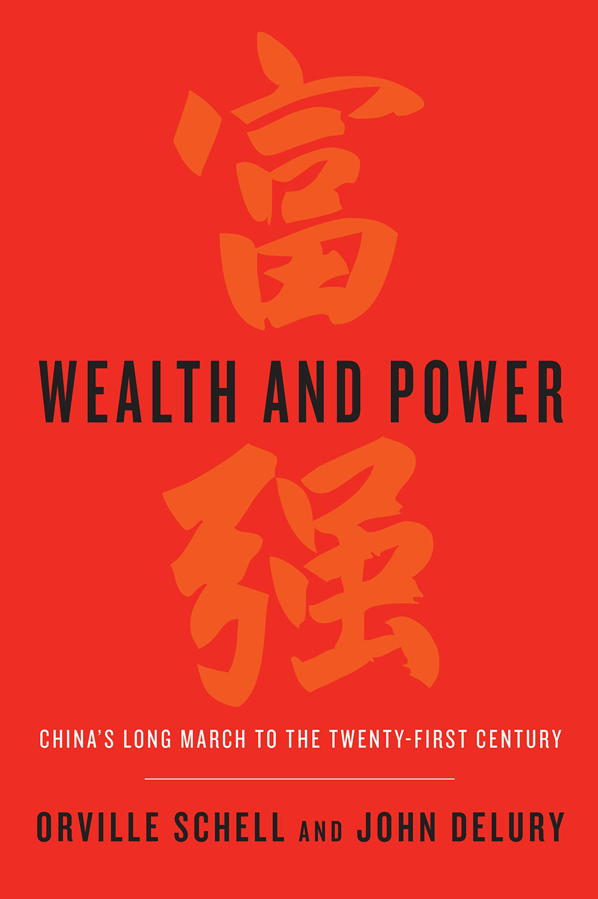
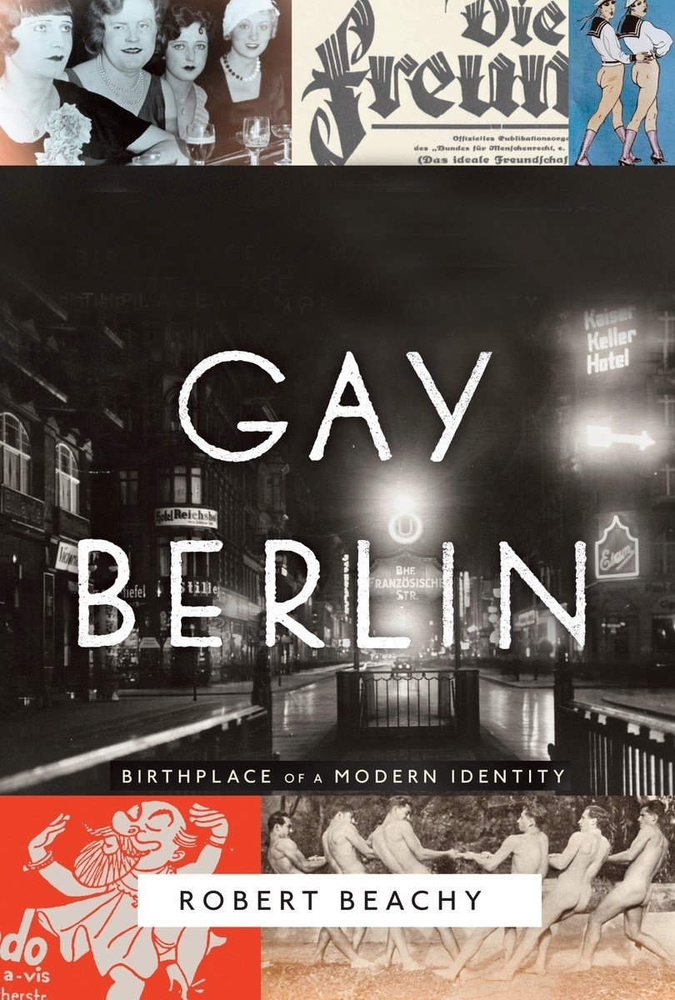
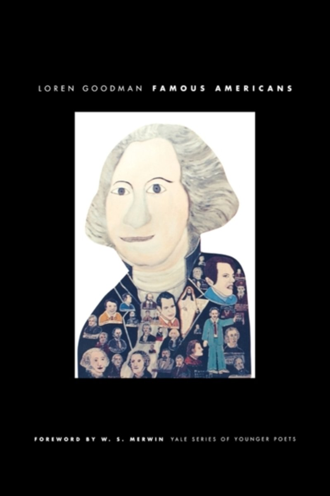

During my freshman and sophomore year, I dedicated my summer to club activities. Going to campus almost every day to prepare for the big event planned in September, I remember these steamy and sweaty summer days to be filled with passion. But I always craved for more room, for flexibility, or for ‘my time’. I put a lot of effort into these club activities that whenever I was done with them, I was knocked out, running the a/c at full power and lying on my bed with blankets rolled up to my neck. As I am done with the club, this summer is all mine. I never expected planning for summer to be this exciting. Summer is approaching quickly and because I had so much on my wish list, a screening process was necessary. I jotted down all the things I wanted to do, and a few candidates survived. One of them is the summer reading. My summer reading list isn’t completed yet, but for some UIC students out there who are also excited to read over the summer, I would like to share some bits from my list: three books written by UIC professors!

_1\. Wealth and Power: China's Long March to the Twenty-first Centur_y written by John Delury

I am sure that if you have been in UIC for a while, you will be familiar with the name John Delury. You might not have taken his class or know him in person, but you would have come across Professor Delury in some way. He could have lectured in your Eastern Civilization class, or he could be teaching your International Studies major friend. If follow up-to-date news from English media, you could have seen him as an interviewee. Professor Delury is the professor of East Asian Studies and some of his latest classes include ‘Modern China-Korea Relations’, ‘Introduction to International Studies’, and ‘Modern Chinese History’. Professor Delury is a world-renowned East Asian relations expert, so this book, which is about eleven icons whose influence shaped modern China, received a lot of attention when it was published. The narrative revolves around the central theme of this book, _fuqiang_, which means ‘Wealth and Power’. This book not only serves to be a cohesive and insightful portrait of eleven most important figures of modern China, but also as a leap to understanding the mechanism of modern China.

You can find this book at Yonsei Library and Underwood Memorial Library. Interestingly, this book also has a Korean translated version. The Kindle version is $9.24 on Amazon.

_2\. Gay Berlin: Birthplace of a Modern Identity_ written by Robert Beachy

It takes ages for most UIC students to decide which Common Curriculum class to take, especially for World L-H-P series and seminars since UIC offers varieties of choices. It’s why the first step to a successful semester would be carefully reading through the syllabus before you sign for a class. Every year, I have to let go of many interesting classes, and unfortunately for me, Professor Beachy’s lectures were always my runner-up choices because for some mysterious reason his classes always overlapped with my requirement classes. Freshmen might know Professor Beachy, the professor of History, as the Western Civilization professor as his latest courses include ‘Western Civilization’, ‘Modern German History’, ‘The History of Sexuality’, and ‘World History’. In this book, Professor Beachy explores how the concept of homosexuality evolved in Germany in the mid-19th century and how it shaped today’s understanding of homosexuality. His examination of various German ideas is done in a rich and careful manner. This book was highly acclaimed and won various awards, including the 2015 Randy Shilts Prize for the best non-fiction work in LGBTQ literature, a Non-Fiction Honor Book by the Stonewall Book Awards of the American Library Association, and a “Soul of Stonewall” award from the Berlin Gay Pride Parade Association for the German translation, Das Andere Berlin.

You can find this book at Yonsei Library and Kindle version is $12.04 on Amazon.

_3\. Famous Americans (Yale Series of Younger Poets)_ written by Loren Goodman

Poetry, dream, and a pet dog are three keywords that come to my mind when I think of Professor Goodman. I want to take his seminar course ‘Dream Writing’, a course offered since 2012, but haven’t been able to do so yet. I’m looking forward to taking it next semester as I have heard so many amazing things about the course and Professor Goodman, the professor of Creative Writing and English Literature. In the course ‘Dream Writing’, students keep a dream log, make one-of-a-kind book as a final project, and are free to express themselves during class discussions. His class looks like an ideal UIC class and recently his courses included ‘Dream Writing’ and ‘The Literature and Culture of Dream’. One fascinating fact about Professor Goodman is that he is a poet. (Wikipedia even has a page on him.) _Famous Americans_ is his first published poetry book. He was the winner of 2003 Yale Series of Younger Poets Competition, and as a result this book was published. Poems in the book explore the life of an icon in a very witty manner, which everyone agrees to be funny and fantastic. If you loved the book, just remember that the author is on campus every Tuesdays and Thursdays. Take your chance!

You can find this book at the Yonsei Library and the Kindle version is $16.72 on Amazon.
