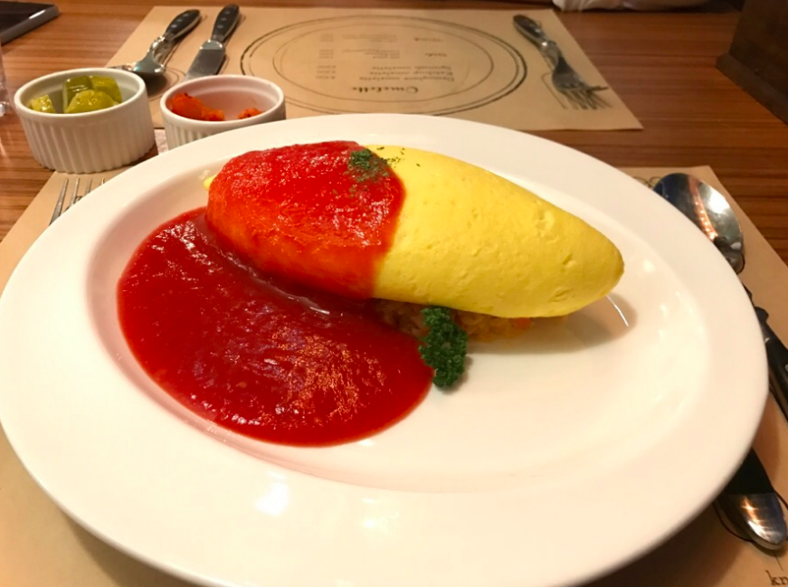
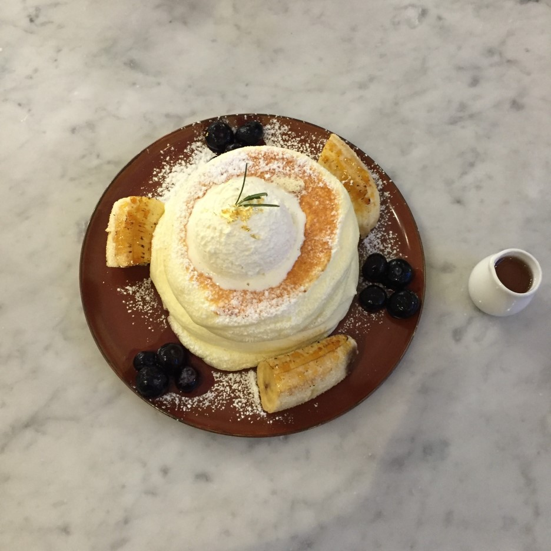

Feeling hungry after a tiresome day of group projects, tests, and extracurricular activities? The three restaurants listed below are located approximately 15 minutes from the Songdo International Campus, making them easily reachable whenever you need something to fill your empty stomach. In addition, the restaurants are relatively small yet filled with colorful and intricate designs that will immediately satisfy your eyes. Most importantly, all three restaurants will immediately take your breath away, starting from their fun presentations to their unique flavors.

**E99**

**Location:** Incheon Yeonsu-gu Conventiadae-ro 116 Prugio World Mark

**Review:** 5/5 stars

**Time:** 15 minutes from campus by taxi

E99 specializes in only three types of omurice dishes: the Demi-Glace Omelette, Ketchup Omelette, and Spanish Omelette. The Demi-Glace Omelette, or the representative dish of a typical Japanese omelette, uses a sauce that is made from the base of a pork and beef broth that has been boiled for 12 hours. The ketchup omelette, on the other hand, is made from various vegetables and ham boiled in savory ketchup, bringing out a distinct bright red color. The Spanish omelette, which is the most expensive item on the menu with a price of 9000 won, has a spicy twist. The vegetables and beef are ground together, giving the sauce a savory, sweet, and peppery taste. Although E99 only specializes in these three main dishes, the savory flavors of the sauces and the soft, plump texture of the egg on top of the fried rice makes E99 really unique. Instead of a typical fried egg, the chef first stirs the egg, rolls it into a cocoon-like structure, then fries only the outside of the egg. The inside of the egg that is only half-cooked wraps around the fried rice when cut in half, making the dish more exquisite than other omelettes dishes.

**솟구쳐차기 (Sotguchachagi)**

**Location:** Incheon Yeonsu-gu Conventia dae-ro 116 Prugio World Mark

**Review:** 4/5 stars

**Time:** 15 minutes from campus by taxi

솟구쳐차기 (Sotguchachagi) specializes in two types of Japanese ramen: tonkotsu ramen and spicy miso ramen. The tonkotsu ramen is made from soup that is pork bone broth with toppings of egg, sliced pork, sliced bamboo shoots, and garlic, giving it a deep taste that excites the taste buds. But the tonkotsu ramen may taste a little bit greasy, since the soup itself is based on pork that contains a significant amount of grease. The spicy miso ramen is also made from pork bone broth with a touch of spicy miso flavor along with similar toppings of egg, sliced pork, sliced bamboo shoots, and garlic. Although the first bite of the spicy miso ramen is not as spicy as expected, the dish gets spicier towards the end, but not to an unbearable point. One characteristic that distinguishes Sotguchachagi was not the ramen, but the side dish of potato _korokke_, or crunchy potato fries, that are fried with bread crumbs on the outside and filled with creamy potato filling on the inside. It bursts out when you take the first bite. The breading and filling of the potato korokke creates a perfect match with the Japanese ramen, as it not only gives the meal a different texture, but also a more savory taste that cannot be felt by only eating ramen.

**젠젠 (ZenZen)**

**Location:** Incheon Yeonsu-gu Haedogi-ro 168

**Review:** 3.5/5 stars

**Time:** 20 minutes from campus by taxi

ZenZen consists of various different types of Japanese soufflé pancakes with a side of fruits. The fruits range from toasted bananas to blueberries and strawberries, and they come with a small bowl of syrup or a topping of whipped cream. Unlike American pancakes, Japanese pancakes like the ones at ZenZen have a softer and creamier texture that is more similar to a pudding than a typical bread-like pancake that is harder to bite into. The soufflé pancake melts in your mouth before you can even chew it, and the fruits on the side seem freshly-picked rather than having been taken out from the refrigerator. Since the pancakes and fruits taste sweet together, an Americano or tea is recommended to go along with the desserts, so that the two flavors can balance off each other, and create a more delectable taste. In addition to the desserts, ZenZen has a well-decorated interior that creates an exquisite mood.The cozy cafe is dimly lit, adorned with abstract paintings hanging on the walls.The comfortable ambience makes ZenZen a perfect place for friends to sit around and chat while feasting on delectable desserts.
