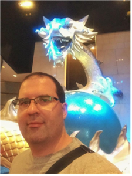

This week’s piece features Professor Daryl Bockett, a UIC Professor.

### Had you always planned on becoming a university professor? If not, what career(s) did you want to have?

> I had originally planned on a career in the field of world domination. Obviously, getting a job in the New Zealand government was the crucial first step, as that is the seat of much of the world’s economic and geopolitical power. Regrettably, I failed the citizenship requirements, having forgotten the rules for rugby, and so I was exiled to Japan.
> 
> In all seriousness, I used to be idealistic enough to want to work for an NGO working in the arms control field. Fortunately, that passed.

### What types of students do you enjoy teaching/working with the most?

> Brilliant ones. That’s why I love teaching at Yonsei. The most brilliant students are the ones who interact, and are not afraid to consider new ideas and new ways of looking at the world.

### How do you prefer your coffee/tea to be made?

> With extra caffeine. And then add an extra shot of espresso or two. Sleep is a crutch for people who can’t handle their coffee.
