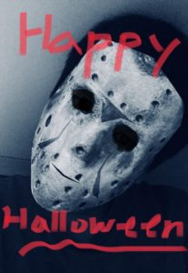

This special Halloween Edition features Jin, the Editor-in-Chief of UIC Scribe.

### So, in the spirit of Halloween, can you tell me what your favorite candy is?

> It’s hard to say what my favorite candy is because I like most of them! I’d say my top two favorites would be _Mars Bars_ and _Sour Patch Kids_. _Mar Bars_ are like _Snickers_ without the peanuts and _Sour Patch Kids_ are just sour gummies. They’re popular in North America, but I haven’t seen them in Korea unfortunately.

### What is your biggest fear?

> Well, my day-to-day fear would be dying. But aside from that, I think I also have megalophobia which is the fear of large objects. Some people with megalophobia are scared of large ships or buildings, but I fear really large objects like celestial objects. For example, imagining how much bigger the eye of Jupiter is than Earth freaks me out a bit. Don’t get me even started on that gargantuan black hole theorized to be in the center of the universe.

### Can you share a paranormal experience you’ve had?

> Hmm well, I don’t think I have a very good one, but there was one incident during my high school years. I was alone in the house with only my oldest brother and we were both in our own rooms. I was studying and I suddenly felt movement behind me. I turned around to look and I saw a shadowy figure zoom across from the middle of my room out into the hallway. As the shadowy figure is rapidly moved away, the glass cover of the ceiling light falls and shatters onto my floor.
