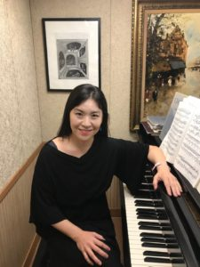

This week’s piece features Professor Hwa Young Seo, a UIC Professor teaching courses on music.

### How did music first become part of your life?

> When I was very little, my aunt was a pianist and I grew up listening to her play. Naturally, I fell in love with the timbre of the piano. Whenever I listened to songs like Für Elise, I would consider it the most gorgeous sound. Gradually, I began to pick up a few notes and started playing on my own. My mom would also bring classical music cassettes which I would listen on repeat till they broke. I went on to attend an arts high school and music has been a part of me since.

### What would you like to say to those who are interested in learning music academically, but have no prior musical experience?

> You cannot force someone to study music. Before taking my course, I consider liking music a prerequisite. Music is about sound, about playing, and really listening. You have to listen to it with all your heart to learn something. Then, if you want to pursue it further, I recommend learning instruments like the keyboard or exploring via Youtube.

### How do you spend your free time? Do you have a hobby?

> I love watching movies of all genres, but especially classics like Hitchcock films. I also enjoy spending time with my three cats. They are independent but also very affectionate, and it’s a pleasure to watch them roam around and do their own thing. One has even begun imitating me by pressing down notes on my piano! And finally, I love exploring the city with my husband.
