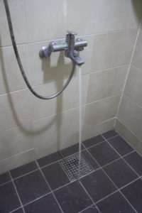

Would you keep the air conditioning on while you run errands outside or leave the faucet open to steam up your house? The answer is most likely “no.” However, such massive waste of resources is produced on campus, particularly in the dormitories. Since dorm rooms are shared space and individual consumption of electricity or water cannot be tracked, the students’ sense of irrelevance increases towards the overall energy being spent. Accordingly, there is a need to set a standard for a minimum level of an eco-friendly lifestyle for the students in dorms. You may compromise between your convenience and eco-friendly values, yet pause and question whether you would use your own room as you use your dorm room.

#### Eco-friendly Mindset and Dorms

An eco-friendly mindset is bearing a sense of responsibility in sustaining our environment. In other words, it is thoroughly examining your actions and realizing their effects on environmental issues such as climate change and pollution. There could be diverse interpretations of an eco-friendly mindset among those who practice it. The standards of such environmental consciousness differ in relation to the sense of relevance to the place, people, and more. Simply put, when we are in settings that make us feel personally responsible to take care of, we tend to apply higher standards of eco-friendly mindset. This phenomenon does not apply explicitly within the campus. You can observe the difference between the use of water and electricity when at home, versus when staying in a hotel, visiting a public space, or traveling to a foreign country. Aside from water and electricity, a wide range of consumable products such as food and clothing are wasted due to these double standards.

#### Waste, Waste, Waste

The waste materials produced exclusively in school dormitories present a difficult problem all by themselves. During the winter, some students leave the shower running and let the hot water steam up the entire room. This way, the steam works as a humidifier. During summer, some students acquire extra room keys through claiming lost cards and leave the air-conditioning running while the room is empty. Since electricity starts flowing once the room key is inserted in the room, students use this method to keep the room chilled throughout the day. Moreover, an incredible amount of food waste is created from the leftovers at the school cafeteria. Since most dorm users rely their meals on the school cafeteria and the dishes are equally proportioned, leftovers are bound to be made on a daily basis. Other waste products within the campus include some lights inside lecture buildings that are left on bright during the night when students do not have access to it. Aside from these cases, there is still a plethora of unreasonable waste created in Yonsei, especially in dorm rooms.

There are eco-friendly reforms that could be adopted by the school, such as implementing buffet style meals or fining food leftovers. Conversely, there are clear limitations. How would Yonsei regulate the air-conditioning and water usage? Would there be CCTVs installed within the rooms? As a result, although the students cannot be blamed for the circumstances, practicing the eco-friendly mindset is ultimately in the hands of the students. This is not solely demanding of our environmental interests. Instead, it is an undeniable fact that students are responsible for the energy consumption within dorms. As a student who has unwittingly forgotten the eco-friendly mindset or who shares a room with such student, you can always rethink your habits and improve. The one-step solution is to maintain the rightful conscience about using your dorm room—treat it no better or worse than your home bedroom.
