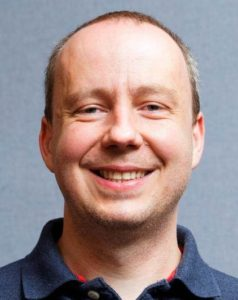

This week’s piece features Dr. Milan Balaz, an associate professor currently teaching at Integrated Science and Engineering Division.

### How is your life in Korea going?

> This is my fourth year in Korea and at Yonsei, and it has been great so far! I have met many very talented, hard-working, yet humble students. I really enjoy interacting with them, teaching them new skills, and challenging their views.

### If there is one thing in UIC that you want improvement before your departure, what would that be?

> I would like to increase the number of laboratory classes for our students majoring in science and engineering, as well as to increase their involvement in meaningful undergraduate research experience either at Yonsei or abroad. Laboratory training is an integral and critical part of science liberal art education. So I was very happy when UIC inaugurated its first science laboratory this Summer(located at the Songdo campus).

### Do you like sports? If so, which one is your favorite?

> I do like sports. I enjoy playing tennis and ping-pong, though I am not particularly good at either of them. However, my wife always lets me win, so I think I will keep playing. Tennis is also my favorite sport to watch on TV.

 

To find out more about Dr. Balaz, visit his website:

[https://yonsei.pure.elsevier.com/en/persons/milan-balaz](https://yonsei.pure.elsevier.com/en/persons/milan-balaz).
