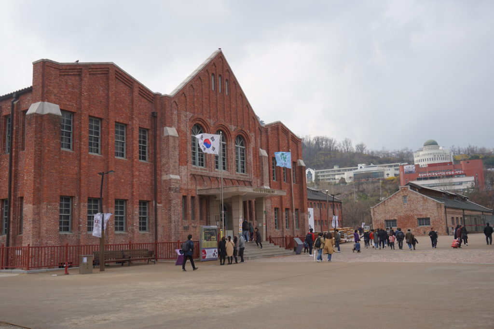

On March 1st, 2019, “Manse”, which means long live Korean independence, was shouted out by ten thousand people who gathered in Gwanghwamun Square, Seoul. It was a ceremony organized by the Korean government to simulate the March 1st (3·1) movement that took place 100 years ago. This year, the 100th anniversary of March 1st movement and the establishment of Korean provisional government was remarkably and widely commemorated throughout the country. We should take a moment to reflect back on this imperative part of Korean history.

#### History of March 1st Independence Movement

The March 1st Movement was a demonstration against Japanese colonial power to regain independence of Korea. According to Encyclopedia Britannica, 2,000,000 Koreans participated in about 1,500 demonstrations. Among them, about 7,000 people were killed, 16,000 were wounded, and 46,000 were arrested by Japanese police and soldiers. Cheongdogyo and Christian church members acted as leaders of the movement and numerous students also participated in demonstrations shouting “Manse”, claiming liberty to regain national independence. Finally on March 1st, 1919, the text of declaration of independence was distributed, and leaders and students gathered at Taehwagwan Restaurant to read “Proclamation of Independence” in public. The aim of this movement was to receive more international attention in order to pressure Japan from continuing the colonial rule.  

#### Why 3·1 Movement is Noteworthy

Although Korea did not “regain independence right away with street demonstrations”, 3·1 movement was invaluable because it “awaken\[ed\] the spirit of independence in the hearts of our brethren,” as Son Byeong Hui said in his speech on the day before the March 1st movement. Furthermore, 3·1 movement was significant as it disclosed Koreans’ strong dedication for independence and united independence activists in their beliefs and actions. The period of independence movement was a fight against injustice and oppression. Therefore, March 1st, 1919 was a critical day in Korean history and we should remember the activists’ effort and sacrifice that contributed to independence of Korea.  

#### A New Movie, _The Resistance_ Released_The Resistance_ was released on

February 27, 2019 to remember Yu Gwan Sun and the March 1st movement. Yu Gwan Sun was a female independence activists who vigorously fought for independence and freedom at the age of 16. The movie is about Yu’s life while she was in Seodaemun prison after leading the demonstration. Although she was beaten and tortured in the prison, she continued to organize protests and never stopped supporting Korean independence. One of her famous sayings is “even if my fingernails are torn out, my nose and ears are ripped apart, and my legs and arms are crushed, this physical pain does not compare to pain of losing my nation”. The movie effectively portrays her lifelong sacrifice for Korea’s independence. According to Korean Film Council, _The Resistance_ ranked number 1 during the first week of March and sold more than 1,150,000 tickets.

#### Seodaemun Prison History Hall’s Special Exhibition

Seodaemun prison history hall hosted a special exhibition for the centennial anniversary of March 1st Movement. Seodaemun prison is the place where Yu Gwan Sun was imprisoned and a historical place that symbolizes the agony of independence activists. Seodaemun Prison was built with the aim of suppressing Korean patriots and independence activists who endeavored to regain national sovereignty. Seodaemun prison history hall is currently used as a museum and a memorial to display the living conditions inside the prison and provide evidence of the torture independence activists had to endure. The underground chambers of the administration building display numerous inhumane torture techniques used by Japanese prison guards. Torture devices included small boxes with spikes inside, sharp pins to poke prisoners’ fingernails, and narrow coffins where no one could move inside. In addition, there were 12 factories inside the prison where prisoners were used as forced labor. This hall embodies a painful history of Korea where 400 people died or were executed and 300 to 600 were tortured.  

Remembering the March 1st movement and the sacrifice of independence activists should not only be highlighted this year but should continue to be remembered as a proud history of Korea.
