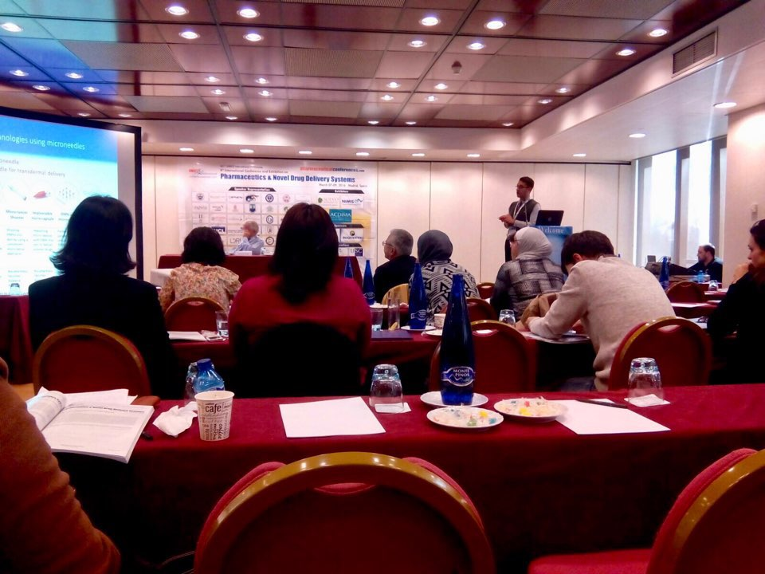

_I met Dr. Lahiji at an LSBT alumni talk that was held earlier this year. I had the wonderful opportunity to interview him, and got to know more about his journey from UIC to graduate school as well as his research on painless drug delivery systems._

A photo from the 2019 graduation ceremony with Dr. Samuel Carroll Brooks III (right), Dr. Janie Sue Brooks (left) and Dr. Shayan F. Lahiji (middle)

**Please introduce yourself (student year, major, your current work, etc.)**

I’m Shayan F. Lahiji, a postdoctoral associate at Yonsei University in the Department of Biotechnology. In 2013, I received my B.S. in Life Science and Biotechnology from Underwood International College (UIC), and in 2019, I graduated with a Ph.D. degree in Biotechnology from Yonsei University.

Since 2014, I have published 5 papers as first author, 9 papers as co-author, and applied for 4 patents in Korea, U.S., Japan, Europe, and China. In addition, I have been the recipient of several awards, including the “Best Researcher Award” at the 3rd World Biotechnology Conference, the “Young Researcher Award” at the 8th Pharmaceutics & Novel Drug Delivery Systems conference, and the “Best Research Award” from Yonsei University.

Dr. Lahiji at an international conference held in Madrid, Spain to present his scientific research

**What made you want to pursue science?**

Since I was young, I was so passionate about science. When I was in high school, I wanted to know how the world really works rather than memorizing science. I tried to make sense of what I saw and wondered about its existence. I realized that through science, I would be able to understand and explain the phenomena in our universe, predict upcoming events, and develop technologies for a better life. It was very clear early on for me that my career would be related to design and developing technologies that could make a difference in our lives.

**What projects are performed in a typical week of your job?**

Receiving governmental funds and grants plays a crucial role in determining the future direction of our research. Therefore, the work at our laboratory is mainly divided into two categories: writing proposals and performing experiments in accordance with the projects. If we have some extra time, we can work on new concepts and technologies that could have the potential to receive funds. A typical week at the laboratory for me involves writing proposals, designing the experiments, performing experiments, writing scientific articles, and reading the recent publications of the researchers working in the same field.

**Do you have any advice for students interested in the field of science?**

To be mentally strong! During the past 7 years of my research, I learned that experiments do not always go as expected. Even a simple experiment may sometimes fail many times and take much longer than a complex experiment. On the other hand, in order to publish a scientific paper, we have to go through a process of evaluation by experts who may have different perspectives and opinions regarding the research that we have performed for more than a few years. Thus, in my opinion, it is extremely important to be mentally strong and to learn from the failures.

**How did you prepare for your career (previous internships/ school clubs at college/ study abroad programs, etc.)?**

A year before graduating from UIC, I started reading scientific articles related to novel technologies. Among those articles, the ones related to pain-less drug delivery systems caught my attention the most. Back then, there were only a few laboratories around the world that focused on the development of pain-less drug delivery systems and luckily, one of them was at Yonsei University. I started working as an intern and after a few months of experiencing laboratory life, I decided to apply for the graduate program and continue my education at the same laboratory.

**Can you tell us about your research?**

An interview with KBS related to the dissolving microneedle fabrication technologies that Dr. Lahiji uses at the laboratory.

My research is focused on the design and development of novel patient-friendly drug delivery systems, known as dissolving microneedles. I have developed various applicators to pave the road for replacing hypodermic needles with painless and environmentally friendly dissolving microneedles. So far, I have successfully encapsulated hair-loss treatment agents, insulin, and anti-wrinkle compounds within microneedles. Currently, I am involved in a project to customize the previously developed applicator systems to launch a product that is focused on market needs.

**What do you hope to achieve in the future?**

I have a passion for sharing knowledge, which makes writing articles and teaching a pleasure for me. Since there are not many courses related to drug delivery technologies and systems, I am planning to create content related to drug delivery systems and teach in this field.

**As one of our alumni, please give us some advice about UIC student life.**

Networking is important. Participating in group activities and university clubs prepares you for your career and is the easiest way to expand the circle of your friends at university. I joined taekwondo, hiking, cycling, language exchange and most of the English-speaking clubs that I could attend.

Conduct regular meetings with your academic advisors and professors. It is not easy to make a decision about your career after graduation. Do not be afraid to share what you are struggling with the professors. They can help you to find your path and build a successful career.

Practice to overcome your procrastination habits. Try to specify what you want to do and stay motivated to do the work.

Be Happy. There are always ups and downs in life, as it is a journey of discovery, but what matters the most is to enjoy life and to trust yourself.  

Be productive. Try to make fewer decisions and work smarter rather than harder.
