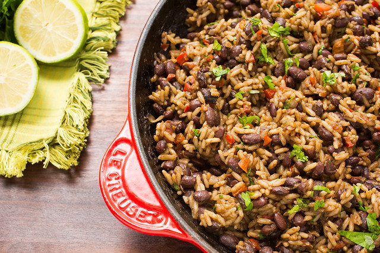

One of the most exciting parts about being a UIC student is getting to interact with people from diverse backgrounds and cultures from all over the world. Though I am ethnically Korean, I grew up in Nicaragua before coming to UIC. During my first year, I realized that for many students, Nicaragua is a place you sweepingly hear about in history textbooks, if not at all. Thus, I would like to share a bit about this place I consider home at heart.  

Nicaragua, also known as “the Land of Lakes and Volcanoes,” is the largest country in Central America. It is composed of 15 departments and two autonomous regions, with Managua as its capital city. It has a population of around 6 million inhabitants of mostly mestizo or Spanish-indigenous people. Given the historical legacy of colonization by both Spain and Britain, the official language is Spanish, but you will hear English and some indigenous languages in the Caribbean coastside. Since Nicaragua is located close to the equator, it has a tropical climate, meaning it is summer year-round.  

As you would expect from the title, Nicaragua’s most notable terrenial features are its lakes and volcanoes. Just by looking at the map, Lake Nicaragua and Managua stand out the most.

Map of Nicaragua

Lake Nicaragua is the largest lake in Central America and is also one of the few freshwater lakes in the world with ocean animals like sharks, swordfish, and tarpon. Within Lake Nicaragua, there is a famous tourist attraction called Ometepe Island, which is made up of the twin volcanoes Concepción and Maderas. One of my most memorable middle school trips was climbing Maderas with my classmates. It took roughly eight hours to climb, left me shoeless and with many scratches, but with an imprinted image of its beautiful crater lagoon. Other famous volcanoes near the capital city are Volcán Masaya and Cerro Negro. At Volcán Masaya, you can see smoke coming out from the crater and lava at night. At Cerro Negro, you can experience “volcano-boarding” on its black sand-like surface. Since Nicaragua is located along the Ring of Fire, it is also common to feel earthquakes once in a while.  

**Top 3 places to see in Nicaragua**

I would like to introduce you to three of my favorite spots and must-go places in Nicaragua: Laguna de Apoyo, Downtown Granada, and San Juan del Sur.   

Back in Nicaragua, my family and I often visited Laguna de Apoyo, a crater lagoon, to enjoy the sight of its deep turquoise blue waters and swim. It is a one-hour drive from Managua and it is a place where you can just relax, kayak, or jump dive from floating wooden decks. I remember kayaking for the first time in this lagoon.   

Laguna de Apoyo

Downtown Granada is another beautiful place famous for its bright-colored colonial baroque architecture and multiple cathedrals. People take a lot of pictures at the main plaza or in front of the yellow Granada Cathedral. There are many restaurants and shops where you can buy traditional handicraft souvenirs. You can also rent bikes and tour in horse carriages along the Calzada Street.   

Granada Cathedral

Lastly, San Juan del Sur is one of the most visited tourist attractions in Nicaragua located in the southwestern department of Rivas. It is well-known for its beaches, colorful pastel buildings, its vibrant nightlife filled with Latin music vibes, and traditional and seafood cuisine. If you are at San Juan, do not forget to visit Christ of Mercy Statue. There, you will be able to enjoy the breathtaking scenery of San Juan’s main beach and surrounding mountains and buildings.   

Christ of Mercy Statue

**Traditional Cuisine**

Last but not least, I want to share pictures of my favorite traditional Nicaraguan cuisine.   

Gallo Pinto

This dish is called Gallo Pinto. It is made of fried rice and red beans with onion, sweet pepper, and garlic. It is often eaten with fried cheese, fried plantains, roasted beef meat, and cabbage salad. Gallo pinto is a regular Nicaraguan meal, but I would never get tired of eating this. You can find it at any Nicaraguan food restaurant.   

Nacatamal

This dish is called Nacatamal. It is made up of ground corn filled up with pork meat, rice, potato, tomato, sweet pepper, and more. It is then wrapped into a plantain leaf and boiled in hot water for around 4 hours before it is ready to eat. It is usually eaten on September 15th, Nicaragua’s Independence Day.  

Mangoes are probably my favorite fruit, and if you like sour fruits, you will like the “Nica” way of eating them. Instead of ripe mangoes, slice green ones and eat them with salt, lemon, vinegar and chilli seeds.   

Green Mangos

So far I have emphasized Nicaragua’s picturesque nature-abundant sites, but on a personal dimension, it has helped me appreciate the uniqueness of diverse cultures. Nicaragua has gifted me with long-lasting friendships and a dream. As a developing country, it faces major obstacles of poverty and socioeconomic inequality; this has partially inspired me to major in International Studies and to become interested in the Sustainable Development and Cooperation field. As a UIC community, I hope that we can celebrate our multicultural diversity and learn from each other’s insights and experiences.
