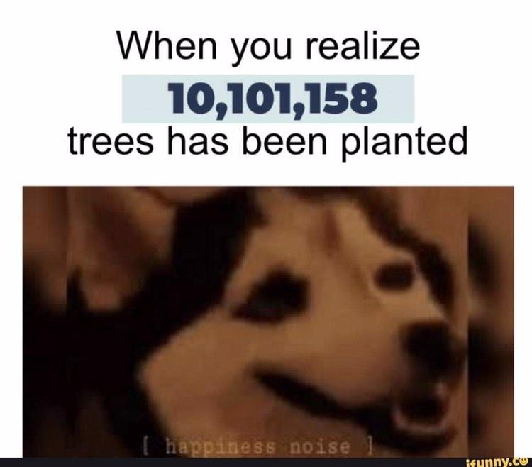

An interview with my Ride-or-Die friend, Lucia Tensi, 17.5, PSIR/SDC student.

**What makes you happy?**

> I’m a positive person, so i tend to get happy at the smallest things, although I do believe that school stole that positivity away from me a little. I’m happy when I’m around people that I love and feel loved by them. I’m happy when people compliment me, recognize my talents, and call me “impressive” or “smart”. I’m happy when I influence my friends with my life choices like making them stop using plastic straws or eating meat. I’m happy when I’m around animals that are protected and when people that represent a threat to the animals are punished. Basically, I’m happy whenever there’s good news regarding the environment.

**What do you want to do in the future?**

> I have different goals in life, but after I graduate, I want to go to South Africa to train in wildlife guardianship and become a park ranger. I also want to work for UN’s animal and environment protection branch. I’m also interested in geo-engineering. That might be my next step if the South African plan fails.

**If you could describe yourself as a meme, it would be…?**  

