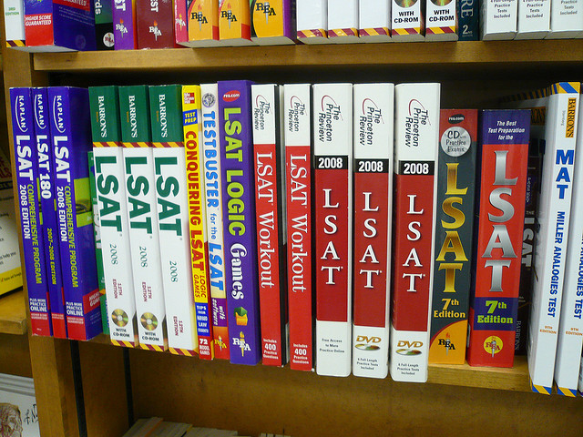

Are you a UIC student about to go on winter break? Check out this article for suggestions about the best things to do during your vacation and how to be well-prepared for the spring semester.

### Internship

Many UIC students start applying for internships during winter break before their junior year. Starting out by working on small internship tasks and later advancing to professional levels of work is a great advantage when going to graduate school or applying for a job in the future. Take advantage as a UIC student through the UIC Career Development Center, which offers job market insights and career-related advice for the student community. They have the latest job and internship announcements on their website. For instance, they recently posted a seasonal internship at the Samil PricewaterhouseCoopers (Samil PwC) Global Tax Services Division, a premier tax advisory firm with the largest tax practice in Korea. Students will be given the opportunity to work alongside many experts with backgrounds in tax, law, finance, and economics. This would be a great first step for students studying Economics, Quantitative Risk Management, Creative Technology Management or anyone else who wants professional experience dealing with financial consulting or tax laws.

Internships are a great opportunity for students to learn from full-time professionals, but also to save up money to help you get through your next semester or prepare to go on an overseas exchange. But even if you are not working during this vacation, do some research now for future internships so that you do not miss that  opportunity.

It is recommended to not only look for internships at domestic firms but also be open to experiencing the work culture of multinational corporations, transnational nongovernmental organizations, or startups. For students planning to go on exchange, you can also use your exchange university’s Career Development Center equivalent to find local job opportunities.

Another side tip is to prepare a well-written resume. With an updated resume, you can readily apply for an internship when you spot a great opportunity. If you are planning to go on exchange, do prior research on the internships you are interested in to cater your resume to that market.

### Certifications and long-term plans

One of the exclusive benefits of UIC is participating in exchange programs to universities that only UIC students can enroll in, such as Amherst College, which even offers scholarships at half of UIC’s regular tuition.

Rather than rushing to score high on the TOEFL during the semester, get the score that you are aiming for during winter break. Also, for better job market opportunities, study for language certificates, computer usage literacy licenses, and other certifications to not only broaden your range of professional abilities but also find your genuine interests.

Begin your research on graduate programs and requirements. Take the time to go to university websites and find out about their average GPAs, graduate coursework, required academic achievements, or firms that recruit at the school. Having prior knowledge can help direct your focus in your current course of study.

If you are planning to enroll in law school abroad, start testing the waters for the Law School Admission Test (LSAT). Test yourself on how high you score before committing to full preparation or start forming a study group with your fellow college mates. If you are planning to enroll in graduate school abroad, start preparing for the Graduate Record Examinations (GRE). You can easily purchase sample questions online or at any large bookstore.

### Plan for the upcoming semester

Applications for the UIC Global Research Project start around April/May every year. Students who are interested in performing a self-directed field research project anywhere around the world can apply for the program. Yet, in order to be selected, students need to submit a blueprint of the research topic, methodology, and specifically what relevant institutions or individuals you will arrange meetings and interviews with, such as research institutions, colleges, government agencies, and NGOs. Therefore, you can start preparing for building the framework of your research, selecting a country that is most suitable for such field work, and who you want as your advisory professor. 

The Global Career Tour, which was held in Japan this year, also requires a similarly great amount of work, with applications ending around April/May as well. Why not get a head start?

### Travel!

Lastly, put yourself out in the world and travel. Visit exotic places on your bucket list, your dream school, or your friends and family members living abroad, and enjoy your freedom as a college student. Earn valuable cultural experiences with new people around the world, expand your career horizons, hone your communication skills, but most importantly, grow as a person. 

The best part about winter break is that you can productively spend your time and enjoy it in any way you would like. Following these suggestions will make you feel confident and set for the future. 

Good luck!
