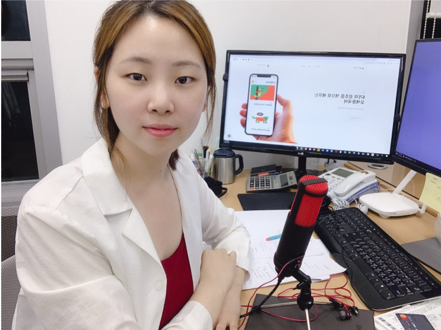

Interview with the CEO of the start-up Color Project

In the 21st century, searching for a job is a struggle present in the majority’s daily reality. What is a “good job”? For many millennials and — in a few years, for generations Zr’s — this question might as well be their biggest nightmare. The competition for employment is increasingly brutal for college graduates, even for those coming from prestigious universities like Yonsei. Many young individuals would rather turn to other options, like starting their own company.

South Korea is surprisingly welcoming for new companies, providing one of the most excessive support systems to start-ups in the world. However, is this support sufficient?

To answer these questions, I interviewed Ji Hyun Lee, the CEO of the language education start-up, Color Project, about her experience of founding her first company that also recently received an investment from Yonsei University. Color Project creates Chinese learning textbooks and has also just launched a Chinese teaching app, 5 Color Chinese, that utilizes their own patented five color method. This method connects each complicated Chinese intonation type with a specific color, making not only the pronunciation easier to understand but also helps students learn new words more effectively. 

**Can you please briefly introduce yourself?**

> My name is Ji Hyun Lee and I am the CEO of the company ColorProject. Our company is a language education start-up, as of now we focus on teaching the Chinese language in Korea and abroad. I myself have been teaching Chinese since I graduated from Seoul National University.

**When and why did you decide to start your own company?**

> I and our co-founder Xiao Lin started Color Project in summer 2016. We were previously teaching together and created the five-color method to teach Chinese as well. Since this new method had a lot of success, even in big companies like Samsung or National Industrial Bank, we have decided to start our own business together. We were convinced by the number of people who supported us.

**What were your biggest concerns when you made this decision?**

> When we were first thinking of making our own business our biggest worry was about our teaching methods. What if our study methods and concepts are not effective? I had to do a lot of research and during our offline classes, we interviewed as many students as possible about our five-color method as possible. At first, I wasn’t persuaded that something like this could actually be turned into a profitable business idea but with more and more positive feedback, we started to gain confidence and launched our project. 

**What or who helped you the most in the beginning?**

> From the very start, we were supported by the Korean government through the program called Venture School.\* We received funding and that enabled us to develop our first product. With that, we then could reach out to different investors and participate in several start-up contests and started to grow more. 

\*Writer’s Note: The Korean government offers many different funding and accelerator programs for both Korean and international start-up companies. You can find more information for example at the Seoul Start-up Hub Center website.   

**Do you think it is easy to start your own company in Korea? Why or why not?**

> In a way, it is easy because of the generous government support. Since we were able to get funding right away, it provided us with a good support structure.  However, I also think that surviving on your own is very hard for Korean companies. Since many start-ups don’t go immediately into the market but are protected by this governmental support, it gets trickier when they need to operate without it. In other countries, companies are thrown into the market right away and have to fight for support which lets them grow as they should. 

To wrap up with my personal opinion, it is obvious that life is not so easy these days, even when you earn a degree from a prestigious university like Yonsei. Students and young workers face many difficulties, but also are open to many new options. Establishing a start-up company might be the next step for many of my fellow graduates as well. Having had the chance to work at several start-up companies over the past few years, I believe that these small work environments can appear much more welcoming, compared to big corporate offices, and often can show you a new area of work you might have not considered before. You don’t need to create your company as soon as you graduate, but who knows what the future holds? Maybe that’s what you should try next.
