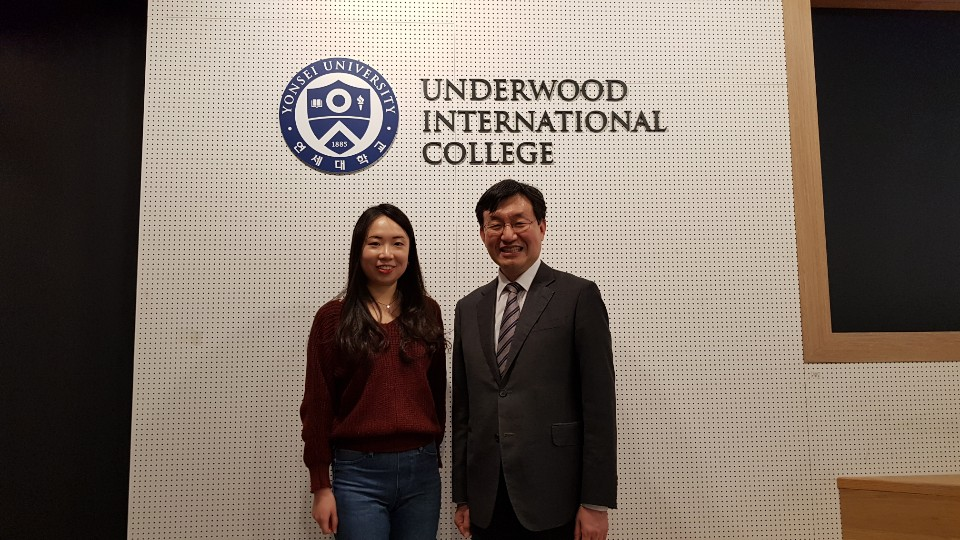
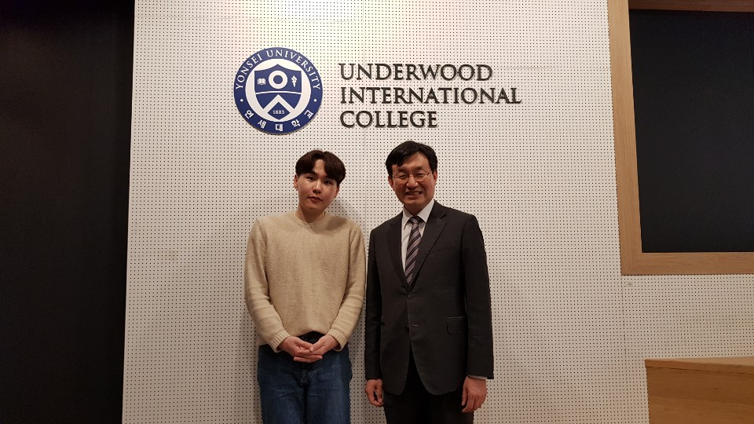

_This interview asked two alumni about their lives as UIC students, why they decided to apply to their graduate school of choice, future goals, and tips on undergraduate life and studying abroad._

### Carmen Choong (Accepted to Univ. Washington MA/PhD program &UCLA, UChicago MA program)

**Can you please introduce yourself?**

I’m Carmen Choong. I’m a UIC 15.5 International Studies major and I’m from Singapore.

**Why did you choose to apply to the graduate programs that you did?**

I am doing a major switch. So even though I was an IS major, I applied to only sociology programs. I applied to seven schools – four were PhD and three were MA. They are all in America, and I’m more inclined to accept my PhD offers right now. However, I’m still waiting for all of my responses.

**How was your life as a UIC student? Could you share any memorable events from your school days?**

I think the UIC CC seminar classes were one of the best things about UIC. I actually hit the bare minimum requirement for my major credit requirements and I took all my other classes in CC seminars. I think the kind of intellectual inquiry that you can get from UIC seminars and small classroom sizes is something that is really unique to UIC. This makes UIC education what it is. At the same time, it’s also where I formed the closest relationships with not only my classmates, but also my professors. They’re the ones that offered a lot of guidance when it came to grad school applications and career advice. The CDC and Professor Denton were very helpful in re-reading my essays and giving a lot of their time. 

**What is your plan after finishing your graduate degree?**

I applied to grad school with the idea that I’d love to continue learning and reading and sharing the knowledge and also researching more about societal issues that disturbed me in many ways. The ability to dissect and critically analyze is something that is a great privilege. 

**What tips would you give to yourself as an undergraduate?**

Spending more time learning Korean would have been helpful. Be willing to look outside of Yonsei for a community and to participate in activities outside of school. Go for office hours! Don’t be afraid to ask. Don’t be afraid to make a relationship with your professor. 

**Do you have any last comments to students who aspire to enter the same field or study abroad?**

For me, I didn’t decide on my grad school major because it wasn’t something that was offered at UIC. It was because of my exchange program that I learned about a new field and got that exposure. I’d say be brave and put yourself outside to experience things that are beyond your comfort zone, because the opportunities are boundless when you dare to step up to it.

### Jae Yeon Jeon (Accepted to UCR and UCSB MA/PhD program & Dartmouth, Buffalo, Harvard, UMass Amherst MA programs)

**Can you please introduce yourself?**

I’m Jeon, Jae Yeon from Korea. I studied comparative literature and I’m a class of 15.

**Why did you choose to apply to the graduate programs that you did?**

Comparative Literature is a relatively smaller field compared to other national literature fields, so I didn’t have many choices to begin with. I didn’t want to apply to PhD directly, although I did apply to some PhD programs. I looked into some programs that offer MA programs and it was either 1 year or 2 years long. I didn’t want to do a year-long program. After considering all the criteria, I was left with 10 schools to apply to. 

**How was your life as a UIC student? Could you share any memorable events from your school days?**

I feel like the biggest benefit that is offered explicitly to UIC students is that we can take seminar courses. Because I wanted to do graduate studies in literature, there are so many liberal arts classes in the common curriculum. This was definitely an advantage for me. The most rewarding experience was definitely writing the senior thesis. 

**What is your plan after finishing your graduate degree?**

If I accept the offer from the PhD program, I would try to find a teaching position. I would love to teach literature. If I accept the offer from the MA program, I would have to do the application cycle again. 

**What tips would you give to yourself as an undergraduate?**

Try to experience everything so that you can decide what field you’re really dedicated to. I think as a college student, the most important thing is to find out what you want to do for the rest of your life. In my case, this came after experiencing different jobs and internships. 

**Do you have any last comments to students who aspire to enter the same field or study abroad?**

If you think you’re cut out for grad school, start getting your materials as soon as possible. Try to find professors who would be willing to write letters of recommendation. Take good care of yourself. I think it’s important to have a healthy daily routine. Workout and eat healthy. It’s good to have a sustainable routine. 

Don’t try to be so hard on yourself. I think that getting into grad school has a lot of luck to it. Getting rejected doesn’t necessarily mean that you’re not good enough. It wasn’t the right fit or the timing wasn’t right. There are so many different factors. Regardless, try to love yourself.
