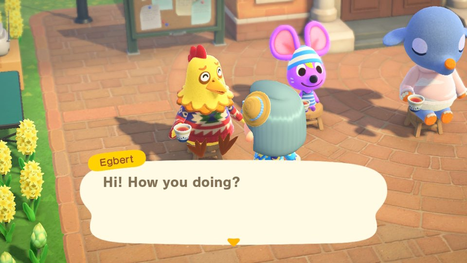
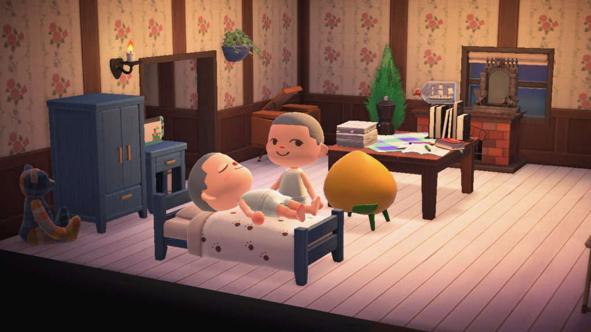
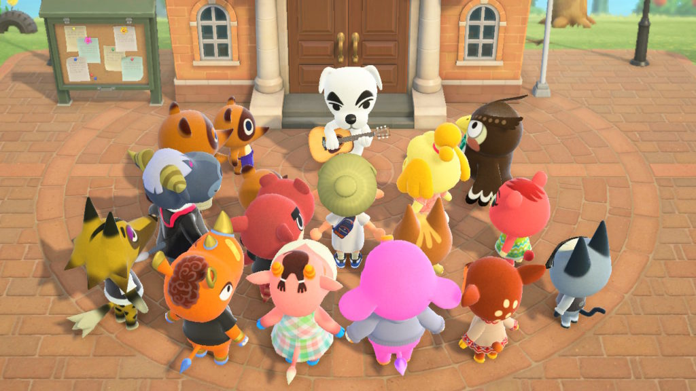

A good video game can make you feel things. With a balanced emphasis on world-building and interactivity, video games are able to transport players to a world in which they are a dual-gun-wielding half-human half-dragon spawn chosen by the gods to save a town of anime characters who are all inexplicably in love with them—or, in the case of Animal Crossing: New Horizons (ACNH), a villager who sells fruit and talks to their neighbors. Games like Animal Crossing fall into the social simulation subgenre. According to Glow Up Games co-founder Mitu-Khandaker-Kokoris, social simulation games are games that let players engage in social interactions with non-playable characters (NPCs) or observe interactions among other NPCs. In addition, because genres are not mutually exclusive, a game can be both a fast-paced action and social simulation game.

Video games with elements of social simulation have exploded in popularity, with the aforementioned Animal Crossing selling over 2.6 million physical copies in Japan alone within its first 10 days of its release. So what exactly is the appeal? Don’t we get enough social interactions in our day-to-day lives?

Well—yes and no. While it’s true that a lot of us feel exhausted after a long day of socializing with Fellow Humans, social _simulations_ can offer an entirely different experience. “In games like My Sweet Home, people want something cozy, a feeling of familiarity and friendliness,” says Hee Jung Kown, an Information and Interaction Design (IID) professor who specializes in world-building in digital spaces. “If you think about games like Stardew Valley, they’re not really competitive—they’re more about helping and caring for the \[NPCs\] around you or the people you’re playing with online.” Because of the rewards that come with cooperating in simulation games, players tend to seek out socially productive behaviors. In ACNH, this means writing letters and buying presents for digital animals and spending tens of hours planting enough flowers so a naked cartoon dog can visit your island and make your landlord happy.

For players like Wooyoung Kim, a recent graduate of Underwood International College (UIC) who has played ACNH 7 hours a day on average since its release in March 2020, one of the main appeals of games focused on social simulation lies in their charming worldbuilding. “Everything is so aesthetically stimulating,” she says. “I love interacting with the environment and watching a completely uninhabited island turn into a bustling little town over time.” When done correctly, digital spaces can offer pleasing visuals that match the tone of the town, city, or island the player avatar inhabits, making navigating these worlds just as fun as talking to the colorful characters that live in them.

The social simulation genre has become more important than ever before. Because of the spread of COVID-19, people are unable to go outside and socialize with friends, strangers, and anyone in between, but being able to talk to adorable talking animals can help cope with long periods of social distancing. “The bidirectional nature of video games offers players a unique experience in which they feel like they’re at the center of these interactions, unlike in more passive mediums like streaming,” says Professor Kwon. In addition, because most social simulation games offer an online multiplayer option, people can invite their friends and family to explore in-game worlds together. Thanks to games like ACNH, anyone with a Switch and 60 dollars can leave behind their corona-related anxiety to dive into a world where the only thing they have to worry about is planting enough flowers so KK Slider will come perform on their island.

