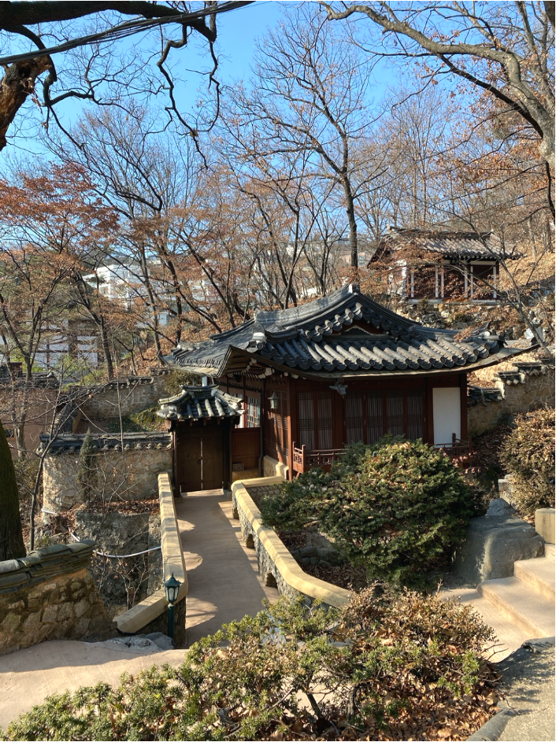

#### The Hidden Oases of Seoul

Seoul is a beautiful city that has so much to offer. Whether one needs to buy some fashionable clothes, get the newest items from Korean beauty brands or just want something delicious to eat, this city has it all. There are growing new neighborhoods full of brand-new skyscrapers right next to alleys with rows and rows of traditional Hanoks. Each part of Seoul has something special to offer. The only common factor for all the hundreds of square kilometers of Seoul is the fast speed with which people, vehicles and pretty much everything moves around.

While a bit quieter during these uncertain times of COVID19 pandemic, which is making everyone stay preferably in the safety of their homes, Seoul is still quite a hectic maze. It is easy to get lost amongst all the people who are just too busy for everything. It feels that now is more important than ever to find a way to unwind and take a good breather, whether it’s a coffee with friends or a small home movie night. Yet, escaping the buzz of the city even for a bit and enjoying the beauty of nature might be the ultimate way to relax. There are several amazing places within close reach of most Seoul people. 

Given the long history of Buddhism in the country, it is no wonder that even the crowded Seoul is home to dozens of Buddhist temples. Some are private, others public, and many have become popular hiking spots not only for the elderly but also for tourists and others. The majority of Buddhist temples lie hidden in mountain forests but here are some of the most easily accessible ones, all perfect places for an afternoon getaway. 

### **Gilsangsa Temple **

Founded in 1997, this relatively young temple lies just about 10 min bus ride from the Hansung University Station (line 4). The relatively unusual building used to be a famous restaurant. The founder Venerable Beopjeong Sunim received the place from a former gisaeng (i.e. female entertainer) Kim Yeon-han who was deeply moved after reading Sunim's writing on "Non-posession".  The numerous temple buildings are interwoven with tall trees and peacefully running water stream. The temple is a frequent visiting spot for locals during lunch hour, as the temple canteen serves free temple food every day from 12 to 1 pm. Many also find Gilsangsa to try the popular temple stay program, or just for a quiet place to walk around. 

### **Bongeunsa Temple**

Bongeunsa is a rare example of a temple lying literally in the middle of the city, with its own subway station. Located in the Gangnam area, just opposite the COEX mall, Bongeunsa temple is definitely one of the busiest and most visited Buddhist temples in Seoul. Despite its location, visitors can still enjoy a spectacular tour through the historical buildings and hide in the shade of the forested hillside. The temple has witnessed a big part of Korean history and the oldest standing library has been in its place since the year 1856. Bongeunsa still retains a great amount of peacefulness and offers a great place to wind down from the stress of the city. The extraordinary mix of modern and historical is just one of the reasons why one should try visiting this place.

### **Geumsunsa Temple**

One of the most popular hiking spots, just on the edge of Seoul city, Bukhansan National Park is home to many Buddhist temples. One of them is also Geumsunsa Temple, which is located at the very beginning of the hiking trail towards the mountain peak. Although a bit farther away from the Seoul center than the other two temples, it has gained many regulars. The slightly longer bus ride means that upon entering Geumsunsa temple, visitors can immerse in nothing but birds and the sounds of falling leaves. Given its serene atmosphere, Geumsunsa is one of the most popular places for temple stay. But just regular hikers passing by often enter to soak in the beauty of this very historical place, which is believed to have been established before the year 1405.

I myself have discovered this place as part of my research for one of my Common Curriculum courses - when I was writing about female figures in Korean Buddhism, and have been visiting occasionally ever since. Never have I imagined that I’d be able to meet such welcoming and inspirational Sunim, and not just for this reason, I would wholeheartedly recommend Geumsunsa temple to anyone looking for a quiet hideout. Moreover, maybe the best thing about the temple is the energetic puppy that welcomes any visitor with his whickering tail. 

There are over hundreds of temples all around the vast lands of Korea. Each temple has something unique to offer and every visit is another nice way to take a step back, breathe, and forget about the pressures of the modern lifestyle.
