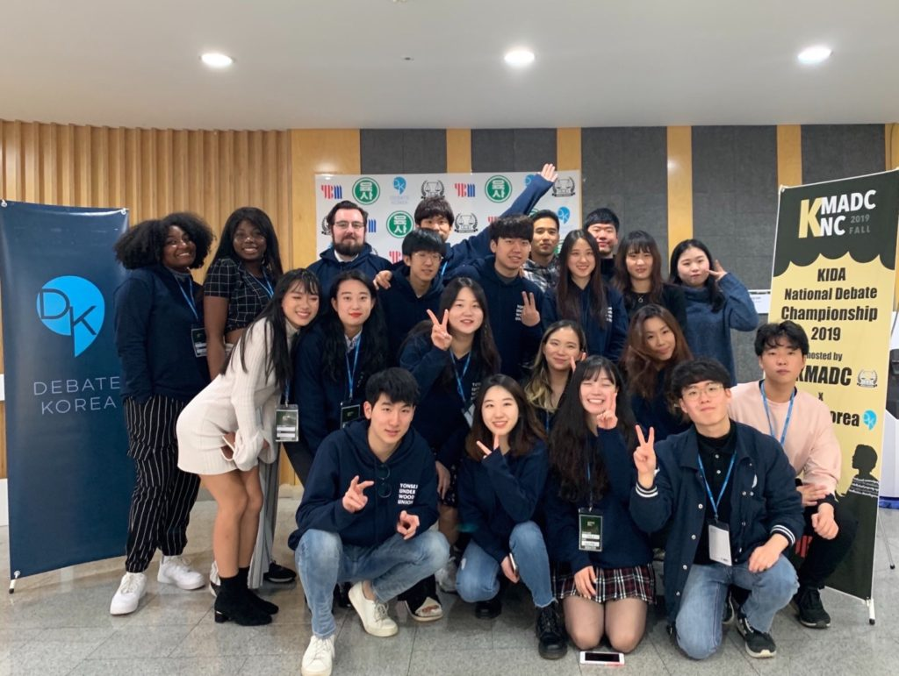
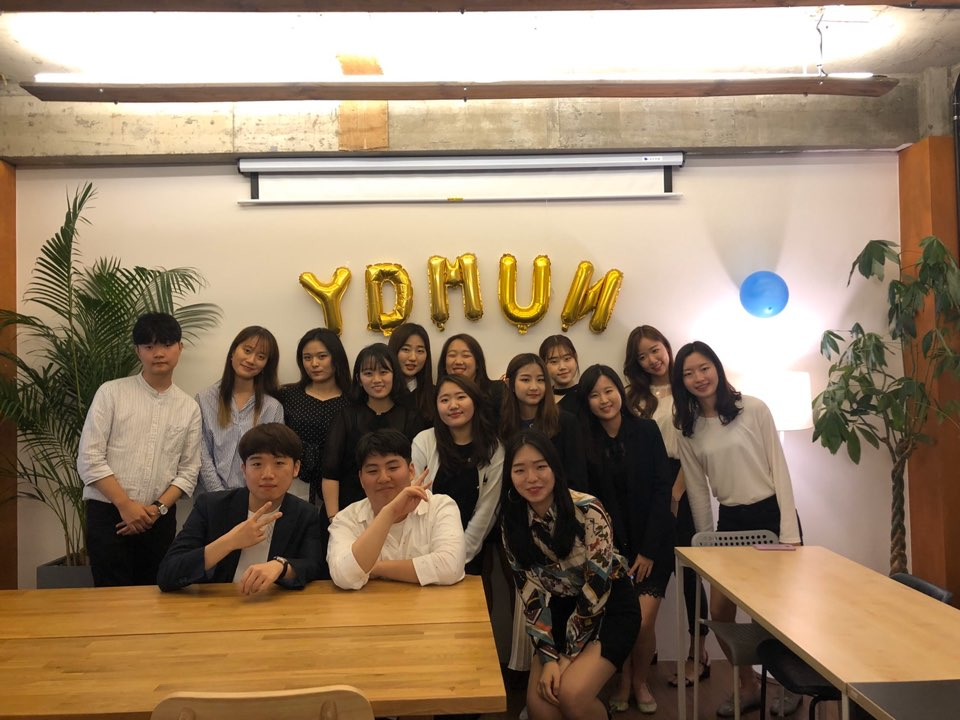
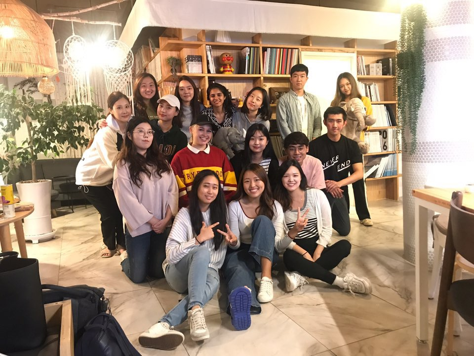
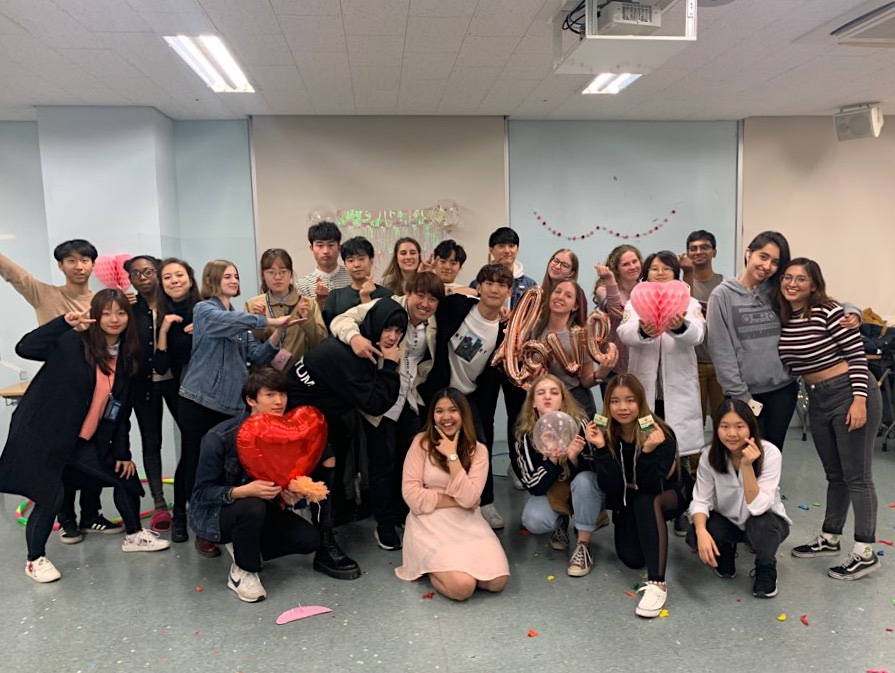

For our freshmen who have yet to fully immerse into Yonsei’s school culture: here is a comprehensive look at some (but not all) of the most popular student club options at UIC.

### **Yonsei Underwood Union (YUU)**

YUU was founded in 2006 as Yonsei’s varsity English debate club. Based in Sinchon, it boasts 47 members, a significant number of which are foreigners, exchange students, and non-UIC majors. As one of the nation’s most esteemed debating organizations, YUU continues to excel in tournaments and is the only Korean team to have broken at the World Universities Debating Championship (WUDC).

Sessions are held on Tuesdays and Thursdays, during which members listen to lectures, engage in debate rounds, and receive constructive feedback. YUU rotates between the Asian Parliamentary and British Parliamentary format each semester. All new members are required to participate in Korea’s largest collegiate debating tournament, the biannual KNC. Further participation is not mandatory yet encouraged for informal matches, overseas tournaments, after-parties, and MTs.

**Words from President Joonseo Chang (IS 19)**

> To all debaters out there: the 2021 WUDC will be hosted right here at Yonsei, where YUU will be playing a pivotal role. If you are an aspiring rhetorician with a fervor for world events, join us in this once-in-a-lifetime opportunity.

### **Yonsei Delegation for Model United Nations (YDMUN)**

YDMUN is the only MUN representative of Korea to be recognized by the Ministry of Foreign Affairs and Trade. Since its nascence, YDMUN has prevailed in global tournaments and is the first Asian delegation to be awarded the highest honors at the National Model United Nations (NMUN). Based in Songdo, this club selects 14 committee members each semester and welcomes non-UIC students.

The biggest yearly project for YDMUN is the extremely popular Yonsei Model United Nations (YMUN), an event aimed at educating middle and high school students on international affairs. In addition to organizing YMUN, members participate in joint-university sessions, are invited to homecomings, and travel to the United Nations headquarters in New York to partake in the annual NMUN.

**Words from President Mina Kim (IS 19)**

> Through the demanding activities of YMUN, I have challenged myself, made lifelong friends, and learned priceless lessons. We encourage all those interested to join us on our quest for academic achievement and diplomatic excellence.

### **Underwood Law Society (ULS)**

ULS stands out from the many other law societies of Yonsei for two reasons: its adoption of English and its focus on international law. This Sinchon-based club has 17 members and is geared towards undergraduates with an appetite for legal studies.

ULS hosts weekly sessions during which students discuss legal issues within the boundaries of each semester's academic theme (e.g. International Criminal Law for Spring 2020). Members may submit legal journals to the ULS X JCL student conference, where UIC professors provide feedback and grading. Moreover, this law society recurrently dominates in various Moot Court competitions, while graduates have gone on to enroll at some of the world’s most prestigious law schools.

**Words from President Yejin Kim (JCL 17)**

> ULS welcomes all students striving for academic enlightenment regarding international law. Please do not hesitate to apply during our summer recruitment!

### **Underwood Global Community (UGC)**

UGC was founded with the purpose of providing a social bonding platform for UIC students yearning for meaningful relationships. Based in Songdo, UGC is especially popular among freshmen and foreigners unfamiliar with Korean culture.

With its emphasis on good food, good music, and an overall good time, UGC offers multiple events from dinners with professors and barbeque events to International Potlucks.  Prepare to be smothered in affection by UGC’s officers, who are more than willing to offer help with everything including airport pickups and neighborhood tours. 

**Words from President Ummairah Binte Shariff (CLC 19)**

> Coming to a new country by yourself may feel daunting at first, but UGC can help your adjustment. Although we have chosen to halt activities this semester in light of COVID-19, stay tuned for our return in the fall.

**Looking for something else?**

UIC’s diverse culture has spawned a plethora of student organization options. For a broader selection, please visit the UIC website or refer to student club promotions in your division’s Kakao chatroom.
