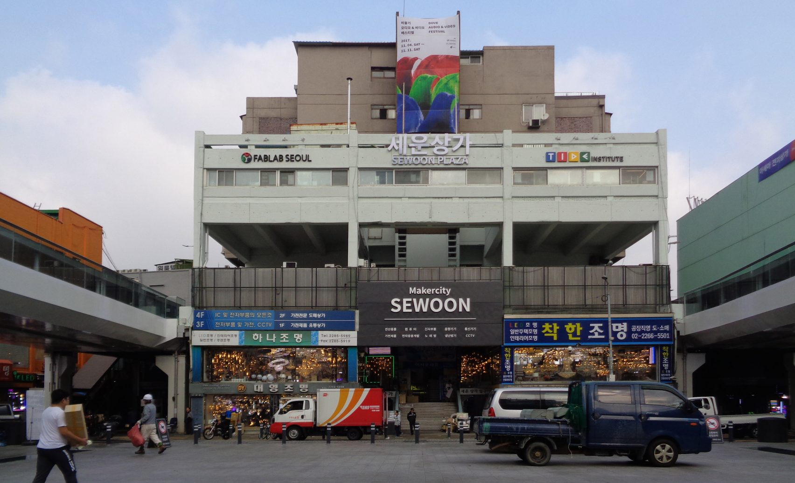

“There are places I'll remember

All my life, though some have changed

Some forever, not for better

Some have gone, and some remain

All these places had their moments

With lovers and friends, I still can recall

Some are dead, and some are living

In my life, I've loved them all”

With a longing melody, the lyrics of “In My Life” by the Beatles above meditates on the past that will never come back again. Such “retro-style” sentiment is resurging in the current society as the contents such as Vinyl turntable, flare trousers, vintage photo effects, Famicom, Reply TV show series (1997, 1994, 1988), gain popularity. Coined from the term retrospect, “retro-style” refers to style imitative of lifestyles, trends, or art forms from the historical past, arousing nostalgia. There are multiple places that harbor these fragments of the past that we will often stop and think about, and one of them is Sewoon Plaza, an electronics district located at Jongro district.

The Sewoon Plaza was founded in 1968 as Korea's first electronics market under the idea of creating a thriving business community complex. With numerous craftsmen and electronic supplies gathered in one place, the plaza prospered and reached its peak during the 1970s & 80s as the largest retail market. According to a brief interview with a shop owner who has been in business for thirty years, he needed at least three part-timers to run the much larger store back in the 80s. However, with the transition from analog to digital, the medium of online shopping and business of major companies began to replace the Sewoon plaza. The appearance of the Yongsan electronics market and large-scale imports of Chinese products further deteriorated the market. With the number of customers decreasing, more merchants moved out and the place as a whole faded away from the memories of the people. After several decades of enduring the test of time, in 2017, the “Dasi Sewoon Project” advocated the second rise of the market as a "Maker City" that embraces both the creative manufacturing and creative printing industries.

However, such a reconstruction project does not significantly change the situation for the merchants. Another merchant running the cable business, when asked for her opinion on the project, replied in a heavy voice that while the new effort attracts more people in general, they are not her customer. Her honest commentary that most of the owners here were just holding on since they had nowhere to go delivered the subtle lack of hope. It exposes the fear we are all prone to—that we will be left behind, forgotten from society. How the place that was once the core of all electronics trade slowly creeps away into oblivion reminds of the fragility of human existence in front of time. Everything is impermanent and there is no way of going back to the past.

The Sewoon Plaza is the remnant of analog technology in the digital age. While analog technology could simply be thought of as the legacy of the past, it was and still is a way of life for some people. Sewoon Plaza may be no more than a slum area in the city, it is still the place of livelihood for merchants and their families. Some still fall in love with the area and believe that it is the place for their dreams to be sown. The owner of the record shop ‘Mio Records’, a Korean-Japanese, decided to settle in Sewoon Plaza as the complex was prominent for its abundant supplies of audio equipment. When asked by his fellow colleagues of his reason for moving into a site frozen in time, he would always offer the same response: that he loved Sewoon Plaza. The audio equipment such as Vinyl turntable and records, which were considered revolutionary in their appearance, are now considered antique. As the ceaseless “wind of change” continuously stirs the society forward, the current cutting-edge technology would one day become outdated as well. One never-changing factor of life is the change itself as our society perpetually evolved to reach where we are today. Such breakthroughs that totally change the way of our living are defined as “paradigm shifts”. The most recent shift was the digital revolution that commercialized the internet. This introduced the new medium of commerce called internet shopping, which impacted the lives of many intermediary merchants. While society must adapt to the change, there are always groups or individuals falling behind.

What we must remember is that any of us are subjected to falling behind. This poses the essential question of technological advancement and the adapting society. While technological development promises us a prosperous future, there is a dark shadow lingering behind with those left out. How could we minimize this blind spot is the question we must strive to answer as we embrace the fourth industrial revolution.

The story of Sewoon plaza is the self-portrait of men living in contemporary society. We are all of us are subjected to the fate of falling behind from the ever-moving society one day as we age. However, we must also all live on. Perhaps this is why the story of Sewoon Plaza consoles us in the end: despite trailing from behind, we still rely on a bit of hope, love, and sadness to carry the weight until the very end. The story of being forgotten applies to all of us who must stand the test of time and such vulnerability that binds us all resonates with us.

“Though I know I'll never lose affection

For people and things that went before

I know I'll often stop and think about them

In my life I'll love you more”

(Ending line of “In My Life” by Beatles)