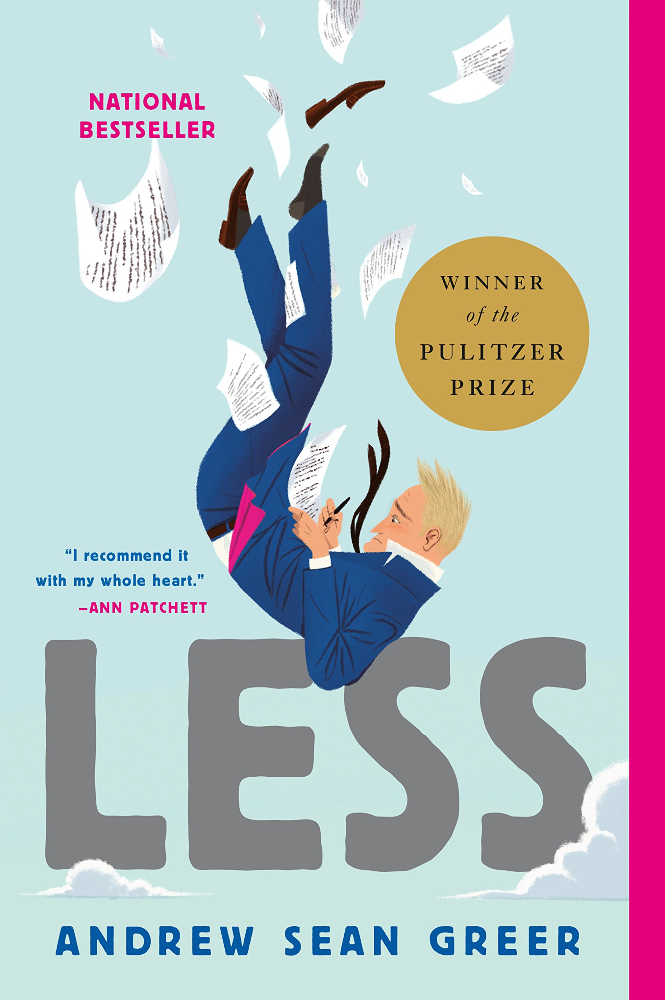

“Less” by Andrew Sean Greer is a less-than-intriguing name for a novel (no pun intended), yet it is the winner of the 2018 Pulitzer Prize for Fiction. As such, there should be more to it than the brief title suggests. However, upon finishing the book, the title feels more than apt; above all things, this book is about a man called Arthur Less. The eponymous hero, Arthur Less, is an almost fifty-year-old gay writer. The last part merits a mention given that it constitutes a significant facet of the book. “Less” recounts Arthur Less’s journey around the world–or, perhaps more accurately, a plight.

Right after receiving a wedding invitation from his past lover (for nine years), Less impulsively decides upon an around-the-world spree of literary invitations. Literary invitations sound appealing and all, but most of the time he would travel to foreign countries and hold book signings. During this process, he recalls his past relationships, contemplates about aging, and eventually fails to elude becoming fifty years old – Greer presents them all in an episodic succession.

To be perfectly frank, not much happens besides that. At this point, you’d ask: why is this a Pulitzer winner in the first place? It’s a question that is sure to be answered by finishing the first chapter of the book. Greer’s writing grabs you by the throat, pulls you right in, and suddenly you’re thrown into the world of Arthur Less. A caveat, however, is due: Greer is seriously prone to bouts of verbosity, and his sense of humor is too depressing to qualify as mindless entertainment. Nevertheless, if you get past all the Nabokov-like tomfoolery, “Less” will deliver an emotional punch that could easily last for months.

In more than one way, “Less” is redemptive of itself the same way life (and sheer chance) is redemptive of the novelist Arthur Less. At first, not many people would find Less’s self-pity convincing, and multiple reasons exist for this initial antipathy. Arthur Less is reasonably good-looking, he manages to make a living through writing, he is a white cisgender male, and his homosexuality doesn’t make his life a hellish place. It’s hard to care about a fictional character when he reads like a walking bundle of first world problems. By the end, however, readers can laugh and cry with him, as if that initial antipathy was simply an illusion. In this sense, “Less” does what all good books ought to do: the reader genuinely gets to know the character on a more than personal level.

Another feat that “Less” succeeds is this: its message is, at heart, life-affirming. The greatest of the arts almost always share in this one quality. At first, the book might sound cynical, or sad; by the end though, life should be worth living and love should be worth the effort. All things considered, “Less” is a book about life and love and getting old; the readers will surely fall in and out of love as Arthur Less travels through uncharted waters and encounters menaces from the past and the present alike. As fate’s machinations go, past rivals turn out to be unexpected comrades, and aborted relationships might just take its belated toll. Ultimately, “Less” is not an unhappy book. By the end of his journey, Less finds redemption, and a sense of direction towards a happier life.

So, how does “Less” compare to past Pulitzer winners? Personally, the book falls a little short of previous winners such as “The Road” or “The Goldfinch.” There is a sense of incompleteness to “Less” – the writing is a little too charming, the characters are a little overstated, and so on. At certain points, it feels as though the author is trying too hard. Nonetheless, the book will certainly break your heart, and mend it afterwards – that is more than what ninety-nine percent of literature manages to achieve.