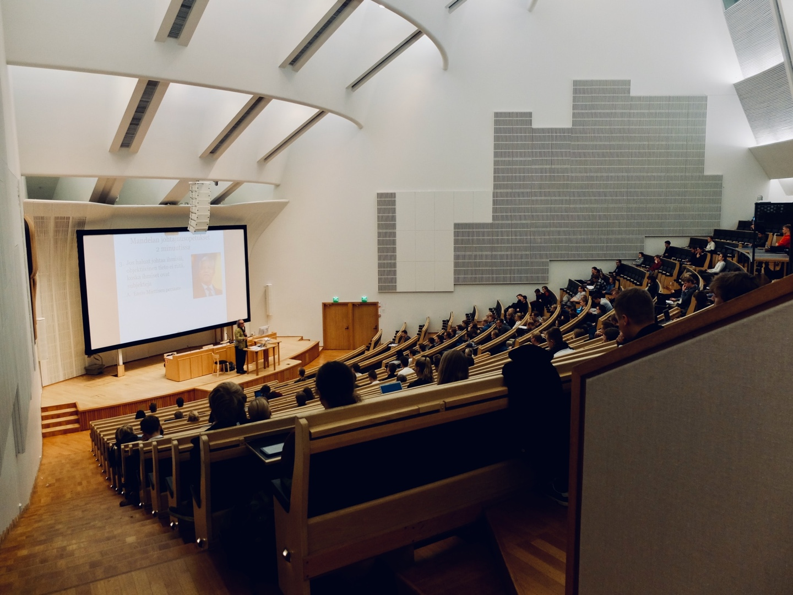

<!--StartFragment-->

On January 29th, Yonsei University announced its plans to continue conducting classes online via zoom for the 2021 spring semester. Since the 2020 Spring Semester, the school’s tuition refund process has come a long way. What began as simple protests by students led to significant changes in policies; most recently, Yonsei University provided information about the 2020 fall semester tuition refunds and additional COVID-19 related scholarships. Here is a quick guide to the school’s most recent student aid policies.

> **COVID-19 Special Scholarship**
>
> The COVID-19 Special Scholarship is a need-based scholarship and is part of the tuition refund for the 2020 fall semester. Yonsei University’s Department of Student Welfare finalized the decision to provide the COVID-19 Special Scholarship on February 25th and started doing so on the same day. Only undergraduate Sinchon campus students within the 4th to 8th income bracket, according to standards set by the Korean Student Aid Foundation, received the scholarship. The size of the scholarship varied depending on the income bracket. Those in a higher income bracket were given a bigger scholarship than those in lower income brackets. This is because the scholarship aimed to refund the entire cost of tuition for each student. Students in higher income brackets paid more money and, thus, received a bigger refund.
>
> **COVID-19 Special Scholarship II**
>
> On February 26th, the General Student Council concluded negotiations with the university to provide a tuition refund for all students regardless of income. Called the COVID-19 Special Scholarship II, it was meant to assist with paying for living costs for all students who attended the 2020 fall semester. The COVID-19 Special Scholarship II was meant to give these students a minimum of 150,000 won. Additional funds were to be given based on the students’ majors. Because the size of the scholarship had to be calculated individually for each student, this scholarship was given later than the COVID-19 Special Scholarship.
>
> Even though the COVID-19 Special Scholarship II was meant to assist every student, it had many exceptions. Students who 1) took less than 12 credits in the previous semester (2020 spring semester); 2) had a GPA lower than 2.4; 3) were on a leave of absence; 4) were still in school after attending their 8th semester; 5) dropped out in the 2020 fall semester; 6) graduated before February 22, 2021; or 7) attended graduate school could not receive financial assistance. Students who attended the College of Medicine, Dentistry, and Nursing, Underwood International College (UIC), and the Global Leadership Division (GLD), were also excluded. The General Student Council stated on February 26th that the graduates of 2021 and colleges with a separate tuition accounting system were excluded from the COVID-19 Special Scholarship II due to the scholarship fund’s limited financial resources. The student councils of the College of Medicine, Dentistry, and Nursing conducted surveys to gauge student opinion about this decision. UIC and GLD students made efforts to communicate with their administrative offices on this matter as well
>
> Because of the backlash, the General Student Council released another update on March 2nd on the COVID-19 Special Scholarships, disclosing a timeline of the negotiations made with the school and future negotiations to come. The Student Council stated that they were planning to meet with individual colleges, and the Yonsei Tuition Deliberation Committee to expand the scope of the COVID-19 Special Scholarship II and finalize the size of the scholarship that would be given to each student.
>
> **Other COVID-19 Related Scholarships**
>
> The university announced on February 3rd that they would provide two additional scholarships for those who needed financial aid on top of the two COVID-19 Special Scholarships. The first is the second round of COVID-19 Need Based Scholarships. The first round gave 500 students 1 million won each during the 2020 fall semester. The second round provided 1 million won to 350 additional students who initially applied for the COVID-19 Need-based Scholarship.
>
> The second scholarship plan was the Housing Support Scholarship. To qualify, a student had to have taken classes at the Sinchon or International Campus in 2020, be part of or below the 8th income bracket, and have leased out their accommodations for more than 6 months. The General Student Council received applications for this scholarship and selected 100 students that fit the criteria. These students were given 500,000 won each in mid-February.

<!--EndFragment-->