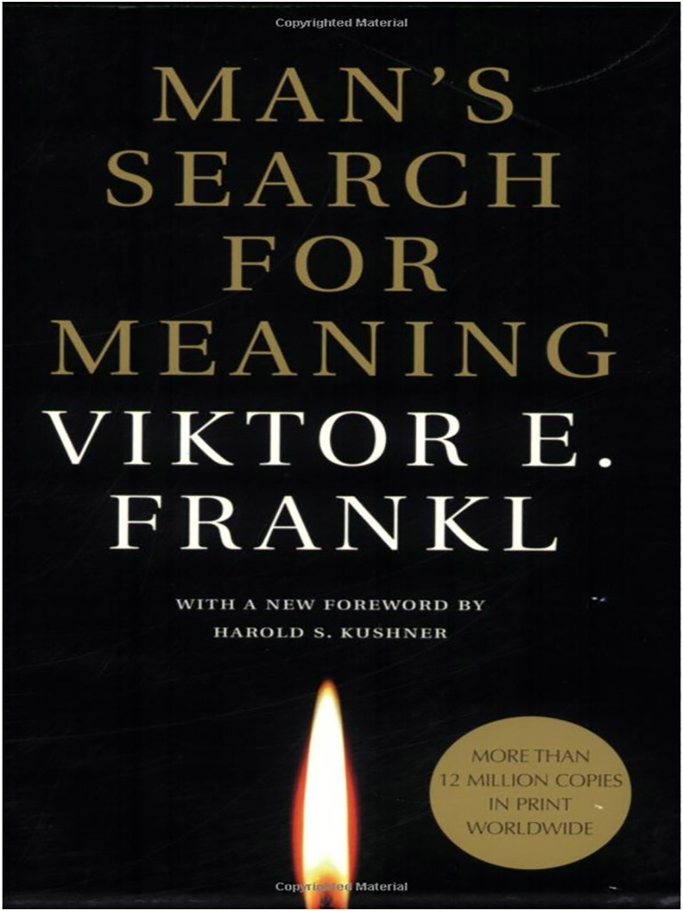

Viktor Frankl’s “Man’s Search for Meaning” is a piece of tragedy but also of hope and pursuit towards a true goal in life. Frankl was a holocaust survivor, who then turned into a neurologist and psychiatrist in order to help many others find meaning in their lives. The book is divided into two main sections: the first is an account of Frankl’s traumatic experience during the holocaust and the second is Frankl’s journey towards finding meaning and helping others do so too. I particularly found the first section to be eye-opening.

One memorable account was how Frankl and many of the other concentration camp prisoners were being transported to another concentration camp of an unknown location. On the train, people were praying that their train was not heading towards Auschwitz. The tragedy was how Frankl saw hills on the way that closely resembled the place he called his hometown. Frankl exclaimed that he could see it and wanted to take a look, but no one was willing to move to give him a glimpse into his old life. Frankl just sat there helplessly in the tight compartment with the frightened, depressed, and mad prisoners around him. After that, Frankl recounted how he thought about his wife as he watched smoke from another concentration camp and wondered where she went as they were separated-wishing desperately that she was alive or in a better place than him. This is when Frankl presented a key idea on love, which he believes to be the answer to life, that love can be with someone even in the mind. Love can be a feeling of familiarity that lives on within a person’s mind regardless of where they are now. You can love one without being with them then. At first, the idea seemed counter-intuitive since you cannot truly love a dead person who cannot reciprocate those feelings back to you, but I have come to see what Frankl means by it now. Perhaps, love is more about giving than receiving in some aspects for Frankl too in this case.

Another coping mechanism that Frankl recounts in many of the concentration camp members was humor: dark humor. Some of the prisoners would joke about the harsh punishments they would have to go through, the brutality of the guards, and even their own deaths. The first part of the book made for a powerful story that captured the darkest terrors recorded in humanity. Luckily, in the second part, Frankl teaches us how to find meaning and true fulfillment in life.

One of the core ideas that I found insightful was that you have to adapt to what life presents you with to a large degree. At first, I found the idea depressing more than anything as you are limited to what life gives you rather than what you want to do, but now I think I understand that he means the best for us as he wants us to find the greatest meaning in the situations we are presented with. Another lesson that I found insightful was that we should not necessarily seek pleasure or try to avoid pain, but try to look for meaning. Essentially, if you find the thing that gives you the most meaning, there will be pain and pleasure that inevitably comes with it, but you will feel contempt with what you have and truly appreciate the life you are given.