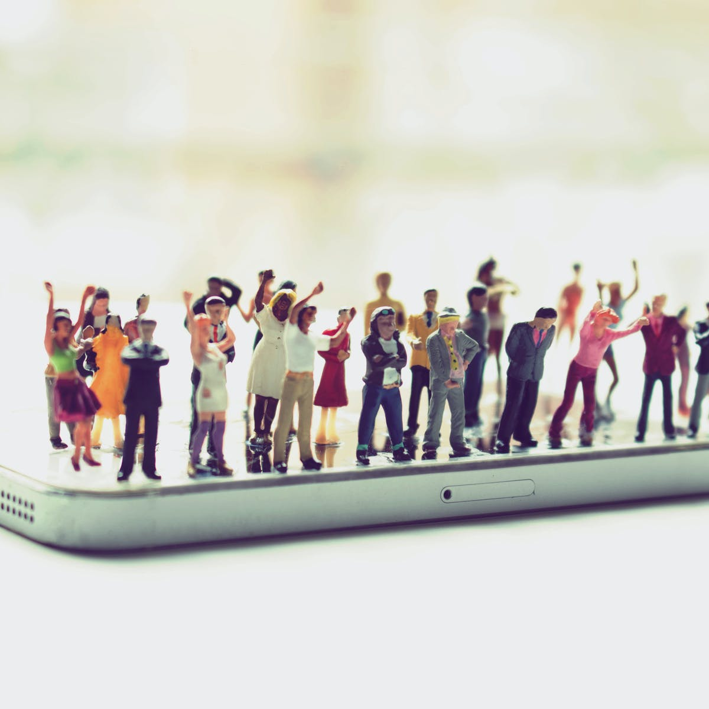

On the sixth of June 2020, J. K. Rowling quote tweeted an article that made her become the talk of the town. In the tweet, Rowling addressed the word ‘menstruate’ in the quoted article’s title (“Opinion: Creating a more equal post-COVID-19 world for people who menstruate”) and voiced curiosity on other potential expressions to describe people who menstruate. This tweet soon sparked criticism, as users thought Rowling was only considering women as “people who menstruate”, when in fact transgender men also experience menstruation. Reproach against her further rose when Rowling, faced with the criticism, expressed empathy to transgenders but continued to defend her position by showing concern about gender transitioning. The amounting denunciation soon made Rowling leave Twitter and led to a huge drop in the sales of the “Harry Potter” series.

This incident clearly demonstrates “cancel culture,” a phenomenon where an individual, business, or movement becomes strongly denounced by the public. This pile-up of criticism can eventually block the “canceled” individual to continue and advance in his career. Cancel culture is often associated with “outrage culture” where the subject faces trolling, harassment or shame from the public.

The culture of “canceling” dates back to the 1999 film, “New Jack City,” where the character Nino Brown ends his relationship with his girlfriend with the phrase: “Cancel that b\*\**h, I’ll buy another one.” However, the show that ultimately brought cancel culture to the spotlight was the reality show, “Love and Hip-Hop: New York,” broadcasted on VH1 in 2014. In Season 5 of the series, cast member Rosado tells his love that “you’re canceled.” This expression soon caught up on Black Twitter, where users used this phrase to express their disapproval to a particular action. In 2017, cancel culture became widely popular, where people publicly criticized actions of celebrities that offended them.

Since then, many celebrities as well as companies have suffered from cancel culture. The comedian Kevin Hart, after being appointed as the host of the 2019 Academy Awards, suffered enormous online critique on his past homophobic tweets. Pop star Lana Del Rey was met with #lanadelrayisoverparty hashtags after expressing frustration at criticism about her lyrics compared to several artists of color. Louis C.K. and Kevin Spacey have been “canceled” because of their inappropriate behavior around women. SoulCycle became the target of cancel culture for its owner’s financial ties to Trump.

The debate surrounding cancel culture and its effects continues with varying arguments presented for each side. Proponents argue that cancel culture has been effective at combating acts of abuse or harm. The #MeToo movement in 2017 is a famous example: the movement, which was accompanied by the cancellation of those accused of rape and sexual harassment (such as Harvey Weinstein), was somewhat effective in making governments and companies reform policies related with gender equality. Proponents also argue that cancel culture empowers individuals by offering them a chance to speak out against social misconducts.

On the other side, opponents argue that cancel culture is not an effective method that brings about ideal results. To start with, opponents argue that ending careers are easily said than done: most celebrities who are said to be “canceled” do not actually suffer dire consequences. This proves right, especially for people who have power in the society. For instance, Robert Unanue, CEO of Goya Foods, rather saw an increase in his sales after being “canceled'' for praising President Trump on his promotion of a Hispanic prosperity initiative. Furthermore, opponents argue that people are no longer able to learn from mistakes as cancel culture do not allow any mistakes to be made in the first place. Cancel culture doesn’t lead to any improvement; it makes people either hail intense criticism to others or makes them worry about being “canceled” by others. This creates a culture of walking on eggshells rather than producing healthy social change.

Ultimately, cancel culture has good and bad consequences. It allows all citizens to participate in the prevention of social problems, although its consequences might not actually be put into action. However, no matter what stance one takes on cancel culture, one thing is certain: cancel culture shouldn’t simply be a means of unconditional, intense criticism. As current incidents show, cancellation that ends at simply directing critiques at the guilty and bringing their careers to an end doesn’t induce the intended positive consequences of cancel culture. One must understand what the “cancelled” has done wrong, and try to build a sound society by promoting ethical social values with others.