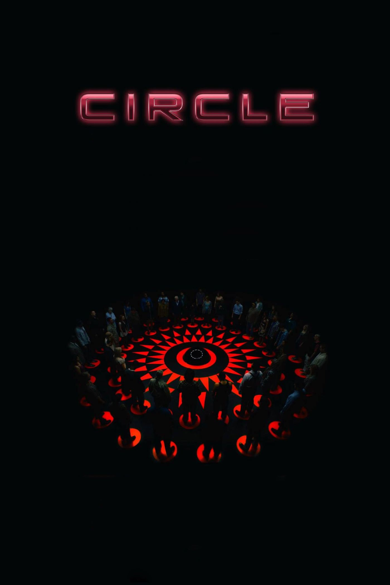

“Circle” starts out with 50 strangers in a dark room, all standing on red domes after an alien invasion. When a person moves or touches someone else, they would die with a strike of lightning. Eventually, the players realize that this is a game and they could decide who should die every two minutes. The players scramble to form groups to protect themselves, and just like that, the movie unfolds until the very last person remains standing. This science-fiction thriller details the ethical questions that arise when selecting who to kill.

Notably, the room is filled with people of different ages, gender, race and sexuality. When the voting begins, they immediately start to form factions based on personal beliefs and values. At first, the elderly are targeted, because many believe that the young players deserved a chance to live. Some groups lie about their marital status to garner support from the group. Other players target the marginalized members of society, such as racial minorities. Eventually, after many rounds of execution, only three remain standing: a man, a child, and a pregnant woman. The man convinces the child that they should both abstain from voting and commit suicide to give the pregnant woman and her baby a chance to live. However, after the child abstains, the man immediately switches his vote to kill the pregnant woman. The two players fall down to the floor and the man remains victorious – or so he thinks. The game ends with a final vote, in which the man plays against the fetus still living inside the dead mother. However, the man votes for the fetus and he is left standing there.

“Circle” portrays a social experiment in which the audience can see how human nature can turn into something horrific, when the circumstances are dire. The players demonstrate the inner struggle between morality and the survival of the fittest. As they decide on who to execute, they struggle between prioritizing who should live on and their own selfish motivations for survival.

Besides the parallels to human nature, “Circle” shows the debate on illegal immigration, abortion, racism, sexism and more. The characters each get less than two minutes to present their arguments and decide on what stance is better. In a way, these decisions are snap judgments, since the players do not have enough time to properly consider the complex sides of the debate. The players, therefore, mainly rely on stereotypes and preconceived notions to guide them throughout this game.

The ending of the movie was especially disturbing, since it showed the true fight for survival between a man and a pregnant woman. The man tricked the child and pregnant woman into losing and although he thought he won, he still needed to vote off the unborn child before claiming his victory. At the end of the movie, the victors from each game met with others who have also survived in a futuristic setting. However, the catch was that there were mainly women and among them, pregnant women. Since the game can only have one victor, this meant that the pregnant women would’ve needed to understand that she would have to sacrifice her child for save her own life. This demonstrates the “survival of the fittest” mentality and poses the question, “To what lengths would you go in order to survive?” While in some ways, it makes sense that the pregnant women would give up their babies to survive themselves, it does seem harsh that they would be forced to make this decision in the blink of an eye.

“Circle” also has eerie parallels to the real world, with COVID-19 looming over us. The race for developing vaccines and treatments has already started, and many companies and research facilities have made huge strides in creating possible therapies for the coronavirus. However, even after the development of the vaccine or treatment, another question remains. How will these vaccines/treatments be supplied to the whole world? Mass producing a biopharmaceutical product at a global scale is nearly impossible. Since many governments have realized this, they have made separate deals with other governments with a promising vaccine or treatment, which would secure their supplies. This once again raises the point that the countries that are most in need of adequate healthcare are those that wouldn’t be getting the treatments because of a lack of financial resources. This is just another prime example of survival of the fittest, but one that has real life consequences.

Ultimately, “Circle” causes viewers to question themselves about how far they are willing to go to get ahead and stay competitive.