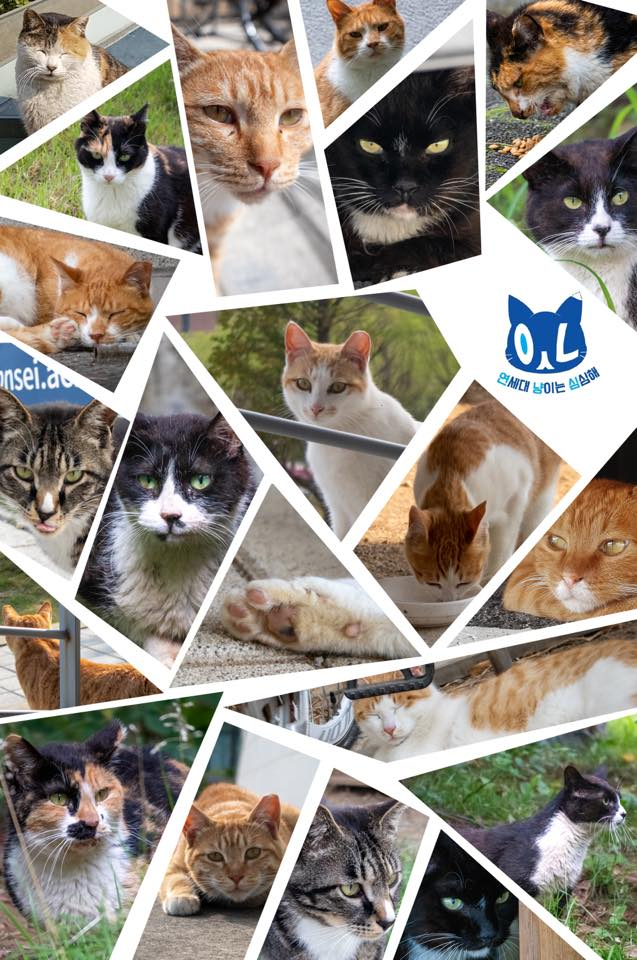
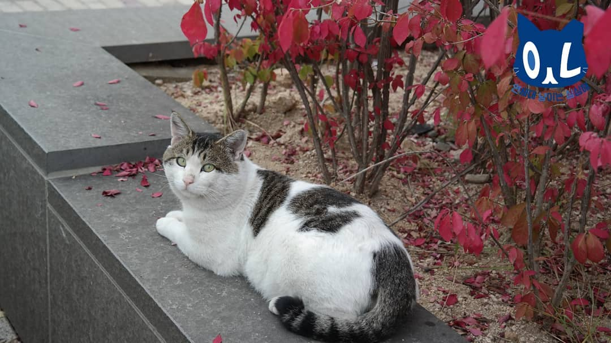
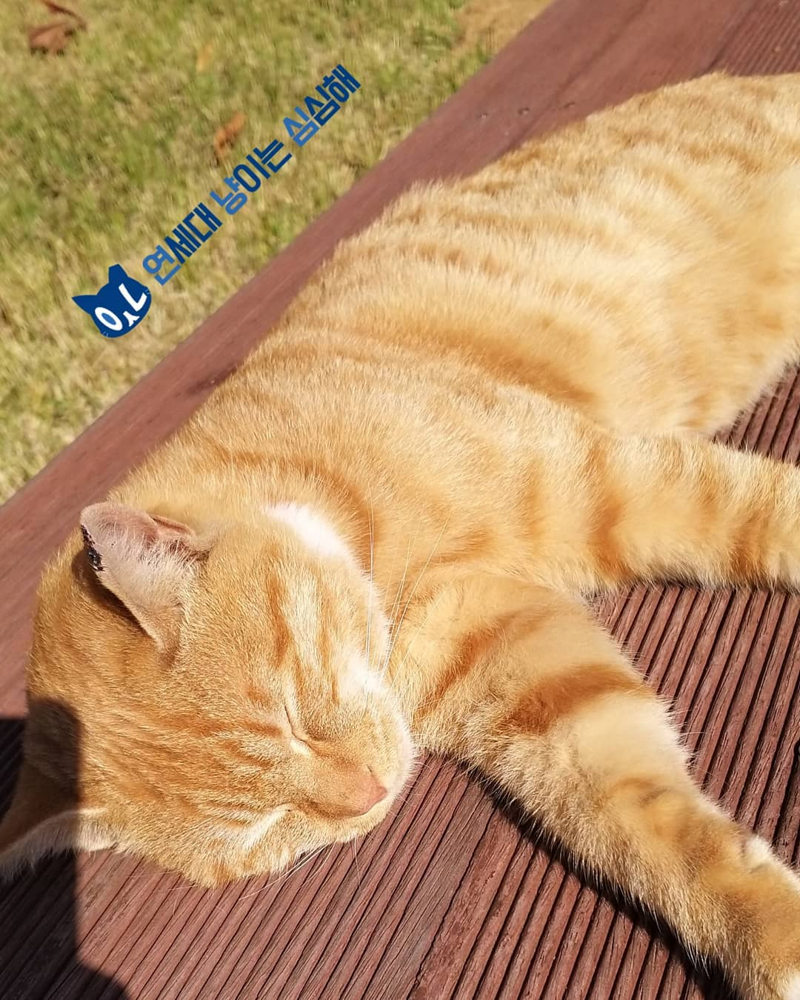

A staggering number of cats brush tails with city dwellers every day. [According to the city of Seoul, there were at least 250 thousand feral cats roaming its streets in 2015.](https://www.chosun.com/site/data/html_dir/2015/10/16/2015101602125.html) Even though the numbers have gone down over the years due to active TNR (Trap-Neuter-Return) policies, [20 to 30 thousand abandoned house cats are added to the streets each year.](https://www.yna.co.kr/view/AKR20160527156600052) 

Where there’s a concentration of both humans and wild animals, problems are bound to appear. For one thing, many feral cats live off of dumpsters within residential areas. They rip up garbage bags and spill their contents while looking for food, causing reeking smells, bug infestations and increasing the risk of contact with various germs. However, an even more visible—or rather, audible—problem for residents is the noise. When females go into heat, they let out loud mating calls that draw the males into their territory, resulting in deadly cat-fights between the males over the chance to breed and a sleepless night for residents kept awake by the noise. 

However, there are ways to make peace with our city felines. Providing a regular source of food and water through feeding stations eliminates their need to raid dumpsters, and thus helps to maintain public sanitation. This also keeps the cats themselves more clean, reducing the risk of human infection upon contact. 

However, it’s essential to accompany caretaking with population control, as merely feeding them would result in overpopulation. The most widespread method of population control is TNR: after trapping the cats, they are taken to the vet to undergo neutering, and after 24 hours of hospital care for males and 72 hours or females, they are released back to the place they were captured. Neutered males become unresponsive to the females’ mating calls and pheromones, while neutered females stop experiencing heat and do not attract additional males into their territory, resulting in a natural decrease in population.

Yonsei University’s cat club, Yonnyangsim, does all these things and more to control and protect over 80 feral cats that are living on Songdo campus. [Seven caretaker groups from seven colleges run 11 feeding stations across the grounds, provide medical care for sick cats, and actively carry out TNR in order to prevent over-population.](https://m.blog.naver.com/PostView.nhn?blogId=yonseiblog&logNo=221636358871&proxyReferer=https:%2F%2Fwww.google.com%2F) But how do all these activities actually work? It must take a lot of time and resources for students to take care of almost a hundred cats! The fifth club president, Kim Tae—, provides us with some answers.

**Q:** As a cat-lover myself, one thing I especially looked forward to on Songdo Campus was the Songdo cats. But due to the pandemic, most freshmen have never had a chance to see them. Could you introduce a couple of them for us?

**A:**

This is Tofu. Handsome, isn’t he?

This is Yuni, a tabby who only joined us last year.

**Q:** I heard the club carries out active TNR every semester, but how does that actually work? It can’t exactly be an easy process for college students to carry out.

**A:** We have several cat traps available on campus, which we use during the intensive TNR seasons, which is usually twice a year. Three to four members form a team and take charge of one area. In this way, about ten teams cover the whole campus, trapping the cats that live within their given territories. Then they take the unneutered ones to a nearby hospital, which they chose for its appropriate cost and distance. Then we release the males 24 hours and the females, 72 hours, after their surgery back to their territories on campus.

**Q:** Your club runs 11 feeding stations—impressive! How do you maintain these facilities? For example, I know you pay for the food and the shelter by selling club merchandise, but does that cover all your expenses?

**A:** A few members are allotted to each area, and everyone takes turns filling the food and water bowls within that area at a given time, following a timetable. The members within the same area contact one another to make sure everyone does their part.

As for the expenses, we do have merchandise sales during school events like Akaraka and the Yeon-Ko Games, but our main source of income are membership fees (paid each semester) and donations, which we receive by posting ads on social media. We also get cat food donations from organizations like Seodonghang.

**Q:** Not only do you feed the cats, but you also also check their health and provide medical care for them. I even heard you have emergency rescue service. How does that work?

**A:** We’re not vets, but the most common health issues that we can notice are serious wounds, runny noses and eye mucus. If a member spots a cat with one of these symptoms, they contact the rest of their caretaker group and they try to trap the cat. Cat tends to move around within its territory, so we only have to search a certain area. Then we take it to a nearby vet. If we expected an expensive hospital bill, we advertise for donations on social media.

Thanks to the tireless efforts of Yonnyangsim members, students and cats are currently living together on Songdo campus in coexistence as fellow campus mates. Perhaps one day, humans and felines alike may find not only Songdo but all our cities a fit habitat for both.