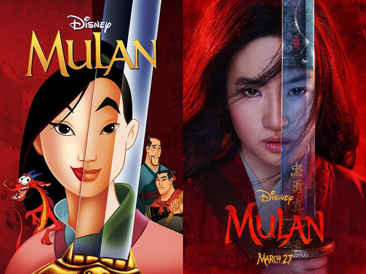

Beginning with Tim Burton’s “Alice in Wonderland” in 2010, Disney has been churning out live-action remakes of their greatest hits. Due to the commercial success of recent remakes such as, “Beauty and the Beast,” “Aladdin” and “The Lion King,” Disney’s remake of “Mulan” was widely anticipated. The level of excitement awaiting Mulan’s 2020 release was especially high amongst Asian communities throughout the world.

Expectations further increased when news broke out that the entire cast were to be composed of Asian actors. There had been quiet apprehension due to previous instances of whitewashing high profile animation works such as “Avatar: The Last Airbender” and “Dragonball Evolution,” but the announcement of an all-Asian cast helped quell the fear of potential whitewashing. In addition, following the success in recent years of Asian-led content such as “The Farewell,” “Fresh Off the Boat,” and “Crazy Rich Asians,” “Mulan” was expected to continue the recent strides made for better Asian representation in Western screens.

The heightened expectation with the movie’s release made the subsequent disappointment even more difficult to stomach. “Mulan” started the entire cinematic experience off on the wrong foot by not having any Chinese audio or subtitles available for international viewers. However, audio and subtitles were available in languages like Dutch, Spanish and even Canadian French, showing how Disney mainly catered the experience towards western audiences. There were also instances of huge misrepresentation of Chinese culture. The phoenix that replaced the delightful Mushu of the original film was supposedly a supernatural being sent by ancestors to deliver messages and had risen from the ashes to do so. This was a markedly Western interpretation of the phoenix, as phoenixes in China are simply considered good omens.

The concept of qi was also misinterpreted, and much more problematic. Throughout the movie, Mulan was pressured to not show her qi as the use of qi by a woman would label her as a witch and she will end up shunned by society. Unlike Western countries with Judeo-Christian backgrounds, China does not have the same history of witchcraft. In the film, qi is misinterpreted as some sort of superpower that Mulan uses to defeat her enemies whereas in Chinese culture, it is simply a life energy that resides in people.

Qi being conflated with witchcraft also brought an outdated portrayal of gender roles. The original Mulan in 1998 was criticised for its story of women having to pretend to be men in order to be given a chance at becoming a hero. Nevertheless, the original was largely lauded for how Mulan, instead of waiting for some prince to come and save her, took charge of her own destiny and defied societal constraints placed upon her. Ultimately, the emperor bows to Mulan, in gratitude for saving his life and all of China. However, in the 2020 remake, Mulan succeeds in defeating the enemy, not by her own efforts but due to the superpowers she was born with. Also, Mulan is simply offered a job to become the emperor’s personal guard and delivered a sword without a proper gesture of gratitude. Despite there being a 22-year gap between the original and the remake, the modern take on gender roles is even more backwards than the original’s.

There is always an inherent risk in remaking age-old classics, but Disney botched this big time. There were no songs like “Reflection” and “I’ll make a man out of you.” Mushu was replaced by a mute phoenix, Captain Li Shang was split into two characters and the enemies of the state were Rourans instead of Huns. These changes served no particular purpose other than to worsen the cinematic experience. In the end, Disney should just have stuck to its original formula of remakes by simply replicating each scene shot by shot. It would have been much more preferable to give into Disney’s naked attempt to rake in money by indulging the audience’s nostalgia.