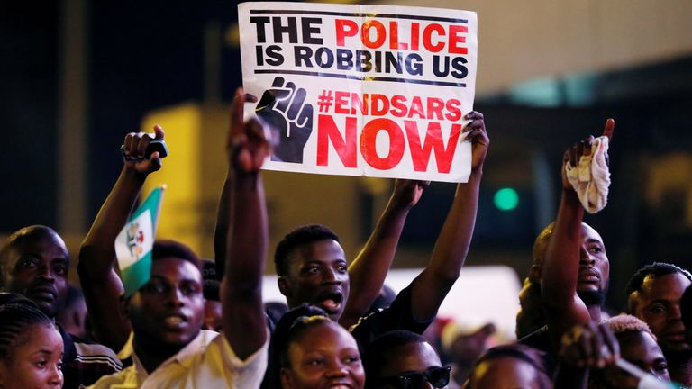

**The Issue in Short**

Shortly after the video of the Special Anti-Robbery Squad (SARS) shooting a young man went viral on local media in early October, the Nigerian populace took to the streets in protest. Enough was enough. This is not the first time SARS has been put in the spotlight. Since its creation in 1992, the Nigerian police unit has been notorious for committing the very crimes it was set to battle. According to Amnesty International, SARS has a record of countless human rights abuses, including extrajudicial killings, extortions, and other forms of torture against innocent citizens. In 2016, the World International Security and Police Index labeled it as the “world’s worst.” Meanwhile, the government’s violent military crackdown killing at least a dozen peaceful protesters has only exacerbated the people’s deep-rooted resentment and emboldened them to call for a transformative change — not just of their police — but their country’s corrupt governance.

**A Bit of History**

In 1960, following Nigeria’s independence from British rule, the country experienced domestic instability marked by a series of military coups and high crime rates. Although the SARS unit was founded as a way to combat this instability, its officers wielded unrestrained authority as they largely operated in the shadows without being required to wear uniforms. This facilitated their engagement in oppressive profiling schemes based on groundless assumptions. For example, youth dressed in nice clothes and carrying a laptop were unfairly detained and harassed for being potential “internet scammers.” A wave of protests against police brutality ensued in 2010, followed by empty-worded promises from the government to bring about reform. For instance, the Open Society Justice Initiative launched by the government in the same year vowed to end police violence by investing US$ 186 million to the cause, yet the program was left severely underfunded, leading to significant operational constraints. In 2016, the government announced that it would disband SARS entirely as more allegations surfaced concerning the group’s large-scale bribery and torture activities, but its legislative response, the Anti-Torture Act, was virtually ineffective. To this day, there has been little change despite the widespread international condemnation that gave rise to the End SARS hashtag trend on social media.

Police brutality, however, is only one of the many issues that has made the recent protests gain greater momentum. Although Nigeria has rich oil reserves, the Oxford Committee for Famine Relief reports that as of 2019 almost 70% of its inhabitants were living in poverty. The National Bureau of Statistics shows that a vast majority of youth aged 15 to 34, who make up almost 40% of Nigeria’s inhabitants, remain un/underemployed. Moreover, administrative corruption, including nepotism and electoral fraud, alongside inadequate social welfare systems in healthcare and education, have been a longstanding source of discontentment. With the sharp drop in world oil prices and the recent COVID-19 pandemic, the economic crisis and systemic inequality are projected to worsen. Thus, it was only a matter of time before Nigerian constituents reached the tipping point of their patience. Today, the prominent End SARS movement represents the desire of the Nigerian people to protect their livelihoods and fight for lasting social reform.

**Future outlook**

A hard road lies ahead if significant progress is to be made. Not all Nigerians are on board on the way forward with police brutality. While most protesters demand the complete dissolution of SARS, Northerners fear that their absence will instigate even more security problems given their history of ethno-religious tensions and frequent Islamist insurgencies. The country has faced growing separatist tendencies as well as a spike in jailbreaks which deepen divides and fuel nationwide turmoil. In attempts to appease the public, the federal government allegedly dissolved SARS, replacing it with the Special Weapons and Tactics Team (SWAT). However, the new unit is viewed with suspicion; many believe that it is nothing more than a mere rebranding of SARS. As a first step to starting genuine dialogue, the Nigerian authorities should address the Lekki Tollgate shootdown of peaceful protesters and provide proper compensation to the victims and their families. This time around, it seems that the youth-driven protests will not back down. The awakening of Nigeria's strong political consciousness is likely to be very influential in the upcoming 2023 elections. As Nigeria embarks on this journey of reform, the international community continues to support their agenda for more accountability, transparency, and the formation of a true democracy.