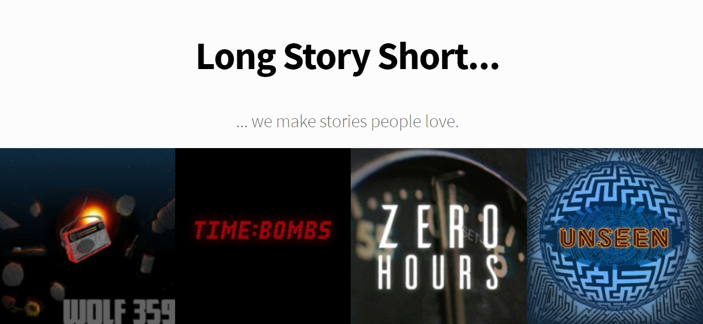

Serialized media saw new heights in the early 1920s when American homes were introduced to a revolutionary form of fiction: the radio drama. Introducing many genres that are now staples in modern entertainment, radio shows captured the ears and minds of the public from the 1920s to the 1950s; this period would later be known as the Golden Age of Radio.

Then the television came along and people decided radios weren’t as fun anymore.

That remains true to an extent, as audio dramas scarcely saw their place in the increasing demand for the spectacles provided by audiovisual mediums. One could easily see how film and television amassed the lion’s share in pop culture over purely acoustic productions. Despite all this, audio dramas are not out; in fact, they have never been more in.

With the rise of podcasts over the past decade, the audio drama found a new life in online distribution. Their comparatively low production cost and ease of production mean that there are libraries worth of free audio dramas that bear the torch of Golden Age radio traditions. One such example is Long Story Short Productions.

Previously the creative team behind “Wolf 359,” Long Story Short Productions recently premiered their newest series in October, but even their earlier works are great ways to get into audio fiction. “Time Bombs,” for instance, is a three-episode miniseries about EOD specialists. Set within a regular shift of a team of bomb disposal technicians in New York, the show was written in a single week and thrives in its brevity. The conversational prose between the main crew and the more objective voice of the audience-surrogate reporter play off each other with little waste of time, as it should when the whole run of the show is less than an hour. The quick humor, short running time, and lightheartedness contrasting with the characters’ macabre line of work do not interrupt the reality the show was based on; a real bomb expert would probably disprove me on this, but speaking as a layman, the technical jargon in the show was convincing enough to have me believe the showrunners did their research, which seems even more likely when considering “Wolf 359” also featured talks about bombs.

The listener may realize that the show, despite being audio-only, feels oddly cinematic. Scenes that would only make sense in a visual medium are present in the show, as if the show ripped the audio from a television show. What makes it even odder is that it works. In media, some sounds became popular tropes to be used with certain scenes or actions (for example, a record scratch or a “ding” used for a freezeframe), and the show relies on this familiarity to create visualizations with as little explicit explanation as possible. Short, funny, sharply written, and with a clever sound design, “Time Bombs” is a good litmus test on whether or not you will like audio dramas.

“Zero Hours” is a show that you can move on to once you pass(?) that litmus test. An anthology about the end of the world, each episode is, as the show’s description puts it, “organized around a kind of apocalypse, whether the cataclysm is planetary or personal.” Emphasis on the word “personal,” but I will try not to spoil it any further. As an anthology series spanning across epochs and focusing on different moments big and small, the story feels thematically flexible while still maintaining a sense of continuity, which is somewhat reminiscent of “Cloud Atlas.” Actually, it is pretty much “Cloud Atlas.” And much like “Cloud Atlas,” some parts lag behind the other items in the anthology, which is really the worst that can be said about the show. Even then, each episode brings a unique flavor to the show with varying settings and scales, all serving as an important backdrop for the two-person conversation format of the episodes. Having each episode themed around different interpretations of the end of someone’s world and structured as a personal conversation between two people makes for a very intimate apocalypse. The team’s clever approach to sound design is present here as well, as the dialogue is only half of the scene, with the other half being the descriptive noises that allow the listeners to draw their own image.

The team’s most well-known work, “Wolf 359,” is also their earliest known project and their longest-running one. What starts as a sci-fi sitcom in a space station seven-and-a-half light-years away from Earth turns into a compelling drama and space opera that shows the team’s greatest strength as worldbuilders and writers of characters. As their earliest work, the sound design, writing, and some of the voice performances in the first season do not match up to the polish of their later work, but they markedly improve as the series continues. With its rich characterization of a diverse cast and a satisfying narrative arc that spans across over sixty episodes, it is still their best work to date.

I imagine that it is currently a universal experience to be staring at a screen all day for online classes and assignments, so maybe you can find your entertainment in a medium that doesn’t burn your retinas out. Fiction podcasts, with their low entry cost to produce (some are even one-man productions!) are mostly free to listen and are overflowing with creative, brilliant stories. Why not pick one up this year?