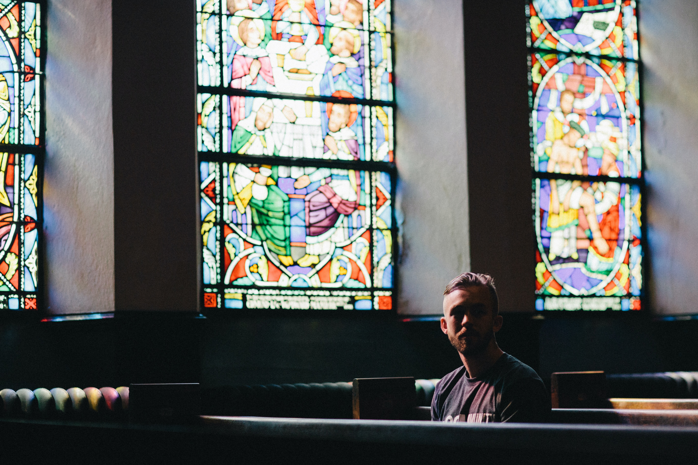

In South Korea, 48 four-year universities and 28 two-year colleges require all students, regardless of their individual religious beliefs, to fulfill chapel requirements for graduation despite most foreign students having non-Christian religious affiliations\[1]. These institutes, which were originally mission schools\[2] when they were founded, make chapel attendance a mandatory requirement to honor their Christian roots. According to them, the purpose of chapel courses is to build “community spirit” among their students and faculty. However, as Korean universities admit more students from diverse backgrounds, questions have been raised as to whether these courses should be mandatory. Some foreign students at Yonsei University claim that the school should accommodate their students’ various religious affiliations by making chapel an elective course.

**Why is mandatory chapel problematic?**

Islam, Buddhism, and Hinduism are just a few of the religions that many members of the student body follow. The prioritization of Christianity at Yonsei University limits the religious freedom of non-believers or those with other religious affiliations. Latifa Sekarini, a sophomore majoring in Comparative Literature & Culture (CLC), and of Muslim faith, feels excluded because the school does not give “room for inclusivity” as believers of non-Christian religions do not get their own sermons. Non-Christians have also reported that while chapel service lectures state that their purpose is not to convert students, their lecture content contradicts this. Maria Esha, a sophomore from the Department of Architectural Engineering, notes that there are “certain connotations in their lessons such as ‘submit to Jesus,’ ‘humanity cannot survive without Jesus,’ and much more, which are contradictory to ‘not converting students.’”

The reason some foreign students do not feel comfortable attending chapel is not simply because the content is irrelevant and confusing to them. To some non-Christians, such as Muslims, listening to Christian concepts during chapel services is a form of blasphemy because they contradict the faith they practice. Esha says, “As a Muslim, numerous topics such as references to Jesus as God were a bit too blasphemous to agree with or listen to.”

To make matters worse, Yonsei University had assistants to make sure that students were actively paying attention during chapel before the pandemic. Some assistants even used to prod students who were seemingly not paying attention with sticks. Non-Christian students view chapel as a regular class they must pass, not a sacred class. As such, they do not owe chapel any special respect, and as long as their conduct does not harm others, they should be free to be inattentive during class. Some argue that if chapel is a regular class, students should pay attention as in every other class. However, regular course professors do not use sticks nor do they use class time to oblige students to pay attention. It is the student’s responsibility to actively participate in class or not.

Even some Christian students have an issue with mandatory chapel attendance. Yonsei University includes dance performances during chapel to make the course more interesting to non-Christian students. Inviting dancers to perform during a sacred Christian service to merely make Christianity more appealing to non-Christians is considered to be sacrilegious by some. It insults devout Christians by turning their religion into a “student tourist” attraction. Esha worries that mandatory chapel “is rather disrespectful to Christianity as a religion” because non-Christians think of chapel as a “burden.”

**Where do we go from here?**

While it is true that mission schools in Korea make no attempt to hide their religious affiliations, international students often choose their university based on its academic eliteness. When students commit to an institute for two or four years, they want to be a part of that institute’s elite legacy and study with renowned professors. These students’ approach is not wrong as distinguished universities often underscore their academic prowess rather than their religious affiliations when persuading potential applicants. Mirabella Siena, a second year CLC student, believes that it is “hypocritical for Yonsei to push Christian values onto non-Christian students when Yonsei mainly attracts international students by emphasizing its academics and high rankings.”

It is ludicrous to compel Korean universities to give up their right to share Christian beliefs with their students. Likewise, it is nonsensical to deny non-Christian students their right to refuse listening to religious sermons that go against their beliefs during chapel. If chapel becomes an elective course instead of a mandatory course, current controversies may be resolved. Universities will be able to hold genuine, sacred chapel services with students who are true believers, and non-Christian students will be free to refrain from classes that violate their religious beliefs.

\[1] Korea Federation of Christian Schools

\[2] Mission schools: Schools founded by Christian missionaries