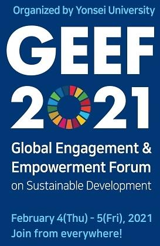

<!--StartFragment-->

As one of the leading academic institutions in Korea, Yonsei University’s endeavors is not limited to the provision of quality education to its students. With the core pillars such as “challenge” and “excellence”, it aims to cultivate innovative leaders and create platforms for international development to fulfill its social responsibility. Such commitment resonates in Yonsei’s establishment of the Institute for Global Engagement and Empowerment (IGEE) in 2017. The institute was founded with the support from the Ban Ki-moon Center for International Cooperation, Center for Global Sustainability, and the Yonsei Institute for Global Health. Led by Ban Ki-moon, former Secretary-General of the United Nations from 2007 to 2016, the IGEE strives to resolve social problems and promote sustainable development.

The Global Engagement Empowerment Forum (GEEF) is the most prominent event organized by the Institute for Global Engagement and Empowerment. GEEF has been held annually since 2018 on issues such as: “Putting People and Planet at the Center” (2018) and “A Call to Action: Empower People, Share Prosperity” (2019). Despite the inability for global leaders to convene in person due to the ongoing pandemic, the 2021 GEEF on the “3P’s (Peace, Prosperity, Partnership) Beyond Security,” was successfully carried out online in February with approximately 3500 participants. “3P’s (Peace, Prosperity, Partnership) Beyond Security,” In the beginning of the forum, Seung-hwan Suh, president of Yonsei University, expressed his hopes of GEEF playing a pivotal role in resolving modern day issues. The success of GEEF 2021 demonstrated such prospects. Global leaders shared insight on the prospects of the post-COVID international society and highlighted the significance of international solidarity. Notably, Ban Ki-Moon and UNHCR Special Envoy Angelina Jolie discussed the necessity of promoting the rights of various groups marginalized from disproportionate COVID-19 and climate change protection—minorities such as children, women, and refugees. Kang Kyung-wha, former Korean Minister of Foreign Affairs, also addressed the need for equitable and affordable vaccine provision. Former Austrian President Heinz Fischer emphasized the importance of efforts to advance the 17 Social Development Goals (SDGs) laid out by the UN. GEEF 2021 thus ignited a constructive discourse on international cooperation in various realms such as social innovation for the realization of the SDGs.

A special forum, “GEEF for ALL,” was also held in May to address the ongoing human rights crisis in Myanmar. Under the framework of the SDGs, the forum focused on the promotion of international cooperation to secure the human rights and security of the local people in Myanmar. Various experts shared views regarding the current conflicts and human rights violations surrounding the Myanmar crisis. Ban Ki-Moon claimed that the issue should not be perceived as a local problem but should be viewed as an urgent call for global action; global leaders should be committed in order to settle the situation through institutions such as the UN and ASEAN. Professor Yang-hee Lee of Sungkyunkwan University addressed the “3 Cuts” proposed by the Special Advisory Council for Myanmar (SAC-M) and explained how the strategy of “cutting the weapons, cash, and impunity” would be effective in stopping the Myanmar military. Likewise, the forum raised attention on ways to resolve the Myanmar crisis and to reinvigorate its democracy.

The annual GEEF held in Yonsei University has received global acclaim: Yonsei ranked first in Korea and 47th in the world in 2020 in the Times Higher Education World University Impact Assessment after the forum. Such achievement is especially notable as it is the only international university ranking that recognizes and evaluates efforts of global academic institutions fulfilling their social responsibilities. Yonsei University has demonstrated commendable engagement with global issues by providing a platform to discuss serious problems at hand. Further involvement with the SDGs shows how schools are contributing in the process of stemming contemporary conflicts. Yonsei University’s efforts also have significance in encouraging and motivating more institutions to take part in similar causes for peace and stability. Moreover, the school has spurred the attention of its students and the public in the fight against social injustices.

<!--EndFragment-->